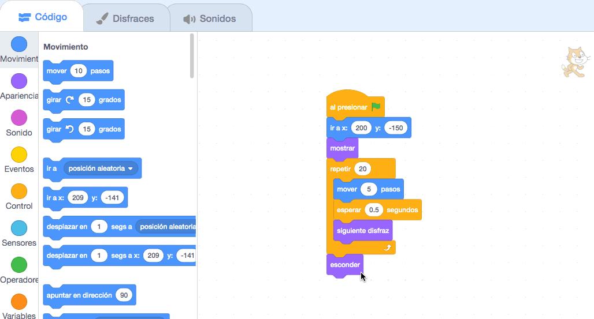

## Perder el autobús

<div style="display: flex; flex-wrap: wrap">
<div style="flex-basis: 200px; flex-grow: 1; margin-right: 15px;">
¿Qué pasa si el gato de Scratch no corre lo suficientemente rápido para tomar el autobús?
</div>
<div>

! [El gato de Scratch pierde el autobús.](Images/cat-misses-bus.png){:width="300px"}

</div>
</div>

--- task ---

Selecciona el **Gato de Scratch** y agrega un bloque `esperar`{:class="block3control"}:


```blocks3
when flag clicked
go to x:(200) y:(-150) 
show
repeat (20) // try different numbers
move (5) steps 
next costume 
+ wait (1) seconds
end
hide
```
--- /task ---

--- task ---

**Prueba:** Haz clic en la bandera verde. ¡El gato de Scratch caminará demasiado lento y perderá el autobús!

--- /task ---

Vas a querer un tiempo de retraso de menos de un segundo. 0.5 es medio segundo, 0.25 es un cuarto de segundo y 0.1 es una décima de segundo.

--- task ---

Cambia el tiempo de retraso en el bloque `esperar`{: class = "block3control"}:


```blocks3
wait (0.2) seconds // try 0.1, 0.5, 0.05
```

**Prueba:** Haz clic en la bandera verde y el gato Scratch caminará más rápido. Elige el tiempo de retraso que prefieras.

--- /task ---

**Elige:** Elige si deseas que el gato de Scratch **pierda el autobús** o que **tome el autobús**.

--- task ---

Si quieres que el gato de Scratch **pierda el autobús**, quita el bloque `esconder`{:class="block3looks"} de tu código para que el gato de Scratch permanezca en el escenario:




```blocks3
when flag clicked
go to x:(200) y:(-150) 
show
repeat (20) 
move (5) steps 
next costume
wait (0.5) seconds 
end
-hide
```
--- /task ---

--- task ---

Si quieres que el gato de Scratch **tome el autobús**, haz que el autobús espere más antes de partir:


```blocks3
+when [timer v] > [6] // change from 4 to 6
glide [2] secs to x: [320] y: [-100] // right-hand side of the Stage
hide
```

Necesitarás volver a colocar el bloque `esconder`{:class="block3looks"} en el código del objeto **Gato de Scratch** si lo hubieras eliminado y quieres que el gato de Scratch tome el autobús con éxito.

--- /task ---

--- task ---

Haz cambios hasta que la animación funcione como quieras.

--- /task ---

<p style="border-left: solid; border-width:10px; border-color: #0faeb0; background-color: aliceblue; padding: 10px;">
Cuando trabajes en un proyecto, a menudo tendrás que retroceder y cambiar o mejorar tu código a medida que tengas nuevas ideas. 
</p>

--- save ---


