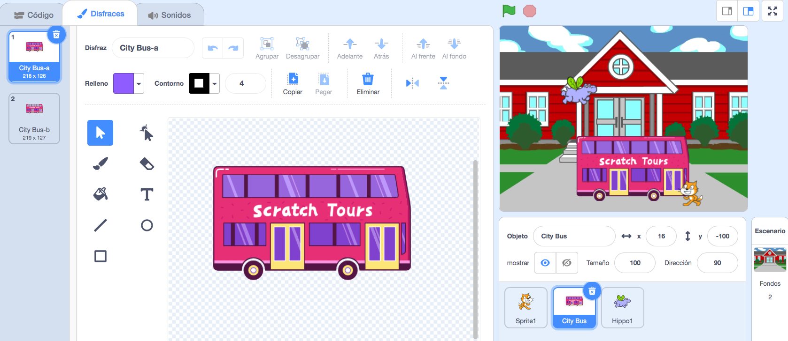
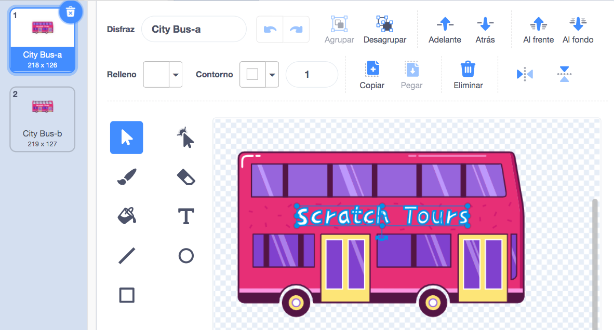
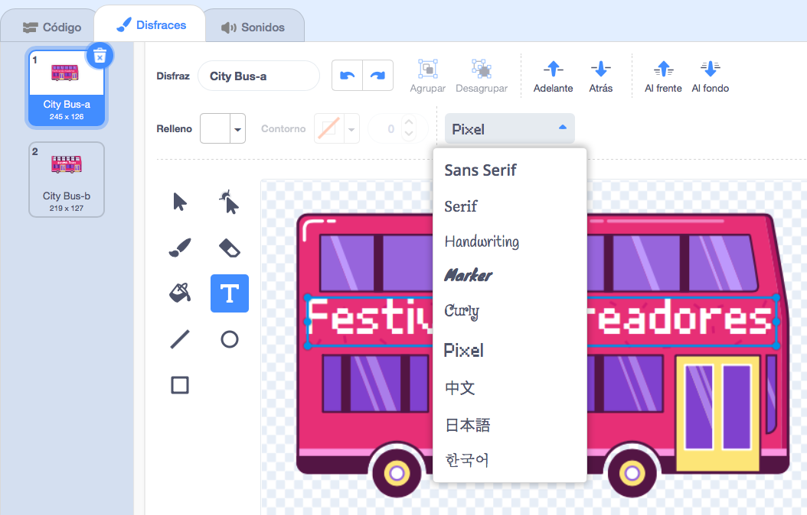

## Cambia el destino

La autobús tiene escrito "Scratch Tours", pero puedes cambiar el destino a uno de tu elección. ¿A dónde quieres que vaya tu autobús?  

{:width="300px"}

--- task ---

Selecciona el objeto **City Bus** (Autobús) y haz clic en la pestaña **Disfraces**:

--- /task ---

--- task ---

Haz clic en el texto blanco "Scratch Tours" para seleccionarlo y luego haz clic en **Eliminar** para quitarlo.

--- /task ---

**Sugerencia:** Puedes usar el ícono **Eliminar** en el editor de dibujo o la tecla <kbd>Supr</kbd> en tu teclado.

--- task ---

Selecciona la herramienta **Texto** (Escritura).

Haz clic en el autobús donde quieres que comience el texto y escribe el destino de tu elección.

Para cambiar la fuente (estilo de escritura), puedes hacer clic en el menú desplegable **Fuente**:

--- /task ---

--- task ---

Haz clic en la herramienta **Seleccionar** (flecha), luego arrastra el texto para colocarlo en el autobús.

--- /task ---

--- save ---
