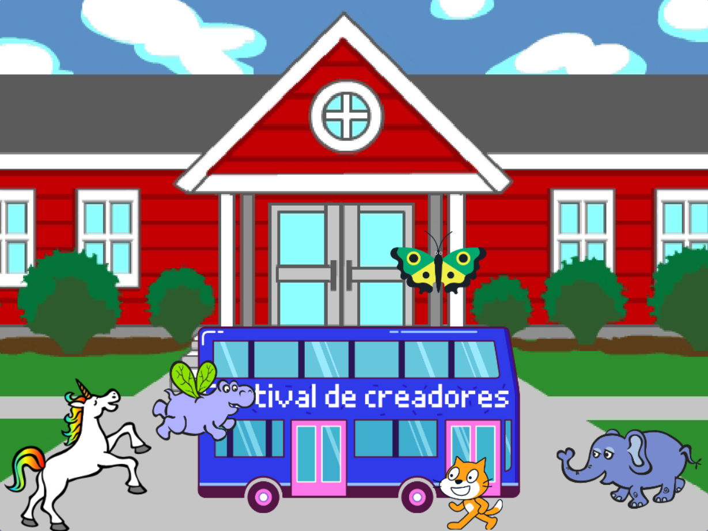

## Mejora tu proyecto

Ahora, puedes agregar un objeto de tu elección a tu animación. Necesitarás agregar código para que tu objeto pueda `ir a`{:class="block3motion"} su posición inicial, `apuntar hacia`{:class="block3motion"} la dirección correcta, y luego usar los bloques `repetir`{:class="block3control"}, `mover`{:class="block3motion"} y `siguiente disfraz`{:class="block3looks"} para tomar el autobús.

**Sugerencia:** Cuando haces clic en **Elegir un objeto**, puedes mantener el cursor del mouse sobre el objeto para ver sus disfraces, o en algunos dispositivos móviles, puedes tocar y mantener pulsado el objeto para ver sus disfraces (si una ventana aparece cuando tocas y mantienes presionado el objeto, toca en el costado de la pantalla para cerrar la ventana y ver los disfraces). Mirar los disfraces de los objetos puede ayudarte a encontrar un objeto que funcione bien para la animación.

{:width="300px"}

Puedes usar cualquiera de los bloques que utilizaste en este proyecto, así como los que ya conoces:

```blocks3
when flag clicked

when [timer v] > [5]

go to x: [0] y: [0] // drag the sprite to choose x and y

show

hide

glide [2] secs to x: [0] y: [-100] // bottom middle of the Stage

repeat [30]
end

point towards (City Bus v)

point in direction (180) // point down

set rotation style [left-right v]

move [3] steps

next costume

start sound [clown honk v]

wait [0.1] seconds // short delay

set [color v] effect to [50] // up to 200
```

--- collapse ---
---
title: Proyecto terminado
---

Puedes ver el [proyecto completo aquí](https://scratch.mit.edu/projects/486719199/){:target="_blank"}.

--- /collapse ---

También puedes '"reinventar"' el proyecto para realizar los cambios que quieras. Podrías agregar efectos de sonido al autobús o a otros objetos, o cambiar el efecto de color del bus. Uno de los objetos podría perder el autobús y no esconderse.

¡Gracias a la creadora digital Lyla por enviar esta fantástica actualización!


--- save ---
