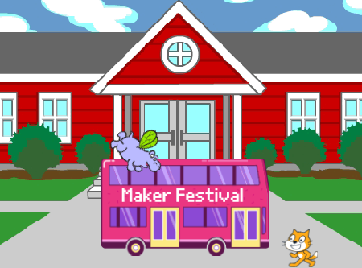

## Introduction

Dans ce projet, tu vas créer une animation avec des sprites qui courent ou volent pour attraper un bus.

Tu vas devoir :
+ Faire en sorte que les sprites fassent des choses différentes `quand le drapeau vert est cliqué`{:class="block3events"}
+ Positionner les sprites sur la **Scène**
+ Utiliser une boucle `répéter`{: class = "block3control"} pour faire `avancer`{:class="block3motion"} et `basculer sur le costume`{:class="block3looks"}

--- no-print --- --- task ---

### Essaie-le

  

Clique sur le drapeau vert pour regarder l'animation. 

Quels sprites changent de costume pour créer un effet d'animation ?

  <iframe allowtransparency="true" width="485" height="402" src="https://scratch.mit.edu/projects/embed/486719199/?autostart=false" frameborder="0"></iframe>

--- /task --- --- /no-print ---

--- print-only ---

--- /print-only ---

**Animation** crée un effet de mouvement en changeant rapidement les images. Les premiers animateurs sculptaient des images dans des blocs de bois et les utilisaient comme tampons. Il est beaucoup plus rapide d'utiliser Scratch pour coder ton animation !

