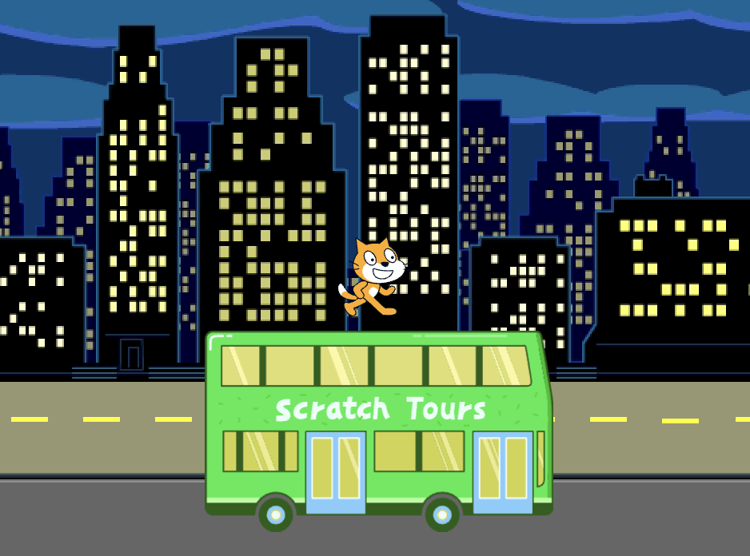

## Créer ta scène de bus

<div style="display: flex; flex-wrap: wrap">
<div style="flex-basis: 200px; flex-grow: 1; margin-right: 15px;">
Tu choisiras un arrière-plan et ajouteras un sprite de bus.
</div>
<div>

{:width="300px"}

</div>
</div>

--- task ---

Ouvre le [Prendre le bus projet de démarrage](https://scratch.mit.edu/projects/582214330/editor){:target="_blank"}. Scratch s'ouvrira dans un autre onglet du navigateur.

[[[working-offline]]]

--- /task ---

--- task ---

Clique (ou sur une tablette, appuie) sur **Choisir un arrière-plan** dans le volet Scène (en bas à droite de l'écran) :


--- /task ---

--- task ---

Clique sur la catégorie **Plein air**. Ajoute un arrière-plan qui constitue un bon point de départ pour ton bus :


--- /task ---

--- task ---

Clique sur **Choisir un Sprite**:


--- /task ---

--- task ---

Tape `bus` dans la zone de recherche en haut :


Ajoute le sprite **City Bus** à ton projet.

--- /task ---

 Dans Scratch, tu exécutes des projets en cliquant sur le drapeau vert au-dessus de la scène. Le bus doit être dans sa position de départ `quand le drapeau vert est cliqué`{:class="block3events"}.

--- task ---

Assure-toi que le sprite**City Bus** est sélectionné dans la liste Sprite sous la scène.

Fais glisser un `quand le drapeau vert est cliqué sur`  du menu bloc `Événements`{:class="block3events"} vers la zone Code :


```blocks3
when flag clicked
```

--- /task ---

--- task ---

Fais glisser le bus vers une bonne position sur la scène :


Les coordonnées **x** et **y** (les nombres utilisés pour décrire la position) du bus sont affichées dans le volet Sprite sous la scène :


--- /task ---

--- task ---

Ajoute un bloc `aller à x: y:`{:class="block3motion"} :


```blocks3
when flag clicked
+go to x: (0) y: (-100)
```

Les nombres dans le bloc `aller à x : y :`{:class="block3motion"} sont les coordonnées x et y actuelles du bus. Les chiffres de ton projet peuvent être un peu différents.

--- /task ---

--- task ---

**Test :** Fais glisser le bus n'importe où sur la scène, puis clique sur le drapeau vert. Le bus doit toujours aller à sa position de départ.

--- /task ---

Lorsque tu fais glisser le bus, il passe devant le chat Scratch .

--- task ---

Pour t'assurer que le **City Bus** est toujours derrière tous les sprites , ajoute un bloc `aller à l'avant plan`{:class="block3looks"}, puis clique sur `avant`{:class="block3looks"} et change-le en `arrière`{:class="block3looks"} :


```blocks3
when flag clicked
go to x: (0) y: (-100)
+ go to [back v] layer
```

**Astuce :** Si tu ne peux pas voir le bloc `aller à l'avant plan`{:class="block3looks"}, tu dois faire défiler le bloc menu `apparence`{:class="block3looks"}.

--- /task ---

--- task ---

Tu peux changer la couleur du bus :


```blocks3
when flag clicked
go to x: (0) y: (-100)
go to [back v] layer
+set [color v] effect to (50) // essaye les nombres jusqu'à 200
```

--- /task ---

--- task ---

Le chat Scratch apparaît dans tous les nouveaux projets Scratch sous la forme **Sprite1** dans la liste Sprite. Clique sur le sprite **Sprite1** dans la liste Sprite pour te préparer à animer le chat Scratch :


**Astuce :** Si tu as accidentellement supprimé le sprite **** (Scratch Cat), tu peux cliquer sur l'icon **Choisir un Sprite** et rechercher `cat`.

--- /task ---

Pour le moment, le chat Scratch est trop gros pour tenir dans le bus.

--- task ---

Dans le volet Sprite, clique sur la propriété **taille** et change la taille du chat Scratch en `50`:


--- /task ---

--- save ---
