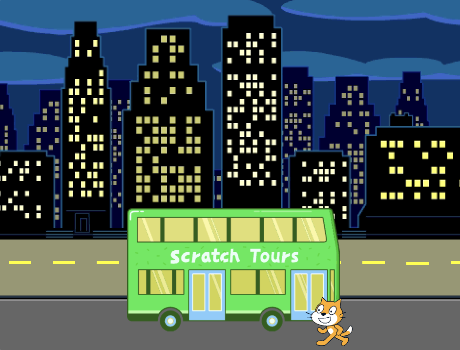
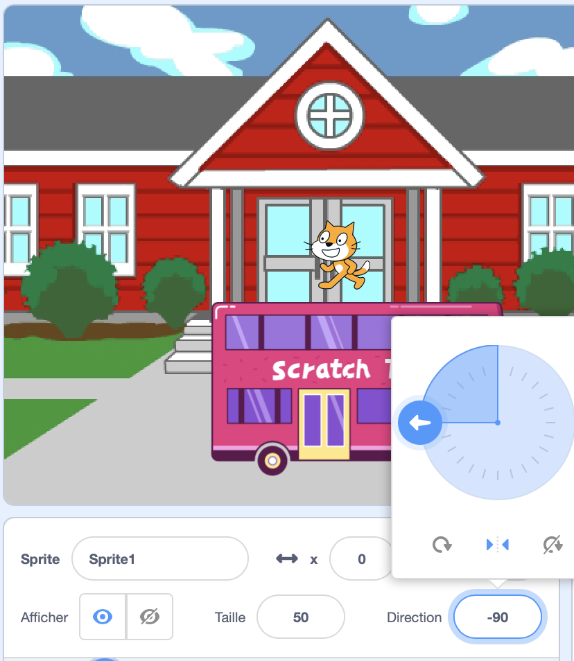
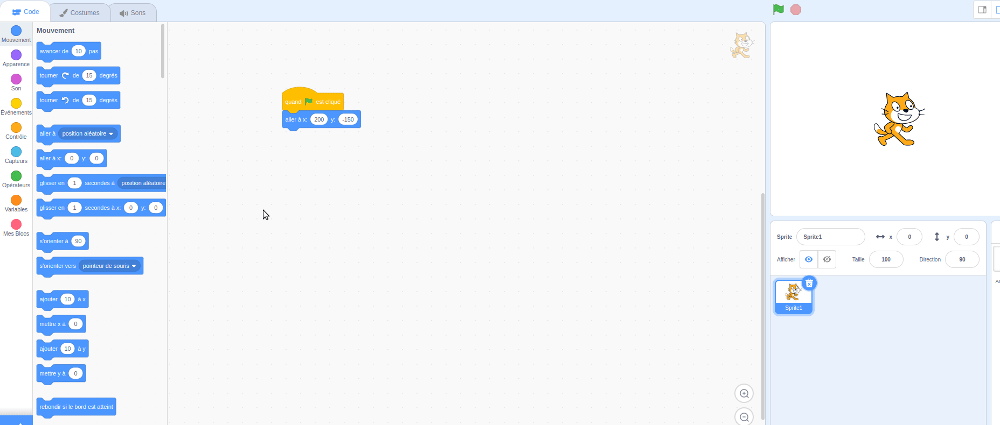

## Le chat Scratch attrape le bus

<div style="display: flex; flex-wrap: wrap">
<div style="flex-basis: 200px; flex-grow: 1; margin-right: 15px;">
Tu animeras le chat Scratch pour qu'il apparaisse sur le **côté droit** de la scène et marche jusqu'au bus en répétant un petit mouvement plusieurs fois dans une **boucle**. 
</div>
<div>

{:width="300px"}

</div>
</div>

### Mettre le chat Scratch dans sa position de départ

--- task ---

Clique sur la propriété **Direction** dans le volet Sprite. Tourne la flèche pour pointer vers `-90`. Ensuite, clique sur l'icone **Gauche/Droite** au milieu pour changer le style de rotation en `gauche-droite` pour empêcher le chat Scratch de se renverser :



--- /task ---

--- task ---

Fais glisser le chat Scratch en bas à droite de la scène.


**Astuce :** Si tu essayes de positionner un sprite en dehors de la scène, il reviendra à sa dernière position sur la scène.

--- /task ---

--- task ---

Ajoute du code pour amener le chat Scratch à sa position de départ :


```blocks3
when flag clicked
go to x:(200) y:(-150) // bottom right-hand side
```

--- /task ---

--- task ---

**Test :** Fais glisser le chat Scratch vers une nouvelle position, puis clique sur ton bloc `aller à x: y:`{:class="block3motion"}. Le chat Scratch doit revenir en bas à droite à chaque fois.

--- /task ---

### Animer le chat Scratch

Tu ajouteras du code dans une boucle `répéter`{:class="block3control"} pour que le chat Scratch répète un petit nombre de pas plusieurs fois. Cela fera apparaître le chat Scratch animé.

--- task ---

Ajoute un bloc `répéter`{:class="block3control"} `10`, puis fais glisser un bloc `avancer de`{:class="block3motion"} `10` `pas`{:class="block3motion"} à l'intérieur :




```blocks3
when flag clicked
go to x:(200) y:(-150) // bottom right-hand side
+ repeat (10) // try different numbers
move (5) steps //  5 is a good walking speed
end
```

--- /task ---

--- task ---

**Test :** Clique sur le drapeau vert. Essaie de modifier les chiffres dans le bloc `répéter`{:class="block3control"}. `10` pour que le chat Scratch s'arrête au bus.

--- /task ---

Certains sprites ont plus d'un costume. Tu utiliseras les costumes du sprite **chat Scratch** pour créer une animation de marche du chat Scratch.

--- task ---

Clique sur l'onglet **Costumes**. Le sprite **chat Scratch** a deux costumes, et ensemble, ils peuvent être utilisés pour faire un mouvement de marche.

--- /task ---

--- task ---

Clique sur l'onglet **Code**. Ajoute un bloc `costume suivant`{:class="block3looks"} :


```blocks3
when flag clicked
go to x:(200) y:(-150) // bottom right-hand side
repeat (20) // try different numbers
move (5) steps //  5 is a good walking speed
+ next costume 
end
```
--- /task ---

--- task ---

**Test :** Clique sur le drapeau vert, et le chat Scratch marchera jusqu'au bus.

--- /task ---

### Cacher le chat Scratch

--- task ---

Ajoute un bloc `cacher`{:class="block3looks"} le chat Scratch lorsqu'il atteint le bus :


```blocks3
when flag clicked
go to x:(200) y:(-150) // bottom right-hand side
repeat (20) // try different numbers
move (5) steps //  5 is a good walking speed
next costume 
end
+ hide
```

--- /task ---

--- task ---

**Test :** Clique à nouveau sur le drapeau vert, et tu verras que le chat Scratch a maintenant disparu.

--- /task ---

### Montrer le chat Scratch

--- task ---

Ajoute un bloc `montrer`{:class="block3looks"} pour que le chat Scratch apparaisse avant qu'il ne marche vers le bus :


```blocks3
when flag clicked
go to x:(200) y:(-150) // bottom right-hand side
+ show
repeat (20) // try different numbers
move (5) steps //  5 is a good walking speed
next costume 
end
hide
```

**Astuce :** Lorsque tu utilises un bloc `cacher`{:class="block3looks"}, tu dois également ajouter un bloc `montrer`{:class="block3looks"} pour t'assurer qu'un sprite est visible quand c'est nécessaire.

--- /task ---

--- task ---

**Test :** Clique sur le drapeau vert pour tester ton projet, et assure-toi que le chat Scratch apparaît.

--- /task ---

