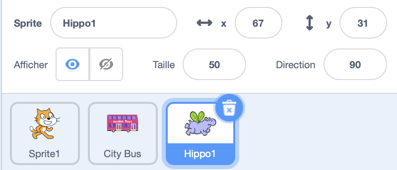

## L'hippopotame vole vers le bus

<div style="display: flex; flex-wrap: wrap">
<div style="flex-basis: 200px; flex-grow: 1; margin-right: 15px;">
Tu ajouteras un sprite hippopotame qui vole jusqu'au bus.
</div>
<div>

{:width="300px"}

</div>
</div>

### Donner à l'hippopotame une position de départ

--- task ---

Modifie le sprite **Hippo1** dans ton projet.

Modifie la **Taille** du sprite **Hippo1** :



--- /task ---

--- task ---

Fais glisser l'hippopotame en haut à gauche de la scène.


--- /task ---

--- task ---

Ajoute du code pour amener l'hippopotame à sa position de départ :

```blocks3
when flag clicked
go to x: [-200] y: [150] // en haut à gauche
```

**Astuce :** Les coordonnées `x`{:class="block3motion"} et `y`{:class="block3motion"} dans le bloc `aller à x: y:`{:class="block3motion"} seront la position actuelle de l'hippopotame, tu n'as donc pas besoin de les saisir.

--- /task ---

### Faire en sorte que l'hippopotame batte des ailes et vole

--- task ---

Ajoute du code pour faire voler l'hippopotame vers le **City Bus** :

```blocks3
when flag clicked
go to x: [-200] y: [150] 
+repeat [100] 
point towards (City Bus v) // changement du pointeur de la souris
move [3] steps
next costume
+end
```

--- /task ---

--- task ---

**Test :** Clique sur le drapeau vert et vérifie que l'hippopotame vole jusqu'au bus. Tu peux modifier le nombre dans le bloc `répéter`{:class="block3control"} pour que l'hippopotame s'arrête juste au bon endroit.

--- /task ---

### Montrer et cacher le bus

--- task ---

Ajoute les blocs `montrer`{:class="block3looks"} et `cacher`{:class="block3looks"} :

```blocks3
when flag clicked
go to x: [-200] y: [150] 
+ show
repeat [90] 
point towards (City Bus v)
move [3] steps
next costume
end
+ hide
```

--- /task ---

--- task ---

**Test :** Clique sur le drapeau vert. L'hippopotame va voler et entrer dans le bus.

--- /task ---
