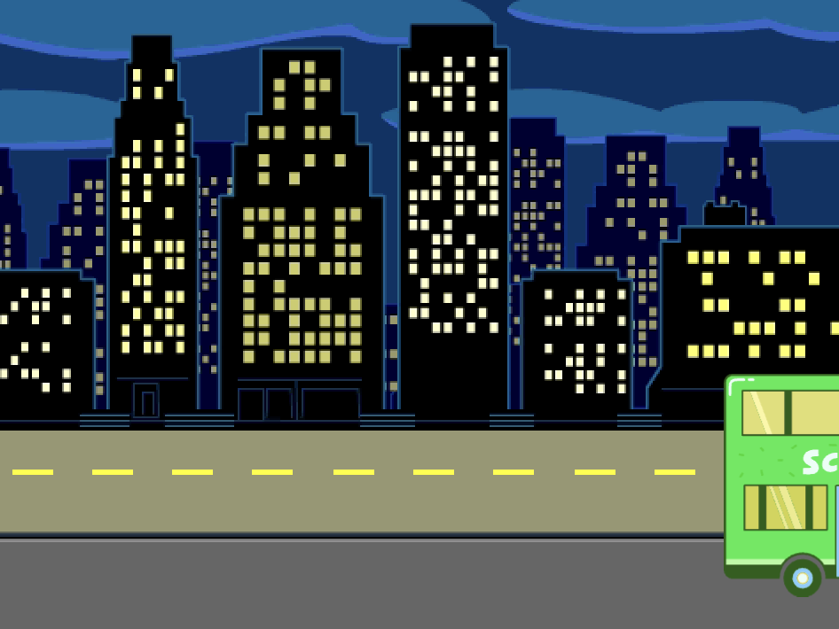

## Le bus part

<div style="display: flex; flex-wrap: wrap">
<div style="flex-basis: 200px; flex-grow: 1; margin-right: 15px;">
Ajoute plus de blocs pour faire démarrer le bus.
</div>
<div>

{:width="300px"}

</div>
</div>

### Animer le bus

--- task ---

Sélectionne le sprite **City Bus**.


--- /task ---

--- task ---

Le bus partira vers la droite quatre secondes après avoir cliqué sur le drapeau vert.


```blocks3
when flag clicked 
wait [4] seconds // changer 1 à 4
```

--- /task ---

--- task ---

Fais glisser ton bus vers le côté droit de la scène. Ce sera la position `x`{:class="block3motion"} et `y`{:class="block3motion"} vers laquelle le bus `glissera`{:class="block3motion"}.


**Astuce :** Si tu déplaces le bus trop vers la droite, il reculera. Réessaie, mais ne le déplace pas si loin.

--- /task ---

--- task ---

Ajoute un bloc `glisser`{:class="block3motion"} `2` `secondes à x: y:`{:class="block3motion"} sous le bloc `attendre`{:class="block3events"}.

Les coordonnées `x`{:class="block3motion"} et `y`{:class="block3motion"} dans ton projet peuvent être un peu différentes et seront la position exacte à laquelle tu as fait glisser le bus.


```blocks3
when flag clicked 
wait [4] seconds // changer 1 à 4
+glide [2] secs to x: [320] y: [-100] // côté droit de la scène
```

--- /task ---

--- task ---

**Test :** Clique sur le drapeau vert. Le chat Scratch et l'hippopotame se déplaceront vers le bus, et le bus partira à droite après quatre secondes.

--- /task ---

### Cacher et montrer le bus

--- task ---

Ajoute un bloc `cacher`{:class="block3looks"} pour donner l'impression que le bus quitte la scène :


```blocks3
when flag clicked 
wait [4] seconds // changer 1 à 4
glide [2] secs to x: [320] y: [-100]
+ hide
```
--- /task ---

--- task ---

**Test :** Clique sur le drapeau vert. Le bus se cachera maintenant après avoir démarré. Tu te souviens comment faire en sorte qu'un sprite réapparaisse lorsque tu cliques sur le drapeau vert ?

--- /task ---

--- task ---

Ajoute un bloc `montrer`{:class="block3looks"} à ton script `quand le drapeau vert est cliqué`{:class="block3events"} pour faire apparaître le bus lorsque tu exécutes ton projet :


```blocks3
when flag clicked
go to x: (0) y: (-100)
go to [back v] layer
set [color v] effect to (85) // essaye les nombres jusqu'à 200
+show
```

--- /task ---

--- task ---

**Test :** Clique sur le drapeau vert et regarde ton animation. Le bus devrait apparaître au centre de la scène, puis repartir vers la droite et disparaître.

Est-ce que tout le monde est dans le bus quand il part ? Tu peux modifier le temps d'attente du bus, si nécessaire.

--- /task ---
