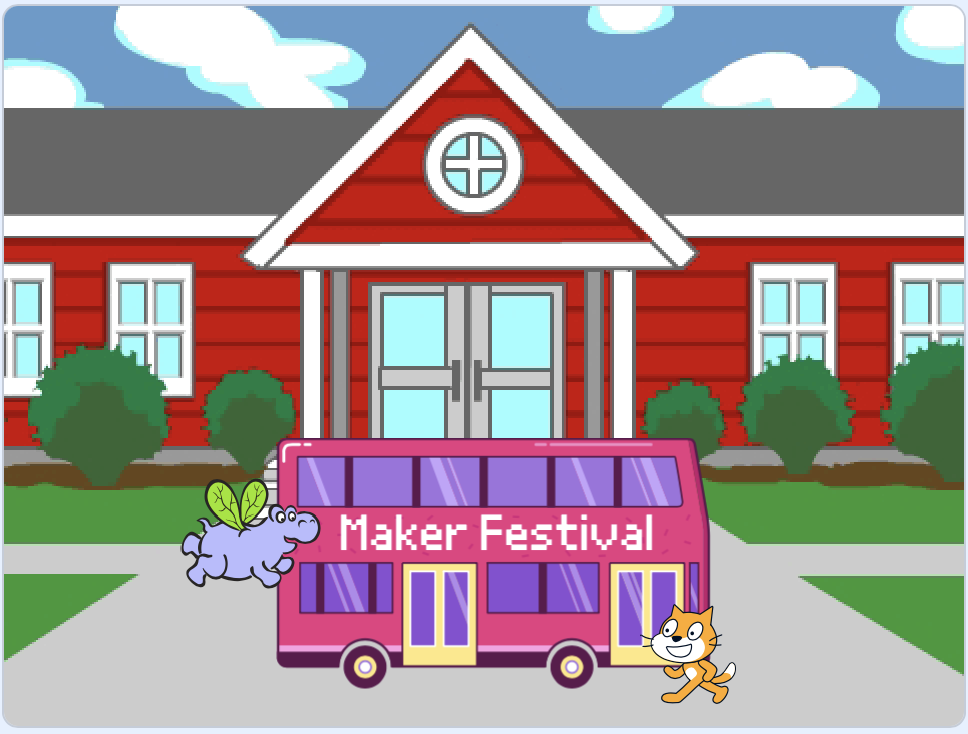
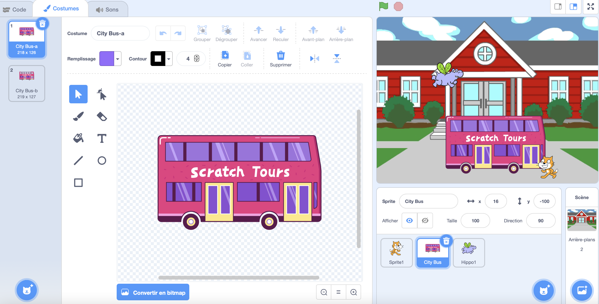
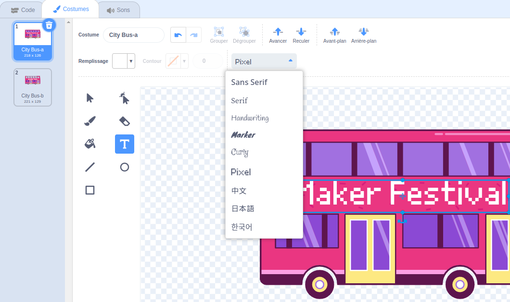
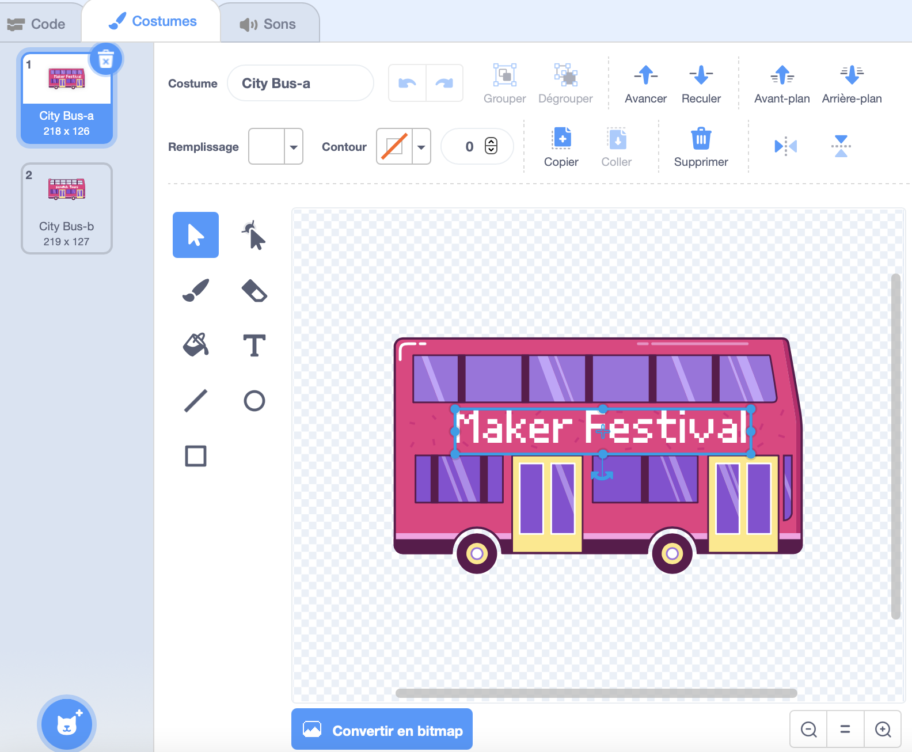

## Changer de destination

L'inscription sur le bus dit « Scratch Tours », mais tu peux changer la destination pour celle de ton choix. Où veux-tu que ton bus aille ?  

{:width="300px"}

### Modifier le sprite City Bus

--- task ---

Sélectionne le **City Bus** et clique sur l'onglet **Costumes**:

--- /task ---

--- task ---

Clique sur le texte blanc « Scratch Tours » pour le sélectionner, puis clique sur **Supprimer** pour le supprimer.

**Astuce :** Tu peux utiliser l'icône **Supprimer** dans l'éditeur de peinture ou la touche <kbd>Supprimer</kbd> de ton clavier.

--- /task ---

--- task ---

Sélectionne l'outil **Texte** (écriture).

Clique sur le bus où tu souhaites que ton texte commence et tape la destination de ton choix.

Pour changer la police (style d'écriture), tu peux cliquer sur le menu déroulant **Police**:

--- /task ---

--- task ---

Clique sur l'outil **Sélectionner** (Flèche), puis faites glisser le texte pour le positionner sur le bus.

--- /task ---

