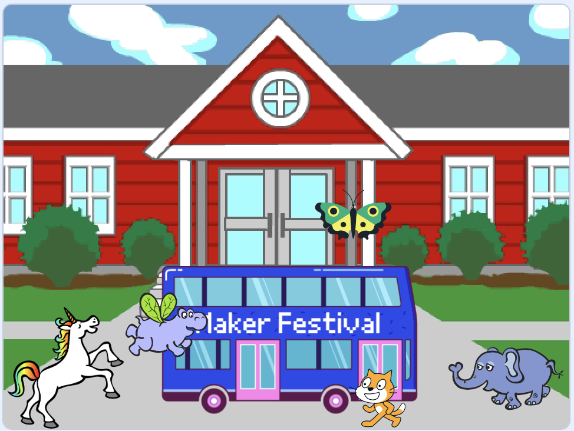

## Améliorer ton projet

Maintenant, tu peux ajouter un sprite de ton choix à ton animation. Tu devras ajouter du code pour que ton sprite `aller à`{:class="block3motion"} une position de départ, `pointe`{:class="block3motion"} dans la bonne direction, puis `répéter`{:class="block3control"} des blocs `avancer`{:class="block3motion"} et `costume suivant`{:class="block3looks"} pour atteindre le bus.

**Astuce :** Lorsque tu cliques sur **Choisir un**, tu peux maintenir le curseur de ton souris sur un sprite pour voir ses costumes, ou sur certains appareils mobiles, tu peux appuyer longuement sur un sprite pour voir ses costumes (si une fenêtre apparaît lorsque tu appuyes et maintenes sur un sprite, appuyes sur le côté de l'écran pour fermer la fenêtre et voir les costumes). Regarder les costumes des sprites peut t'aider à trouver un sprite qui fonctionne bien pour l'animation.

{:width="300px"}

Tu peux utiliser n'importe lequel des blocs que tu as appris dans ce projet, ainsi que ceux que tu connais déjà :

```blocks3
when flag clicked

go to x: [0] y: [0] // fais glisser le sprite pour choisir x et y

show

hide

glide [2] secs to x: [0] y: [-100] // en bas au milieu de la scène

repeat [30]
end

point towards (City Bus v)

point in direction (180) // pointer vers le bas

set rotation style [left-right v]

move [3] steps

next costume

start sound [clown honk v]

wait [0.1] seconds // court délai

set [color v] effect to [50] // jusqu'à 200
```

--- collapse ---
---
title: Le projet terminé
---

Tu peux voir le [projet terminé ici](https://scratch.mit.edu/projects/589903506/){:target="_blank"}.

--- /collapse ---

Tu peux également « remixer » le projet pour apporter les modifications que tu souhaites. Tu peux ajouter des effets sonores au bus ou à d'autres sprites, ou définir l'effet de couleur du bus. L'un des sprites pourrait rater le bus et ne pas se cacher.

Merci au fabricant numérique Lyla pour l'envoi de cette fantastique mise à jour !


--- save ---
