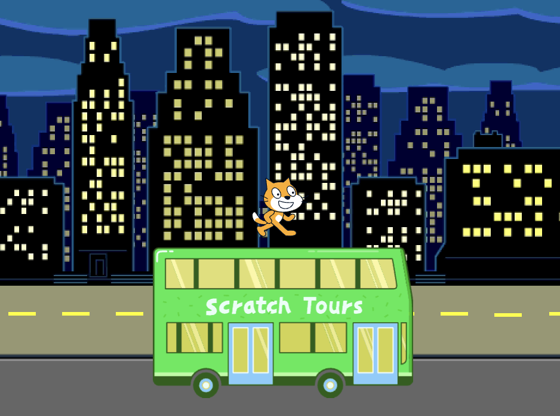
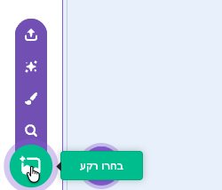
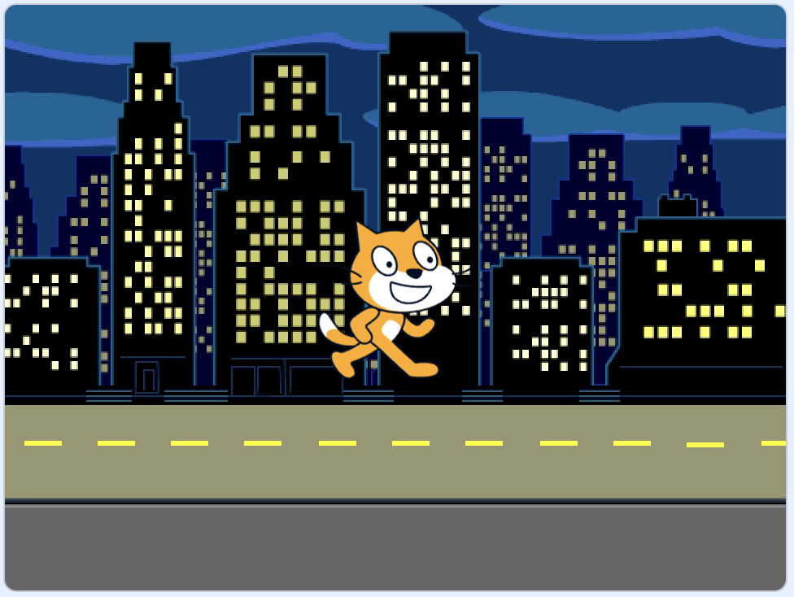
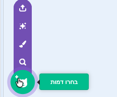
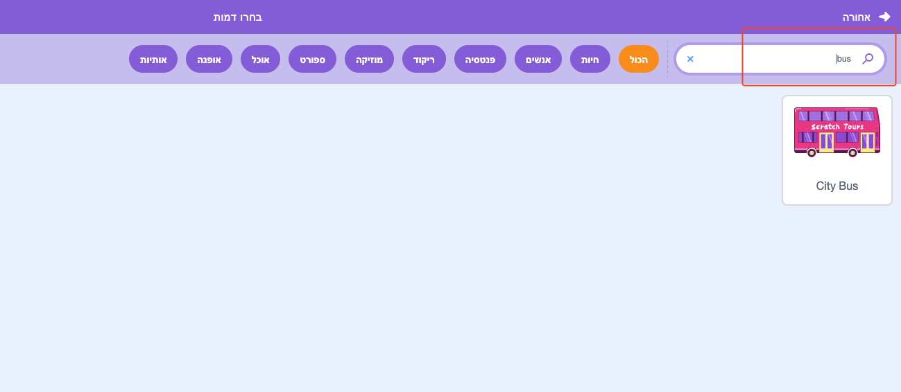
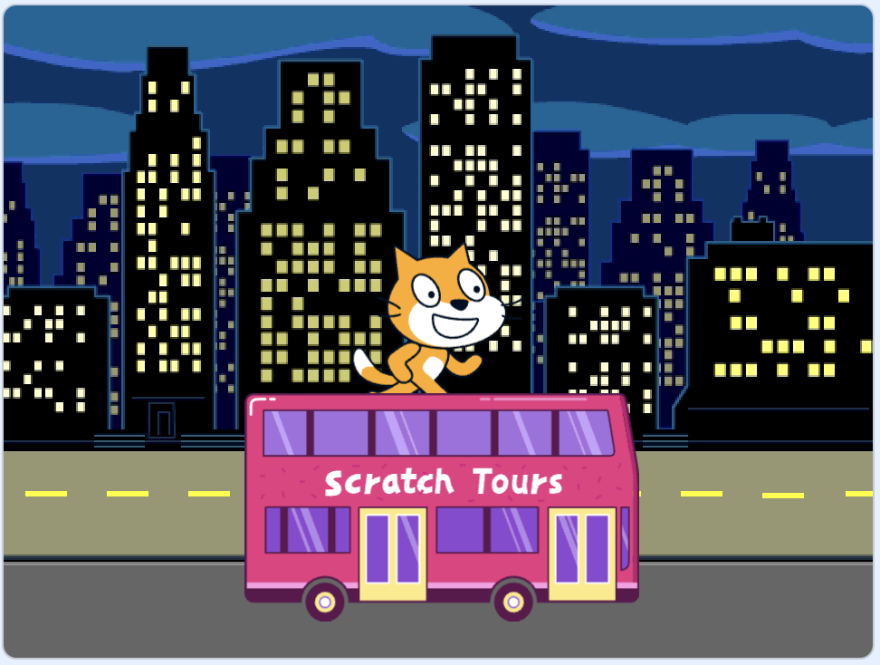
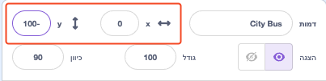
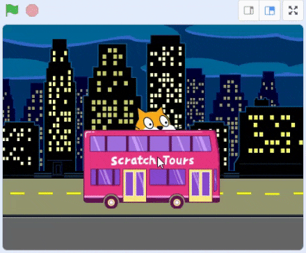
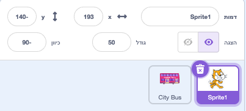
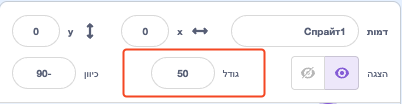

## צור את סצנת האוטובוס שלך

<div style="display: flex; flex-wrap: wrap">
<div style="flex-basis: 200px; flex-grow: 1; margin-right: 15px;">
בחרו רקע והוסיפו ספרייט של אוטובוס.
</div>
<div>

{:width="300px"}

</div>
</div>

### פתח את פרויקט ההתחלתי

--- task ---

פתח את פרויקט ההתחלתי [תפוס את האוטובוס](https://scratch.mit.edu/projects/582214330/editor){:target="_blank"}. סקראץ׳ ייפתח בכרטיסייה אחרת של הדפדפן.

[[[working-offline]]]

--- /task ---

### בחר רקע

--- task ---

לחצו (או בטאבלט, הקישו) על **בחרו רקע** בחלונית הבמה (בפינה הימנית התחתונה של המסך):



--- /task ---

--- task ---

לחץ על הקטגוריה **בחוץ**. הוסף רקע שיהווה נקודת התחלה טובה לאוטובוס שלך:



--- /task ---

### בחר ספרייט

--- task ---

לחץ על **בחר ספרייט**:



--- /task ---

--- task ---

הקלד `אוטובוס` בתיבת החיפוש בחלק העליון:



הוסף את הספרייט **אוטובוס העירוני** לפרויקט שלך.

--- /task ---

### תן לאוטובוס שלך נקודת התחלה

--- task ---

ודא שהספרייט **אוטובוס עירוני** נבחר ברשימת הספרייטים שמתחת לבמה.

גררו בלוק `כאשר הדגל הירוק נלחץ`{:class="block3events"} מתפריט הבלוקים `אירועים`{:class="block3events"} לאזור הקוד:


```blocks3
when flag clicked
```

--- /task ---

--- task ---

גרור את האוטובוס למיקום טוב על הבמה:



הקואורדינטות **x** ו- **y** (המספרים המשמשים לתיאור המיקום) של האוטובוס מוצגות בחלונית ספרייט מתחת לבמה:



--- /task ---

--- task ---

הוסף בלוק `עבור אל x: y:`{:class="block3motion"}:


```blocks3
when flag clicked
+go to x: (0) y: (-100)
```

המספרים בבלוק `הולכים ל-x:y:`{:class="block3motion"} הם קואורדינטות ה-x וה-y הנוכחיות של האוטובוס. ייתכן שהמספרים בפרויקט שלך יהיו מעט שונים.

--- /task ---

--- task ---

**בדיקה:** גררו את האוטובוס לכל מקום על הבמה, ולאחר מכן לחצו על הדגל הירוק. האוטובוס צריך תמיד לנסוע לעמדת ההתחלה שלו.



--- /task ---

### הזז את האוטובוס מאחורי הדמויות ספרייט

--- task ---

כדי לוודא שהספרייט **אוטובוס עירוני** תמיד נמצא מאחורי כל ספרייטי הדמויות, הוסיפו בלוק `עבור לשכבה הקדמית`{:class="block3looks"}, לאחר מכן לחצו על `חזית`{:class="block3looks"} ושנו אותו ל `עורף`{:class="block3looks"}:


```blocks3
when flag clicked
go to x: (0) y: (-100)
+ go to [back v] layer
```

**טיפ:** אם אינך רואה את הבלוק `עבור לשכבה הקדמית`{:class="block3looks"}, עליך לגלול מטה בתפריט הבלוקים `מראה`{:class="block3looks"}.

--- /task ---

### שנה את צבע האוטובוס

--- task ---

ניתן לשנות את צבע האוטובוס:


```blocks3
when flag clicked
go to x: (0) y: (-100)
go to [back v] layer
+set [color v] effect to (50) // try numbers up to 200
```

--- /task ---

### שנה את גודל החתול של סקראץ׳

--- task ---

חתול הסקראץ' מופיע בכל פרויקטי הסקראץ' החדשים בתור **ספרייט1** ברשימת ספרייטים. לחצו על הספרייט **ספרייט1** ברשימת הספרייטים כדי להתכונן להנפשת חתול הסקראץ׳:



**טיפ:** אם מחקתם בטעות את הספרייט **ספרייט1** (חתול סקראץ׳), תוכלו ללחוץ על הסמל **בחרו ספרייט** ולחפש `חתול`.

--- /task ---

--- task ---

בחלונית ספרייט, לחצו על המאפיין **גודל** ושנו את גודל חתול הסקראץ׳ ל- `50`:



--- /task --- 
