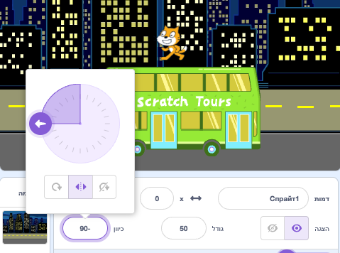
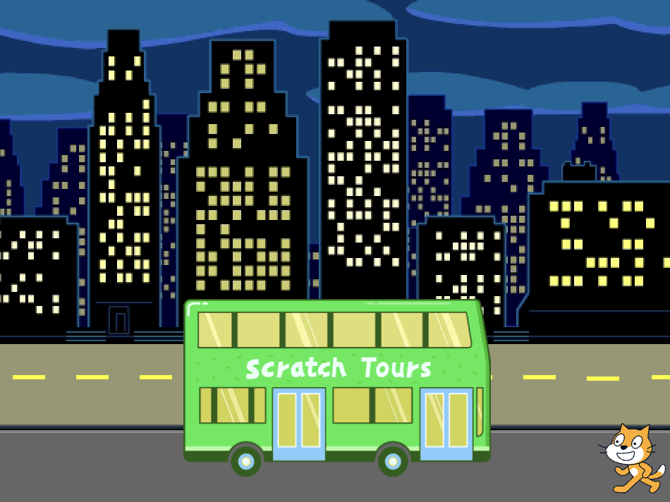
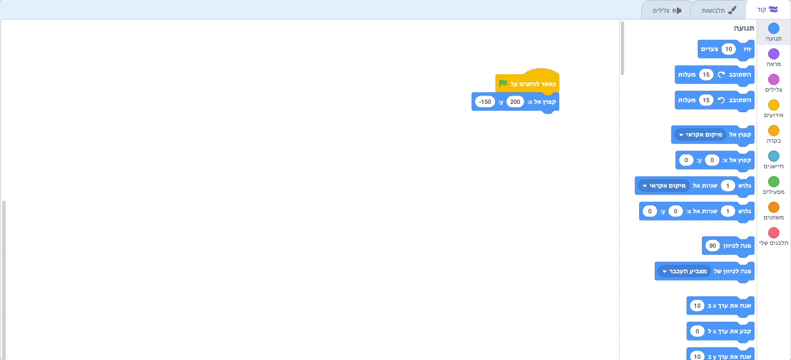

## חתול הסקראץ׳ תופס את האוטובוס

<div style="display: flex; flex-wrap: wrap">
<div style="flex-basis: 200px; flex-grow: 1; margin-right: 15px;">
הנפשו את חתול הגירוד כך שיופיע בצד ימין של הבמה ולכו לאוטובוס על ידי חזרה על תנועה קטנה מספר פעמים בלולאה. 
</div>
<div>

[חתול הסקראץ׳ הולך לאוטובוס.](images/cat-catches-bus.png){:width="300px"}

</div>
</div>

### הכניסו את חתול הסקראץ׳ לעמדת ההתחלה שלו

--- task ---

לחץ על המאפיין **כיוון** בחלונית הספרייט. סובב את החץ כדי להצביע על `-90`. לאחר מכן, לחצו על הסמל **שמאל/ימין** באמצע כדי לשנות את סגנון הסיבוב ל `שמאל-ימין` כדי למנוע מחתול הגירוד להתהפך:



--- /task ---

--- task ---

גררו את חתול הסקראץ׳ לצד הימני התחתון של הבמה.



**טיפ:** אם תנסו למקם ספרייט מחוץ לבמה, הוא יחזור למיקומו האחרון בבמה.

--- /task ---

--- task ---

הוסף קוד כדי להביא את חתול הסקרץ׳ למיקום ההתחלתי שלו:


```blocks3
when flag clicked
go to x:(200) y:(-150) // bottom right-hand side
```

--- /task ---

--- task ---

**בדיקה:** גררו את חתול הסקראץ׳ למיקום חדש, לאחר מכן לחצו על הבלוק `עבור אל x: y:`{:class="block3motion"}. חתול הסקראץ׳ צריך לחזור לצד ימין התחתון בכל פעם.

--- /task ---

### הנפשת חתול הסקראץ׳

תוסיפו קוד בלולאה של `חזרה`{:class="block3control"} כדי לגרום לחתול הסקרץ' לחזור על מספר קטן של שלבים פעמים רבות. זה יגרום לחתול הסקראץ׳ להיראות מונפש.

--- task ---

הוסף בלוק `חזרה`{:class="block3control"} `10` , לאחר מכן גרור בלוק `הזזה`{:class="block3motion"} `10` `צעדים`{:class="block3motion"} לתוכו:




```blocks3
when flag clicked
go to x:(200) y:(-150) // bottom right-hand side
+ repeat (10) // try different numbers
move (5) steps //  5 is a good walking speed
end
```

--- /task ---

--- task ---

**בדיקה:** לחץ על הדגל הירוק. נסו לשנות את המספרים בבלוק `חזור על`{:class="block3control"} `10` כך שחתול הגירוד יעצור ליד האוטובוס.

--- /task ---

לחלק מהספרייטים יש יותר מתלבושת אחת. תשתמשו בתלבושות של הספרייט **חתול הסקראץ׳** כדי ליצור אנימציה של הליכה של חתול הסקראץ׳.

--- task ---

לחץ על הכרטיסייה **תלבושות** . לספרייט **חתול הסקראץ׳** יש שתי תלבושות, ויחד ניתן להשתמש בהן לביצוע תנועת הליכה.

--- /task ---

--- task ---

לחץ על הכרטיסייה **קוד**. הוסף `תחפושת הבאה`{:class="block3looks"} בלוק בתוך `החזרה`{:class="block3control"} בלוק:


```blocks3
when flag clicked
go to x:(200) y:(-150) // bottom right-hand side
repeat (20) // try different numbers
move (5) steps //  5 is a good walking speed
+ next costume 
end
```
--- /task ---

--- task ---

**מבחן:** לחצו על הדגל הירוק, וחתול הסקראץ׳ ילך לאוטובוס.

--- /task ---

### הסתר את חתול הסקראץ׳

--- task ---

הוסף בלוק כדי `להסתיר`{:class="block3looks"} את חתול הסקראץ׳ כשהוא מגיע לאוטובוס:


```blocks3
when flag clicked
go to x:(200) y:(-150) // bottom right-hand side
repeat (20) // try different numbers
move (5) steps //  5 is a good walking speed
next costume 
end
+ hide
```

--- /task ---

--- task ---

**בדיקה:** לחצו שוב על הדגל הירוק, ותראו שחתול הסקראץ׳ נעלם.

--- /task ---

### הצג את חתול הסקראץ׳

--- task ---

הוסף בלוק `הצג`{:class="block3looks"} כך שחתול הסקראץ׳ יופיע לפני שהם הולכים לאוטובוס:


```blocks3
when flag clicked
go to x:(200) y:(-150) // bottom right-hand side
+ show
repeat (20) // try different numbers
move (5) steps //  5 is a good walking speed
next costume 
end
hide
```

**טיפ:** כשמשתמשים בבלוק `הסתר`{:class="block3looks"}, צריך להוסיף גם בלוק `הצג`{:class="block3looks"} כדי לוודא שספרייט גלוי כשצריך.

--- /task ---

--- task ---

**בדיקה:** לחצו על הדגל הירוק כדי לבדוק את הפרויקט שלכם, וודאו שחתול הסקראץ׳ מופיע.

--- /task ---

