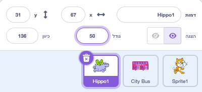
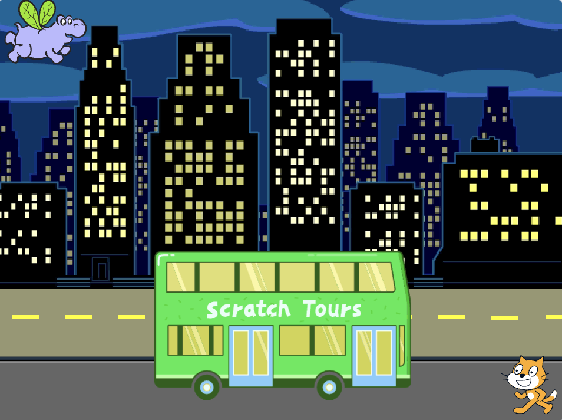

## ההיפופוטם עף לאוטובוס

<div style="display: flex; flex-wrap: wrap">
<div style="flex-basis: 200px; flex-grow: 1; margin-right: 15px;">
הוסיפו ספרייט היפופוטם שעף לאוטובוס.
</div>
<div>

[ההיפופוטם עף לאוטובוס.](images/hippo-flies.png){:width="300px"}

</div>
</div>

### תן להיפופוטם עמדת התחלה

--- task ---

הוסף את הספרייט **Hippo1** לפרויקט שלך.

שנה את **הגודל** של הספרייט **Hippo1** :



--- /task ---

--- task ---

גררו את ההיפופוטם לצד שמאל העליון של הבמה.



--- /task ---

--- task ---

הוסף קוד כדי להביא את ההיפופוטם לעמדת ההתחלה שלו:

```blocks3
when flag clicked
go to x: [-200] y: [150] // top left-hand side
```

**טיפ:** הקואורדינטות `x`{:class="block3motion"} ו- `y`{:class="block3motion"} בבלוק `עבור אל x: y:`{:class="block3motion"} יהיו המיקום הנוכחי של ההיפופוטם, כך שאין צורך להקליד אותן.

--- /task ---

### לגרום להיפופוטם לנפנף בכנפיו ולעוף

--- task ---

הוסף קוד כדי לגרום להיפופוטם לעוף לכיוון **אוטובוס העירוני**:

```blocks3
when flag clicked
go to x: [-200] y: [150] 
+repeat [100] 
point towards (City Bus v) // change from mouse-pointer
move [3] steps
next costume
+end
```

--- /task ---

--- task ---

**בדיקה:** לחצו על הדגל הירוק ובדקו שההיפופוטם עף לאוטובוס. ניתן לשנות את המספר בבלוק `חזור על`{:class="block3control"} כדי לגרום להיפופוטם לעצור בדיוק במקום הנכון.

--- /task ---

### Show and hide the hippo

--- task ---

הוסף בלוקים `הצג`{:class="block3looks"} ו- `הסתר`{:class="block3looks"}:

```blocks3
when flag clicked
go to x: [-200] y: [150] 
+ show
repeat [90] 
point towards (City Bus v)
move [3] steps
next costume
end
+ hide
```

--- /task ---

--- task ---

**בדיקה:** לחץ על הדגל הירוק. ההיפופוטם יעוף וייכנס לאוטובוס.

--- /task ---
