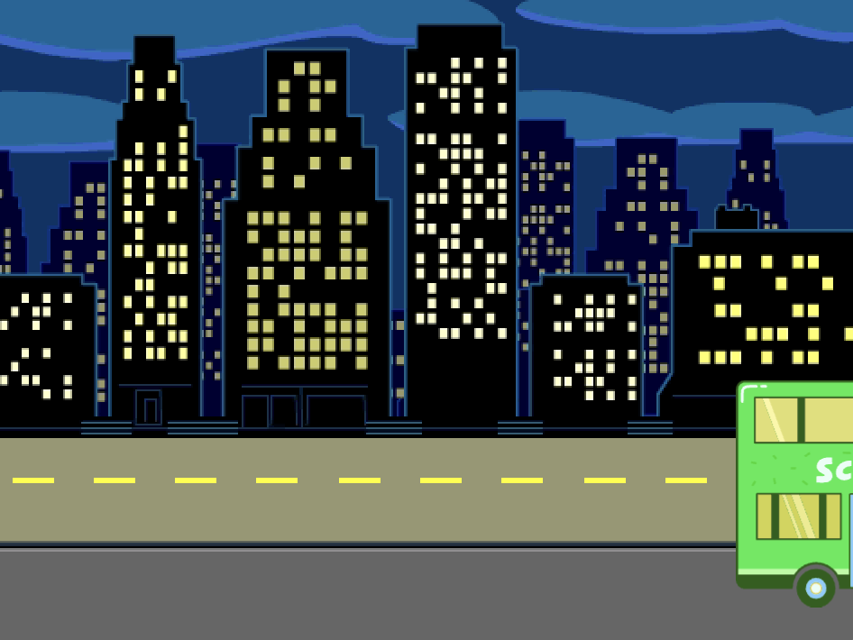
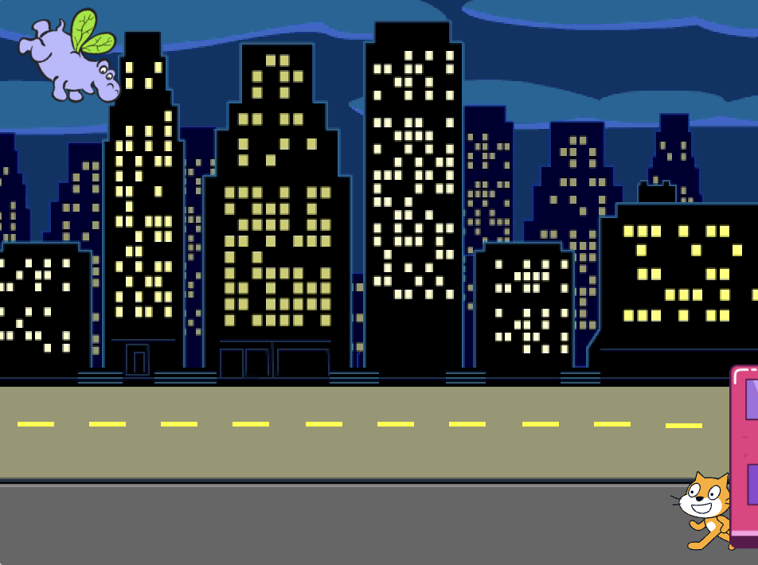

## האוטובוס יוצא

<div style="display: flex; flex-wrap: wrap">
<div style="flex-basis: 200px; flex-grow: 1; margin-right: 15px;">
הוסף עוד בלוקים כדי שהאוטובוס ייסע.
</div>
<div>

{:width="300px"}

</div>
</div>

### הנפשת האוטובוס

--- task ---

בחר את הספרייט **אוטובוס עירוני** .


--- /task ---

--- task ---

הוסף קוד כדי לגרום לאוטובוס לנסוע ימינה ארבע שניות לאחר לחיצה על הדגל הירוק.


```blocks3
when flag clicked 
wait [4] seconds // change 1 to 4
```

--- /task ---

--- task ---

גררו את האוטובוס שלכם לצד ימין של הבמה. זהו המיקום `x`{:class="block3motion"} ו- `y`{:class="block3motion"} שאליו האוטובוס יגלוש ``{:class="block3motion"}.



**טיפ:** אם תזיזו את האוטובוס יותר מדי ימינה, הוא יקפוץ חזרה. נסה שוב, אבל אל תזיז את זה כל כך רחוק.

--- /task ---

--- task ---

הוסף בלוק `גלישה`{:class="block3motion"} `2` `שניות ל-x: y:`{:class="block3motion"} מתחת לבלוק `המתן`{:class="block3control"}.

הקואורדינטות `x`{:class="block3motion"} ו- `y`{:class="block3motion"} בפרויקט שלך עשויות להיות מעט שונות ויהיו המיקום המדויק שאליו גררת את האוטובוס.


```blocks3
when flag clicked 
wait [4] seconds // change 1 to 4
+glide [2] secs to x: [320] y: [-100] // right-hand side of the Stage
```

--- /task ---

--- task ---

**בדיקה:** לחץ על הדגל הירוק. חתול הסקראץ׳ וההיפופוטם יעברו לאוטובוס, והאוטובוס ייסע ימינה לאחר ארבע שניות.

--- /task ---

### הסתר והצג את האוטובוס

--- task ---

הוסף בלוק `הסתר`{:class="block3looks"} כדי לגרום לאוטובוס להיראות כאילו הוא נוסע מהבמה:


```blocks3
when flag clicked 
wait [4] seconds // change 1 to 4
glide [2] secs to x: [320] y: [-100]
+ hide
```
--- /task ---

--- task ---

**בדיקה:** לחץ על הדגל הירוק. האוטובוס יסתתר כעת לאחר הנסיעה. אתה זוכר איך לוודא שספרייט מופיע שוב כשאתה לוחץ על הדגל הירוק?

--- /task ---

--- task ---

הוסף בלוק `הצג`{:class="block3looks"} לסקריפט `שלך כאשר הדגל הירוק נלחץ`{:class="block3events"} כדי לגרום לאוטובוס להופיע כשאתה מפעיל את הפרויקט שלך:


```blocks3
when flag clicked
go to x: (0) y: (-100)
go to [back v] layer
set [color v] effect to (85) // try numbers up to 200
+show
```

--- /task ---

--- task ---

**בדיקה:** לחצו על הדגל הירוק וצפו באנימציה שלכם. האוטובוס אמור להופיע במרכז הבמה ולאחר מכן לנסוע ימינה ולהיעלם.

האם כולם באוטובוס כשהוא יוצא? ניתן לשנות את משך הזמן שהאוטובוס ממתין, במידת הצורך.

--- /task ---
