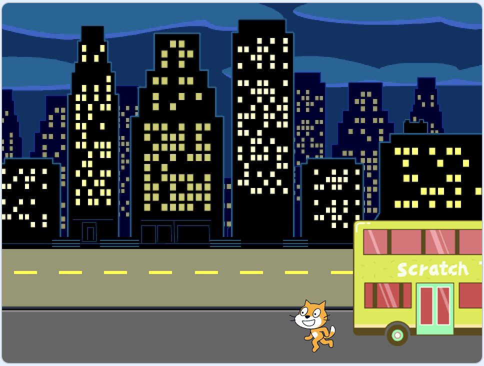
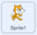
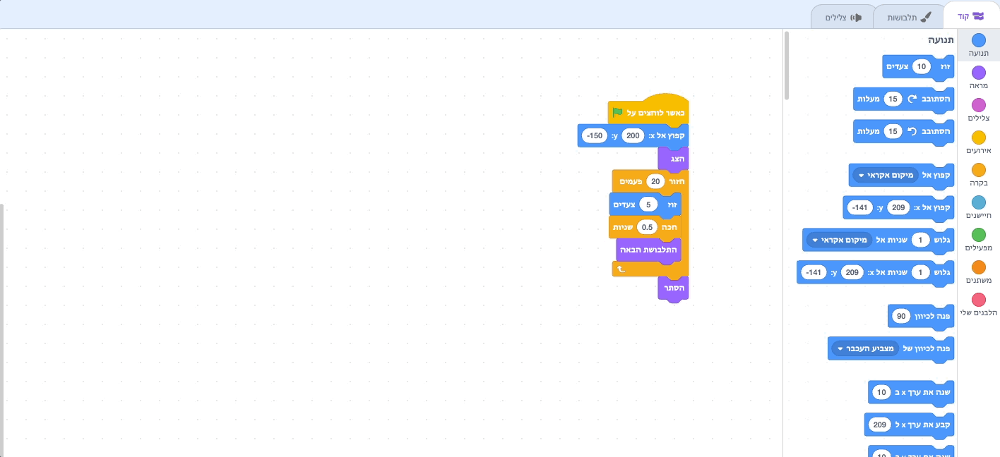
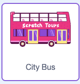

## פספסת את האוטובוס

<div style="display: flex; flex-wrap: wrap">
<div style="flex-basis: 200px; flex-grow: 1; margin-right: 15px;">
מה אם חתול הסקראץ׳ לא רץ מספיק מהר כדי לתפוס את האוטובוס?
</div>
<div>

{:width="300px"}

</div>
</div>

### תגרום לחתול סקראט לפספס את האוטובוס

--- task ---

בחר את הספרייט **חתול סקראץ׳** והוסף בלוק `המתן`{:class="block3control"}:



```blocks3
when flag clicked
go to x:(200) y:(-150) 
show
repeat (20) // try different numbers
move (5) steps 
next costume 
+ wait (1) seconds
end
hide
```
--- /task ---

--- task ---

**בדיקה:** לחץ על הדגל הירוק. חתול הסקראץ׳ ילך לאט מדי ויפספס את האוטובוס!

--- /task ---

### תגרום לחתול סקראט לתפוס את האוטובוס

--- task ---

תרצו השהיות של פחות משנייה אחת. 0.5 זה חצי שנייה, 0.25 זה רבע שנייה, ו-0.1 זה עשירית שנייה.

שנה את ההשהיה בבלוק `ההמתנה`{:class="block3control"}:


```blocks3
wait (0.2) seconds // try 0.1, 0.5, 0.05
```

**בדיקה:** לחצו על הדגל הירוק, וחתול הגירוד ילך מהר יותר. בחר את ההשהיה שאתה הכי אוהב.

--- /task ---

### בחר אם חתול סקראץ׳ יתפוס או יפספס את האוטובוס

--- task ---

אם אתם רוצים שחתול הסקרץ' **יפספס את האוטובוס**, הסירו את הבלוק `הסתר`{:class="block3looks"} מהקוד שלכם כך שחתול הסקרץ' יישאר על הבמה:




```blocks3
when flag clicked
go to x:(200) y:(-150) 
show
repeat (20) 
move (5) steps 
next costume
wait (0.5) seconds 
end
-hide
```
--- /task ---

--- task ---

אם אתם רוצים שחתול הסקראץ׳ **יתפוס את האוטובוס**, גרמו לאוטובוס להמתין זמן רב יותר לפני שהוא יוצא:



```blocks3
when flag clicked 
+wait [4] seconds // change from 4 to 6
glide [2] secs to x: [320] y: [-100] // right-hand side of the Stage
hide
```

תצטרכו להחזיר את הבלוק `הסתר`{:class="block3looks"} לקוד של הספרייט **חתול הסקראץ׳** אם הסרתם אותו ואתם רוצים שחתול הסקראץ׳ יתפוס את האוטובוס בהצלחה.

--- /task ---

--- task ---

בצע שינויים עד שתגרום לאנימציה לעבוד כרצונך.

--- /task ---

<p style="border-left: solid; border-width:10px; border-color: #0faeb0; background-color: aliceblue; padding: 10px;">
כשעובדים על פרויקט, לעתים קרובות חוזרים אחורה ומשנים או משפרים את הקוד שלכם כשמגיעים רעיונות חדשים. 
</p>


