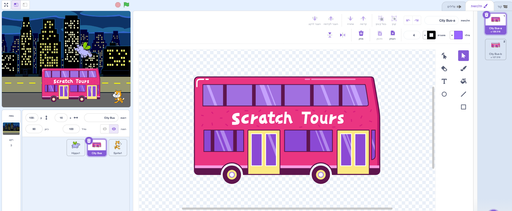
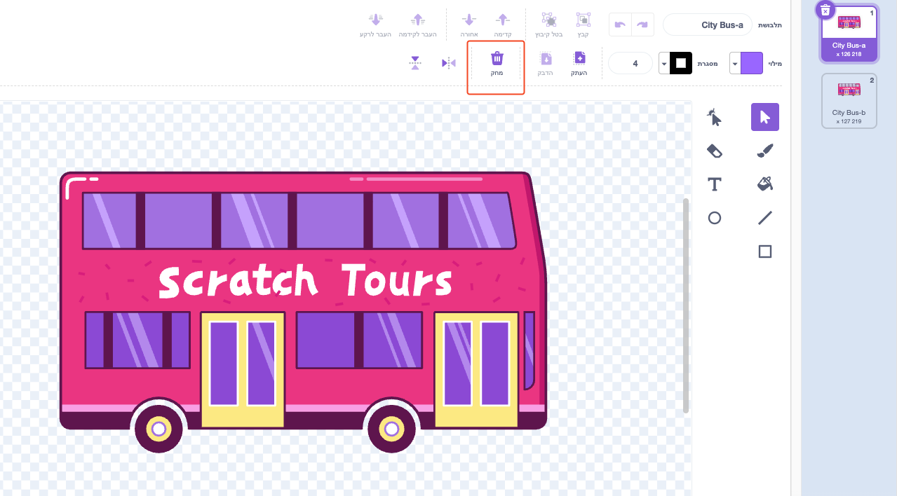
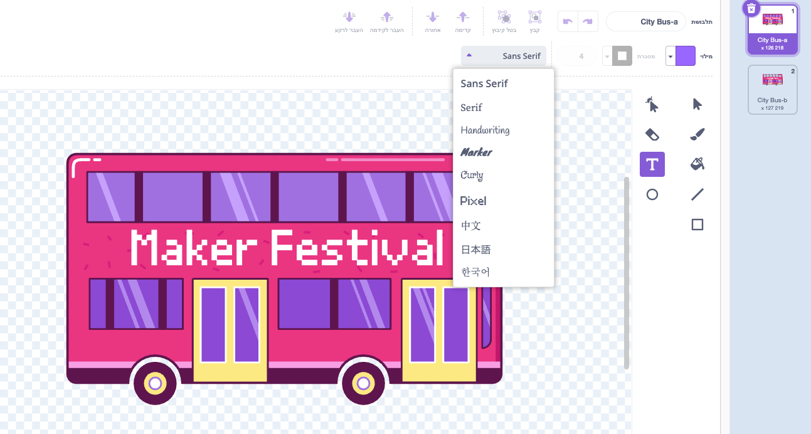
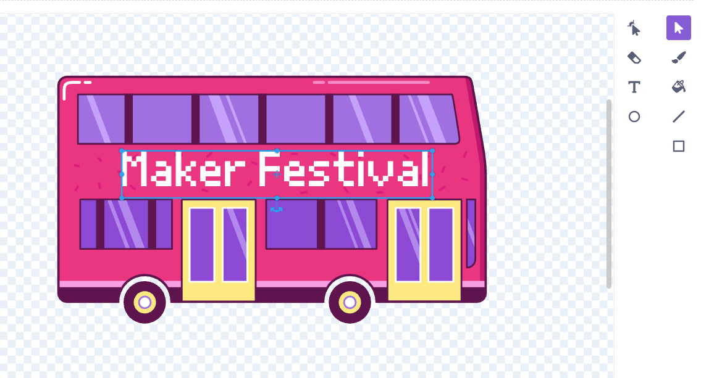

## שנה את היעד

הכיתוב על האוטובוס אומר "סיורי סקראץ׳", אבל אתם יכולים לשנות את היעד לבחירתכם. לאן אתה רוצה שהאוטובוס שלך ייסע?  

[האוטובוס עם הטקסט "פסטיבל היוצרים".](images/maker-bus.png){:width="300px"}

### עריכת ספרייט אוטובוס העירוני

--- task ---

בחרו את הספרייט **אוטובוס עירוני** ולחצו על הכרטיסייה **תחפושות**:

--- /task ---

--- task ---

לחצו על הטקסט הלבן "סיורי סקראץ׳" כדי לבחור אותו, ולאחר מכן לחצו על **מחק** כדי להסירו.

**טיפ:** ניתן להשתמש בסמל **מחק** בעורך הציור או במקש <kbd>מחיקה</kbd> במקלדת.

--- /task ---

--- task ---

בחר בכלי **טקסט** (כתיבה).

לחץ על האוטובוס במקום שבו ברצונך שהטקסט שלך יתחיל, והקלד את היעד שבחרת.

כדי לשנות את הגופן (סגנון כתיבה), ניתן ללחוץ על התפריט הנפתח **גופן**:

--- /task ---

--- task ---

לחץ על הכלי **בחירה** (חץ), לאחר מכן גרור את הטקסט כדי למקם אותו על האוטובוס.

--- /task ---

