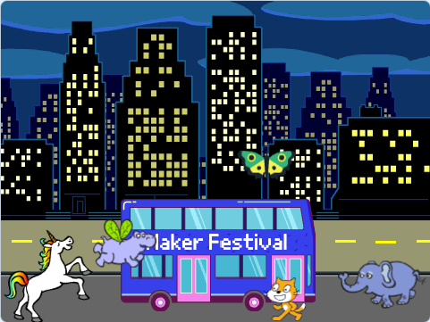

## שדרגו את הפרויקט שלכם

עכשיו, תוכלו להוסיף ספרייט לבחירתכם לאנימציה שלכם. תצטרכו להוסיף קוד כדי לגרום לספרייט שלכם `לעבור ל-`{:class="block3motion"} נקודת התחלה, `להצביע על`{:class="block3motion"} בכיוון הנכון, ולאחר מכן `לחזור על`{:class="block3control"} `להזיז`{:class="block3motion"} ו- `לתחפושת הבאה`{:class="block3looks"} בלוקים כדי להגיע לאוטובוס.

**טיפ:** כשלוחצים על **בחירת ספרייט**, אפשר להחזיק את סמן העכבר מעל ספרייט כדי לראות את התלבושות שלו, או בחלק מהמכשירים הניידים, אפשר ללחוץ והחזק על ספרייט כדי לראות את התלבושות שלו (אם מופיע חלון כשלוחצים ומחזיקים על ספרייט, הקישו בצד המסך כדי לסגור את החלון ולראות את התלבושות). התבוננות בתלבושות של הספרייטים יכולה לעזור לך למצוא ספרייט שמתאים היטב לאנימציה.

{:width="300px"}

אתם יכולים להשתמש בכל אחד מהבלוקים שלמדתם עליהם בפרויקט הזה, כמו גם באלה שאתם כבר מכירים:

```blocks3
when flag clicked

go to x: [0] y: [0] // drag the sprite to choose x and y

show

hide

glide [2] secs to x: [0] y: [-100] // bottom middle of the Stage

repeat [30]
end

point towards (City Bus v)

point in direction (180) // point down

set rotation style [left-right v]

move [3] steps

next costume

start sound [clown honk v]

wait [0.1] seconds // short delay

set [color v] effect to [50] // up to 200
```

--- collapse ---
---
title: Completed project
---

ניתן לצפות בפרויקט שהושלם [כאן](https://scratch.mit.edu/projects/724160134/){:target="_blank"}.

--- /collapse ---

ניתן גם 'לערוך מחדש' את הפרויקט כדי לבצע שינויים שתרצו. אפשר להוסיף אפקטים קוליים לאוטובוס או לספרייטים אחרים, או להגדיר את אפקט הצבע של האוטובוס. אחד הספרייטים יכול לפספס את האוטובוס ולא להסתתר.

תודה ליצרנית הדיגיטלית ליילה על ששלחה את השדרוג הנפלא הזה!


--- save ---
