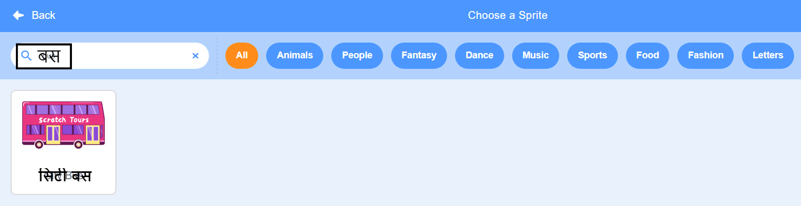
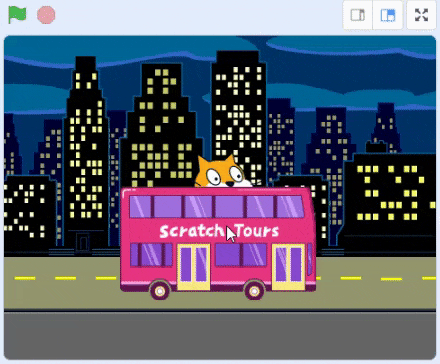
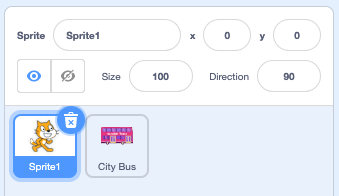

## अपना बस दृश्य बनाएं

<div style="display: flex; flex-wrap: wrap">
<div style="flex-basis: 200px; flex-grow: 1; margin-right: 15px;">
एक पृष्ठभूमि चुनें और एक बस स्प्राइट जोड़ें।
</div>
<div>

{:width="300px"}

</div>
</div>

### स्टार्टर प्रोजेक्ट खोलें

--- task ---

[बस को पकड़ें स्टार्टर प्रोजेक्ट](https://scratch.mit.edu/projects/582214330/editor){:target="_blank"} खोलें।  Scratch दूसरे ब्राउज़र टैब में खुलेगा।

[[[working-offline]]]

--- /task ---

### एक पृष्ठभूमि चुनें

--- task ---

Stage वाले हिस्सा ( जो स्क्रीन के निचले दाएं कोने में हैं) पर  **Choose a Backdrop** पर क्लिक करें (या टैबलेट हो तो, टैप करें):


--- /task ---

--- task ---

**Outdoors** श्रेणी पर क्लिक करें। एक बैकड्रॉप को जोड़ें जो आपकी बस के लिए एक अच्छा स्टार्टिंग पॉइंट हो सकता हो:


--- /task ---

### एक स्प्राइट चुनें

--- task ---

**Choose a Sprite** पर क्लिक करें :


--- /task ---

--- task ---

उपर​ की तरफ सर्च बॉक्स में `bus` टाइप करें:



अपने प्रोजेक्ट में **City Bus** स्प्राइट को जोड़े।

--- /task ---

### अपनी बस को एक प्रारंभिक स्थिति दें

--- task ---

सुनिश्चित करें कि स्टेज के नीचे स्प्राइट सूची में **सिटी बस** स्प्राइट का चयन किया गया है।

`Events`{:class="block3events"} ब्लॉक मेनू से `जब ग्रीन फ्लैग क्लिक किया गया`{:class="block3events"} ब्लॉक को कोड क्षेत्र में खींचें:


```blocks3
when flag clicked
```

--- /task ---

--- task ---

स्टेज पर बस को अच्छी स्थिति में खींचें:


बस के **x** और **y** निर्देशांक (स्थिति का वर्णन करने के लिए प्रयुक्त संख्या) चरण के नीचे स्प्राइट फलक में दिखाए गए हैं:


--- /task ---

--- task ---

एक `go to x: y:`{:class="block3motion"} ब्लॉक जोड़ें:


```blocks3
when flag clicked
+go to x: (0) y: (-100)
```

जो संख्याएं `go to x: y:`{:class="block3motion"} ब्लॉक में जाती हैं, वो बस के वर्तमान x और y निर्देशांक हैं। आपके प्रोजेक्ट में संख्याएँ थोड़ी अलग हो सकती हैं।

--- /task ---

--- task ---

**परीक्षण:** बस को स्टेज पर कहीं भी खींचें और फिर हरे झंडे पर क्लिक करें। बस को हमेशा अपनी शुरुआती स्थिति में जाना चाहिए।



--- /task ---

### बस को कैरेक्टर स्प्राइट्स के पीछे ले जाएं

--- task ---

यह सुनिश्चित करने के लिए कि **सिटी बस** स्प्राइट हमेशा सभी करैक्टर स्प्राइट्स के पीछे है, `go to front layer`{:class="block3looks"} ब्लॉक में जोड़ें, फिर `front`{:class="block3looks"} पर क्लिक करें। और इसे `back`{:class="block3looks"} में बदलें:


```blocks3
when flag clicked
go to x: (0) y: (-100)
+ go to [back v] layer
```

**टिप:** अगर आप `go to front layer`{:class="block3looks"} ब्लॉक को नहीं देख सकते हैं तो फिर आपको `Looks`{:class="block3looks"} ब्लॉक मेनू में नीचे स्क्रॉल करना होगा।

--- /task ---

### बस का रंग बदलें

--- task ---

आप बस का रंग बदल सकते हैं:


```blocks3
when flag clicked
go to x: (0) y: (-100)
go to [back v] layer
+set [color v] effect to (50) // try numbers up to 200
```

--- /task ---

### स्क्रैच कैट का आकार बदलें

--- task ---

स्क्रैच कैट सभी नई स्क्रैच परियोजनाओं में स्प्राइट सूची में **Sprite1** के रूप में दिखाई देती है। स्क्रैच कैट को एनिमेट (animate) करने तैयार होने के लिए स्प्राइट सूची में से **Sprite1** स्प्राइट पर क्लिक करें:



**टिप:** यदि आपने गलती से **Sprite1** (स्क्रैच कैट) स्प्राइट को डिलीट कर दिया है, तो आप **Choose a Sprite** आइकन पर क्लिक कर सकते हैं और `कैट`को खोज सकते हैं।

--- /task ---

--- task ---

स्प्राइट वाले हिस्से में, **आकार** गुण को क्लिक करें और स्क्रैच कैट के आकार को `50`में बदलें:


--- /task --- 
