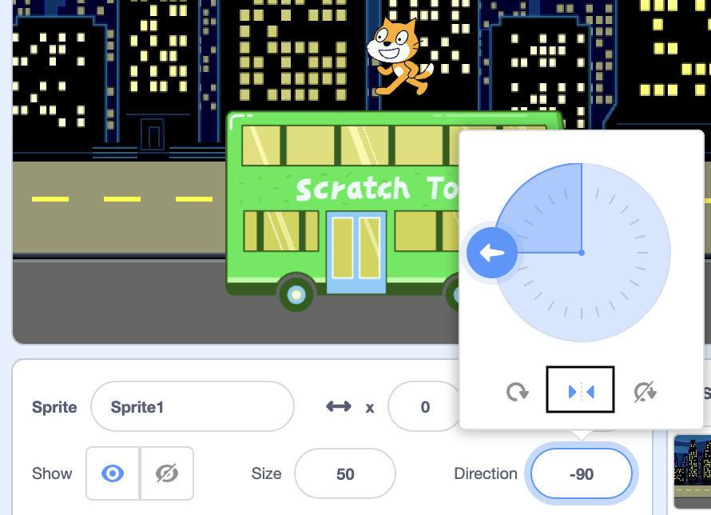
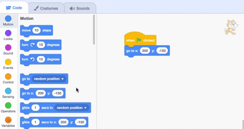

## Scratch Cat बस पकड़ती है

<div style="display: flex; flex-wrap: wrap">
<div style="flex-basis: 200px; flex-grow: 1; margin-right: 15px;">
Scratch Cat को स्टेज के **दाईं ओर** प्रकट होने के लिए एनिमेट करें और **लूप** में कई बार एक छोटी गतिविधि दोहराते हुए बस तक पैदल चलें। 
</div>
<div>

{:width="300px"}

</div>
</div>

### Scratch Cat को उसकी शुरुआती स्थिति में लाएं

--- task ---

Sprite वाले हिस्से में **Direction** प्रॉपर्टी  पर क्लिक करें। `-90` को इंगित करने के लिए तीर घुमाएँ। फिर,  बीच में दिए गए **Left/Right** आइकन पर क्लिक करें रोटेशन शैली को `left-right` में बदलने के लिए जिससे Scratch Cat को उल्टा होने से रोका जा सके:



--- /task ---

--- task ---

Scratch Cat को Stage के नीचे दाईं ओर ड्रैग करें।


**टिप:** यदि आप किसी स्प्राइट को Stage से बाहर रखने की कोशिश करते हैं, तो वह Stage पर अपनी अंतिम स्थिति में वापस चला जाएगा।

--- /task ---

--- task ---

Scratch Cat को उनकी शुरुआती स्थिति में लाने के लिए कोड जोड़ें:


```blocks3
when flag clicked
go to x:(200) y:(-150) // bottom right-hand side
```

--- /task ---

--- task ---

**परीक्षण:** Scratch Cat को नई स्थिति में खींचें, फिर अपने `go to x: y:`{:class="block3motion"} ब्लॉक पर क्लिक करें। Scratch Cat को हर बार नीचे दाईं ओर वापस जाना चाहिए।

--- /task ---

### Scratch Cat को एनिमेट करें

Scratch Cat को कुछ चरणों को कई बार दोहराने के लिए आप एक `repeat`{:class="block3control"} लूप में कोड जोड़ेंगे। इससे Scratch Cat एनिमेटिड दिखाई देगी।

--- task ---

`repeat`{:class="block3control"} `10` ब्लॉक जोड़ें, फिर `move`{:class="block3motion"} `10` `steps`{:class="block3motion"} ब्लॉक को इसके अंदर खींचें:




```blocks3
when flag clicked
go to x:(200) y:(-150) // bottom right-hand side
+ repeat (10) // try different numbers
move (5) steps //  5 is a good walking speed
end
```

--- /task ---

--- task ---

**परिक्षण:** हरे झंडे पर क्लिक करें। `repeat`{:class="block3control"} `10` ब्लॉक में संख्या बदलने की कोशिश करें ताकि Scratch Cat बस में रुक जाए।

--- /task ---

कुछ स्प्राइट्स की एक से अधिक पोशाकें होती हैं। Scratch Cat के चलने का एनीमेशन बनाने के लिए आप **Scratch Cat** स्प्राइट की पोशाक का उपयोग करेंगे।

--- task ---

**Costumes** टैब पर क्लिक करें। **Scratch Cat** स्प्राइट में दो पोशाकें होती हैं, और एक साथ चलने के लिए उनका उपयोग किया जा सकता है।

--- /task ---

--- task ---

**कोड** टैब पर क्लिक करें। Add a `next costume`{:class="block3looks"} block inside the `repeat`{:class="block3control"} block:


```blocks3
when flag clicked
go to x:(200) y:(-150) // bottom right-hand side
repeat (20) // try different numbers
move (5) steps //  5 is a good walking speed
+ next costume 
end
```
--- /task ---

--- task ---

**परीक्षण:** हरे झंडे पर क्लिक करें, और Scratch Cat बस की ओर चल देगी।

--- /task ---

### Scratch Cat को छुपाएं

--- task ---

बस में पहुंचने पर Scratch Cat को `hide`{:class="block3looks"} करने के लिए एक ब्लॉक जोड़ें:


```blocks3
when flag clicked
go to x:(200) y:(-150) // bottom right-hand side
repeat (20) // try different numbers
move (5) steps //  5 is a good walking speed
next costume 
end
+ hide
```

--- /task ---

--- task ---

**टेस्ट:** फिर से हरे झंडे पर क्लिक करें, और आप देखेंगे कि Scratch Cat अब गायब हो गई है।

--- /task ---

### Scratch Cat दिखायें

--- task ---

एक `show`{:class="block3looks"} ब्लॉक जोड़ें ताकि उनके बस तक जाने से पहले स्क्रैच कैट दिखाई दे:


```blocks3
when flag clicked
go to x:(200) y:(-150) // bottom right-hand side
+ show
repeat (20) // try different numbers
move (5) steps //  5 is a good walking speed
next costume 
end
hide
```

**टिप:** जब आप `hide`{:class="block3looks"} ब्लॉक का उपयोग करते हैं, तो आपको एक `show`{:class="block3looks"} ब्लॉक भी जोड़ना होगा, यह सुनिश्चित करने के लिए कि स्प्राइट तब दिखाई दे जब इसकी आवश्यकता हो

--- /task ---

--- task ---

**टेस्ट:** अपने प्रोजेक्ट का परीक्षण करने के लिए हरे झंडे पर क्लिक करें, और सुनिश्चित करें कि Scratch Cat दिखाई दे।

--- /task ---

