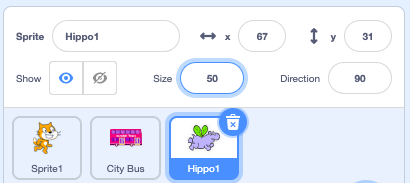

## हिप्पो बस के लिए उड़ान भरता है

<div style="display: flex; flex-wrap: wrap">
<div style="flex-basis: 200px; flex-grow: 1; margin-right: 15px;">
एक हिप्पो स्प्राइट जोड़ें जो बस के लिए उड़ान भरता है।
</div>
<div>

{:width="300px"}

</div>
</div>

### हिप्पो को शुरुआती स्थिति दें

--- task ---

अपने प्रोजेक्ट में **Hippo1** स्प्राइट जोड़ें।

**Hippo1** स्प्राइट का **आकार** बदलें:



--- /task ---

--- task ---

हिप्पो को Stage के ऊपर बाईं ओर खींचें।


--- /task ---

--- task ---

हिप्पो को उनकी प्रारंभिक स्थिति में लाने के लिए कोड जोड़ें:

```blocks3
when flag clicked
go to x: [-200] y: [150] // top left-hand side
```

**टिप:** `x`{:class="block3motion"} और `y`{:class="block3motion"} निर्देशांक `go to x: y:`{:class="block3motion"} ब्लॉक में होंगे हिप्पो की वर्तमान स्थिति, इसलिए आपको उन्हें टाइप करने की ज़रूरत नहीं है।

--- /task ---

### हिप्पो को अपने पंख फड़फड़ाने और उड़ने के लिए तैयार करो

--- task ---

हिप्पो को **सिटी बस**की ओर उड़ाने के लिए कोड जोड़ें:

```blocks3
when flag clicked
go to x: [-200] y: [150] 
+repeat [100] 
point towards (City Bus v) // change from mouse-pointer
move [3] steps
next costume
+end
```

--- /task ---

--- task ---

**टेस्ट:** हरे झंडे पर क्लिक करें और जांचें कि हिप्पो बस के लिए उड़ान भरता है। हिप्पो को सही जगह पर रोकने के लिए आप `repeat`{:class="block3control"} ब्लॉक में संख्या बदल सकते हैं।

--- /task ---

### बस दिखाएँ और छुपाएँ

--- task ---

`show`{:class="block3looks"} और `hide`{:class="block3looks"} ब्लॉक जोड़ें:

```blocks3
when flag clicked
go to x: [-200] y: [150] 
+ show
repeat [90] 
point towards (City Bus v)
move [3] steps
next costume
end
+ hide
```

--- /task ---

--- task ---

**परिक्षण:** हरे झंडे पर क्लिक करें। हिप्पो उड़ जाएगा और बस में प्रवेश करेगा।

--- /task ---
