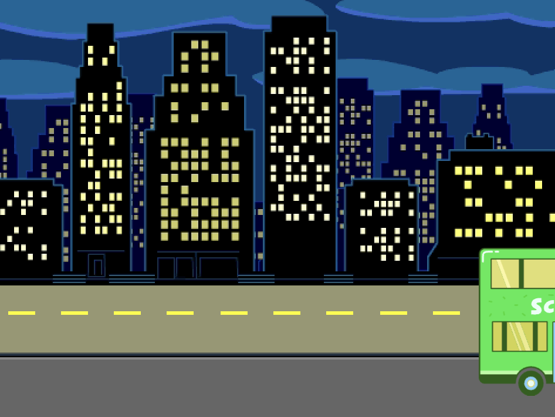

## बस छूटती है

<div style="display: flex; flex-wrap: wrap">
<div style="flex-basis: 200px; flex-grow: 1; margin-right: 15px;">
बस को चलाने के लिए और ब्लॉक जोड़ें।
</div>
<div>

{:width="300px"}

</div>
</div>

### बस को एनिमेट करें

--- task ---

**City Bus** स्प्राइट चुनें।


--- /task ---

--- task ---

हरे झंडे पर क्लिक करने के चार सेकंड बाद बस को दाहिनी ओर चलाने के लिए कोड जोड़ें।


```blocks3
when flag clicked 
wait [4] seconds // change 1 to 4
```

--- /task ---

--- task ---

अपनी बस को Stage के दाईं ओर खींचें। यह `x`{:class="block3motion"} और `y`{:class="block3motion"} निर्देशांक है जहां तक बस `ग्लाइड`{:class="block3motion"} करेगी।


**टिप:** यदि आप बस को बहुत दूर दाईं ओर ले जाते हैं, तो वह वापस उछल जाएगी। फिर से कोशिश करें, लेकिन इसे इतनी दूर न ले जाएं।

--- /task ---

--- task ---

`glide`{:class="block3motion"} `2` `secs to x: y:`{:class="block3motion"} ब्लॉक को `wait`{:class="block3events"} ब्लॉक के नीचे जोड़ें।

आपके प्रोजेक्ट में `x`{:class="block3motion"} और `y`{:class="block3motion"} निर्देशांक थोड़े अलग हो सकते हैं और ठीक वही स्थिति होगी जहां आपने बस को खींचा था।


```blocks3
when flag clicked 
wait [4] seconds // change 1 to 4
+glide [2] secs to x: [320] y: [-100] // right-hand side of the Stage
```

--- /task ---

--- task ---

**परिक्षण:** हरे झंडे पर क्लिक करें। Scratch Cat और हिप्पो बस में चले जाएंगे, और चार सेकंड के बाद बस दाईं ओर चली जाएगी।

--- /task ---

### बस को छुपाएं और दिखाएं

--- task ---

एक `hide`{:class="block3looks"} ब्लॉक जोड़ें ताकि ऐसा लगे कि बस स्टेज से बाहर जा रही है:


```blocks3
when flag clicked 
wait [4] seconds // change 1 to 4
glide [2] secs to x: [320] y: [-100]
+ hide
```
--- /task ---

--- task ---

**परिक्षण:** हरे झंडे पर क्लिक करें। चलने के बाद बस अब छिप जाएगी। क्या आपको याद है कि जब आप हरे झंडे पर क्लिक करते हैं तो यह कैसे सुनिश्चित किया जाता है कि स्प्राइट फिर से दिखाई दे?

--- /task ---

--- task ---

एक `show`{:class="block3looks"} ब्लॉक आपके `when green flag clicked`{:class="block3looks"} स्क्रिप्ट में जोड़ें ताकि जब आप अपना प्रोजेक्ट चलाएं तो बस दिखाई दे:


```blocks3
when flag clicked
go to x: (0) y: (-100)
go to [back v] layer
set [color v] effect to (85) // try numbers up to 200
+show
```

--- /task ---

--- task ---

**परीक्षण:** हरे झंडे पर क्लिक करें और अपना एनीमेशन देखें। बस को Stage के केंद्र में दिखना चाहिए और फिर दाईं ओर चलना चाहिए और फिर गायब हो जाना चाहिए।

क्या बस के छूटने पर सभी लोग सवार होते हैं? जरूरत पड़ने पर आप बस के इंतजार में लगने वाले समय को बदल सकते हैं।

--- /task ---
