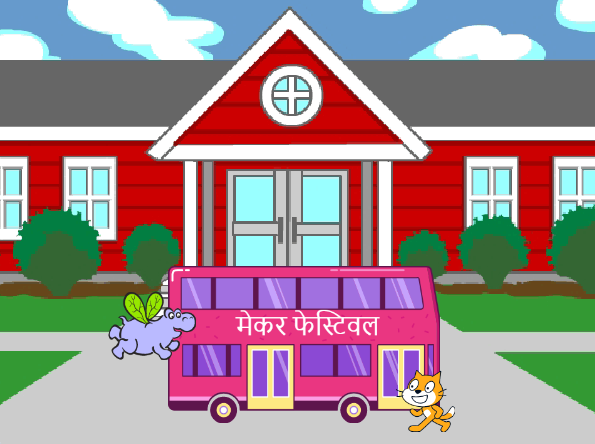
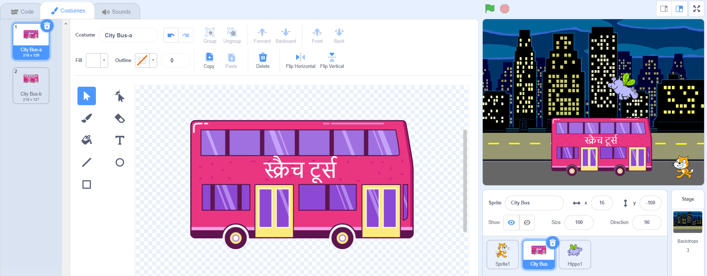
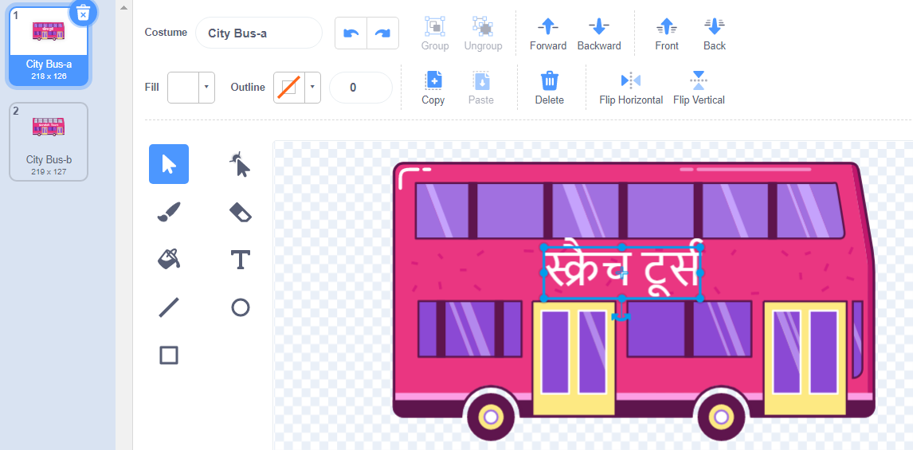
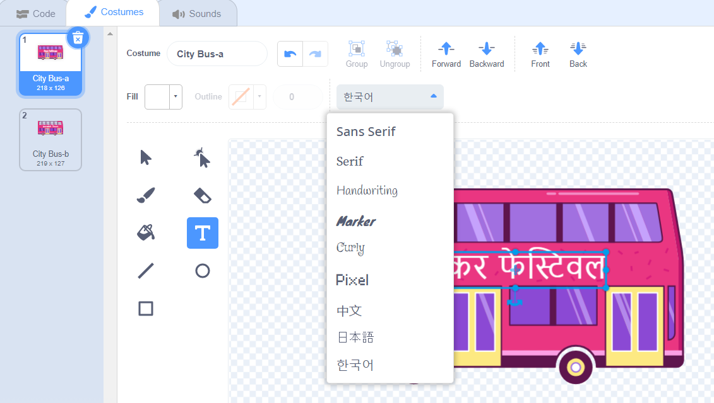
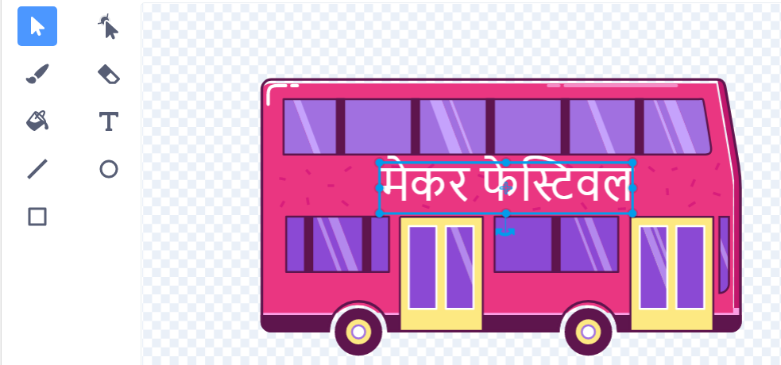

## डेस्टिनेशन को बदलें

बस पर लिखा हुआ है "Scratch Tours", लेकिन आप डेस्टिनेशन को अपनी पसंद में बदल सकते हैं। आप अपनी बस को कहाँ ले जाना चाहते हैं?  

{:width="300px"}

### Edit the City Bus sprite

--- task ---

**City Bus** स्प्राइट का चयन करें औरं **Costumes** टैब पर क्लिक करें:

--- /task ---

--- task ---

इसे चुनने के लिए सफेद "Scratch Tours" टेक्स्ट पर क्लिक करें, और फिर इसे हटाने के लिए **Delete** टैब पर क्लिक करें।

**Tip:** You can use the **Delete** icon in the Paint editor or the <kbd>Delete</kbd> key on your keyboard.

--- /task ---

--- task ---

**Text** (लेखन) टूल चुनें।

उस बस पर क्लिक करें जहाँ आप अपना टेक्स्ट शुरू करना चाहते हैं, और अपनी पसंद का डेस्टिनेशन टाइप करें।

font (लेखन शैली) बदलने के लिए, आप **Font** ड्रॉप-डाउन मेनू पर क्लिक कर सकते हैं:

--- /task ---

--- task ---

**Select** (एरो) टूल पर क्लिक करें, फिर टेक्स्ट को बस पर रखने के लिए उसे ड्रैग करें।

--- /task ---

