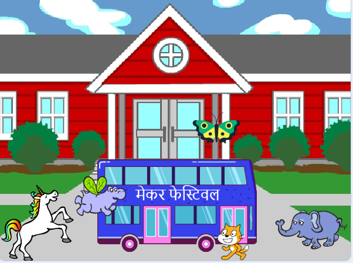

## प्रोजेक्ट को अपग्रेड करें

अब, आप अपने एनीमेशन में अपनी पसंद का स्प्राइट जोड़ सकते हैं। आपको एक कोड जोड़ना होगा जिससे आप स्प्राइट एक शुरू की स्तिथी में  `go to`{:class="block3motion"}  (जा) सकें,  सही दिशा में `point`{:class="block3motion"} करें, ओर फिर `repeat`{:class="block3control"} करें `move`{:class="block3motion"} और `next costume`{:class="block3looks"} ब्लॉक को बस तक जाने के लिए।

**टिप:**जब आप **Choose a Sprite** पर क्लिक करते हैं, तो आप अपने माउस कर्सर को स्प्राइट के ऊपर रखकर उसकी पोषाक देख सकते हैं, या कुछ मोबाइल उपकरणों पर, आप स्प्राइट की पोषाक देखने के लिए उसे टैप करके रख सकते हैं (यदि कोई विंडो जब आप स्प्राइट पर टैप और होल्ड करते हैं तो पॉप अप होता है, विंडो बंद करने के लिए स्क्रीन के किनारे पर टैप करें और पोषाक देखें)। स्प्राइट्स की पोषाक को देखने से आपको एक स्प्राइट खोजने में मदद मिल सकती है जो एनीमेशन के लिए अच्छी तरह से काम करें।

{:width="300px"}

आप इस परियोजना में सीखे गए किसी भी ब्लॉक का उपयोग कर सकते हैं, साथ ही साथ जिन्हें आप पहले से जानते हैं:

```blocks3
when flag clicked

go to x: [0] y: [0] // drag the sprite to choose x and y

show

hide

glide [2] secs to x: [0] y: [-100] // bottom middle of the Stage

repeat [30]
end

point towards (City Bus v)

point in direction (180) // point down

set rotation style [left-right v]

move [3] steps

next costume

start sound [clown honk v]

wait [0.1] seconds // short delay

set [color v] effect to [50] // up to 200
```

--- collapse ---
---
title: पूर्ण परियोजना
---

आप [पूरा हो चुका प्रोजेक्ट यहां](https://scratch.mit.edu/projects/724160134/){:target="_blank"} देख सकते हैं।

--- /collapse ---

आप अपनी पसंद का कोई भी बदलाव करने के लिए प्रोजेक्ट को 'remix' भी कर सकते हैं। आप बस या अन्य स्प्राइट्स में साउंड इफ़ेक्ट जोड़ सकते हैं, या बस का कलर इफ़ेक्ट सेट कर सकते हैं। स्प्राइट्स में से एक बस को मिस कर सकता था लेकिन छिप नहीं सकता था।

इस शानदार अपग्रेड को भेजने के लिए डिजिटल निर्माता Lyla को धन्यवाद!


--- save ---
