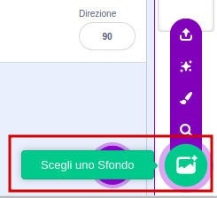
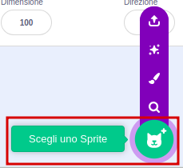
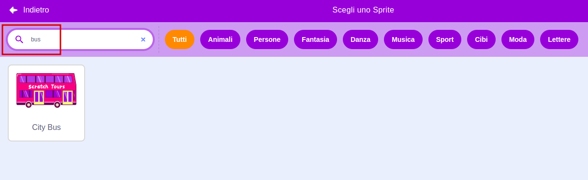
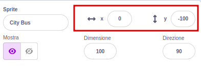
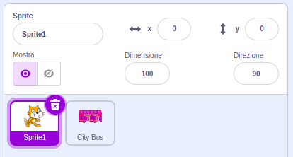
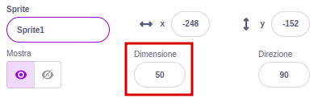

## Crea la tua scena dell'autobus

<div style="display: flex; flex-wrap: wrap">
<div style="flex-basis: 200px; flex-grow: 1; margin-right: 15px;">
Scegli uno sfondo e aggiungi uno sprite dell'autobus.
</div>
<div>

{:width="300px"}

</div>
</div>

### Apri il progetto iniziale

--- task ---

Apri il progetto iniziale [Prendi l'autobus](https://scratch.mit.edu/projects/582214330/editor){:target="_blank"}. Scratch si aprirà in una nuova scheda del browser.

[[[working-offline]]]

--- /task ---

### Scegli uno sfondo

--- task ---

Clicca (o su un tablet, tocca) su **Scegli uno Sfondo** nel pannello Stage (nell'angolo in basso a destra dello schermo):



--- /task ---

--- task ---

Clicca sulla categoria **Esterni**. Aggiungi uno sfondo che sia un buon punto di partenza per il tuo autobus:


--- /task ---

### Scegli uno Sprite

--- task ---

Clicca su **Scegli uno Sprite**:



--- /task ---

--- task ---

Scrivi `bus` nella barra di ricerca in alto:



Aggiungi lo sprite **City Bus** al tuo progetto.

--- /task ---

### Dai al tuo autobus una punto di partenza

--- task ---

Assicurati che lo sprite **City Bus** sia selezionato nella lista degli Sprite sotto lo Stage.

Trascina un blocco `quando si clicca sulla bandierina verde`{:class="block3events"} dal menu dei blocchi `Situazioni`{:class="block3events"} nella tua area del Codice:


```blocks3
when flag clicked
```

--- /task ---

--- task ---

Trascina l'autobus in una buona posizione dello Stage:


Le coordinate **x** e **y** (i numeri utilizzati per descrivere la posizione) dell'autobus sono mostrate nel pannello degli Sprite sotto lo Stage:



--- /task ---

--- task ---

Aggiungi un blocco `vai a x: y:`{:class="block3motion"}:


```blocks3
when flag clicked
+go to x: (0) y: (-100)
```

I numeri nel blocco `vai a x: y:`{:class="block3motion"} sono le coordinate x e y correnti dell'autobus. I numeri nel tuo progetto potrebbero essere leggermente diversi.

--- /task ---

--- task ---

**Prova:** Trascina l'autobus in un punto qualsiasi dello Stage, e fai clic sulla bandiera verde. L'autobus dovrebbe sempre tornare alla sua posizione di partenza.


--- /task ---

### Muovi l'autobus dietro gli sprite dei personaggi

--- task ---

Per assicurarti che lo sprite **City Bus** sia sempre dietro tutti gli sprite dei personaggi, aggiungi un blocco `vai in primo piano`{:class="block3looks"}, quindi fai clic su `primo`{:class="block3looks"} e cambialo in `secondo`{:class="block3looks"}:


```blocks3
when flag clicked
go to x: (0) y: (-100)
+ go to [back v] layer
```

**Suggerimento:** Se non riesci a vedere il blocco `vai in primo piano`{:class="block3looks"}, devi scorrere verso il basso nel menu dei blocchi `Aspetto`{:class="block3looks"}.

--- /task ---

### Cambia il colore dell'autobus

--- task ---

Puoi cambiare il colore dell'autobus:


```blocks3
when flag clicked
go to x: (0) y: (-100)
go to [back v] layer
+set [color v] effect to (50) // prova dei numeri fino a 200
```

--- /task ---

### Ridimensiona il Gatto Scratch

--- task ---

Il Gatto Scratch appare in tutti i nuovi progetti Scratch come **Sprite1** nell'elenco degli Sprite. Fai clic sullo sprite **Sprite1** nell'elenco degli Sprite per prepararti ad animare il Gatto Scratch:



**Suggerimento:** Se hai eliminato accidentalmente lo sprite **Sprite1** (Scratch Cat), puoi fare clic sull'icona **Scegli uno Sprite** e cercare `cat`.

--- /task ---

--- task ---

Nel pannello degli Sprite, fai clic sulla proprietà **Dimensione** e modifica la dimensione del Gatto Scratch in `50`:



--- /task --- 
