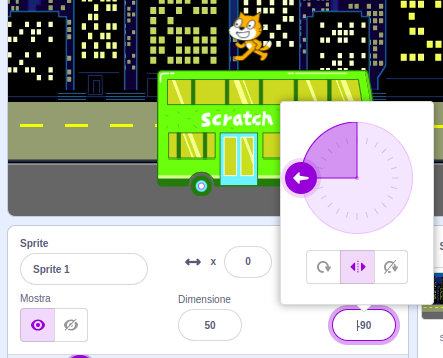
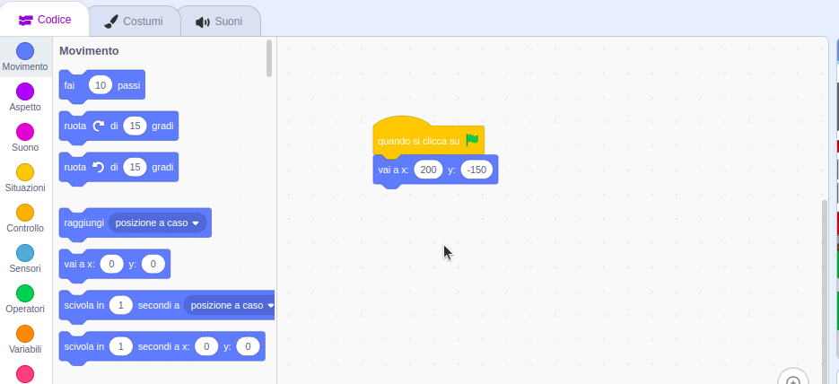

## Lo Scratch Cat prende l'autobus

<div style="display: flex; flex-wrap: wrap">
<div style="flex-basis: 200px; flex-grow: 1; margin-right: 15px;">
Anima lo Scratch Cat in modo che appaia sul **lato destro** dello Stage e cammini verso l'autobus ripetendo un piccolo movimento molte volte in un **ciclo**. 
</div>
<div>

{:width="300px"}

</div>
</div>

### Porta lo Scratch Cat nella posizione iniziale

--- task ---

Fai clic sulla proprietà **Direzione** nel pannello degli Sprite. Ruota la freccia in modo che punti su `-90`. Poi, fai clic sull'icona **Sinistra/Destra** al centro per modificare lo stile di rotazione in `Sinistra-Destra` per impedire allo Scratch Cat di girare sottosopra:



--- /task ---

--- task ---

Trascina lo sprite Scratch Cat nella parte in basso a destra dello Stage.


**Suggerimento:** Se provi a posizionare uno sprite fuori dallo Stage, tornerà alla sua ultima posizione sullo Stage.

--- /task ---

--- task ---

Aggiungi il codice per portare lo Scratch Cat alla sua posizione iniziale:


```blocks3
when flag clicked
go to x:(200) y:(-150) // bottom right-hand side
```

--- /task ---

--- task ---

**Prova:** Trascina lo Scratch Cat in una nuova posizione, poi fai clic sul blocco `vai a x: y:`{:class="block3motion"}. Lo Scratch Cat dovrebbe tornare ogni volta in basso a destra.

--- /task ---

### Anima lo Scratch Cat

Aggiungerai il codice in un ciclo `ripeti`{:class="block3control"} per fare in modo che lo Scratch Cat ripeta pochi passi molte volte. Questo farà sembrare lo Scratch Cat in movimento animato.

--- task ---

Aggiungi un blocco `ripeti`{:class="block3control"} `10` `volte`{:class="block3control"}, quindi trascina un blocco `fai`{:class="block3motion"} `10` <0>passi</0>{:class="block3motion"} al suo interno:




```blocks3
when flag clicked
go to x:(200) y:(-150) // bottom right-hand side
+ repeat (10) // try different numbers
move (5) steps //  5 is a good walking speed
end
```

--- /task ---

--- task ---

**Prova:** Clicca sulla bandierina verde. Prova a cambiare i numeri nel blocco `ripeti`{:class="block3control"} `10` <0>volte</0>{:class="block3control"} in modo che lo Scratch Cat si fermi all'autobus.

--- /task ---

Alcuni sprite hanno più di un costume. Utilizzerai i costumi dello sprite **Scratch Cat** per creare un'animazione dello Scratch Cat che cammina.

--- task ---

Fai clic sulla scheda **Costumi**. Lo sprite **Scratch Cat** ha due costumi e insieme possono essere usati per creare un movimento di camminata.

--- /task ---

--- task ---

Fai clic sulla scheda **Codice**. Aggiungi un blocco`passa al costume seguente`{:class="block3looks"}:


```blocks3
when flag clicked
go to x:(200) y:(-150) // bottom right-hand side
repeat (20) // try different numbers
move (5) steps //  5 is a good walking speed
+ next costume 
end
```
--- /task ---

--- task ---

**Prova:** Clicca sulla bandierina verde e lo Scratch Cat camminerà verso l'autobus.

--- /task ---

### Nascondi lo Scratch Cat

--- task ---

Aggiungi un blocco `nascondi`{:class="block3looks"} allo Scratch Cat quando raggiunge l'autobus:


```blocks3
when flag clicked
go to x:(200) y:(-150) // bottom right-hand side
repeat (20) // try different numbers
move (5) steps //  5 is a good walking speed
next costume 
end
+ hide
```

--- /task ---

--- task ---

**Prova:** Clicca nuovamente sulla bandierina verde e vedrai che Scratch Cat ora è scomparso.

--- /task ---

### Mostra lo Scratch Cat

--- task ---

Aggiungi un blocco `mostra`{:class="block3looks"} in modo che lo Scratch Cat appaia prima di camminare verso l'autobus:


```blocks3
when flag clicked
go to x:(200) y:(-150) // bottom right-hand side
+ show
repeat (20) // try different numbers
move (5) steps //  5 is a good walking speed
next costume 
end
hide
```

**Suggerimento:** Quando usi un blocco `nascondi`{:class="block3looks"}, devi aggiungere anche un blocco `mostra`{:class="block3looks"} per assicurarti che uno sprite sia visibile all'inizio.

--- /task ---

--- task ---

**Prova:** Clicca sulla bandierina verde per provare il tuo progetto e assicurati che appaia lo Scratch Cat.

--- /task ---

