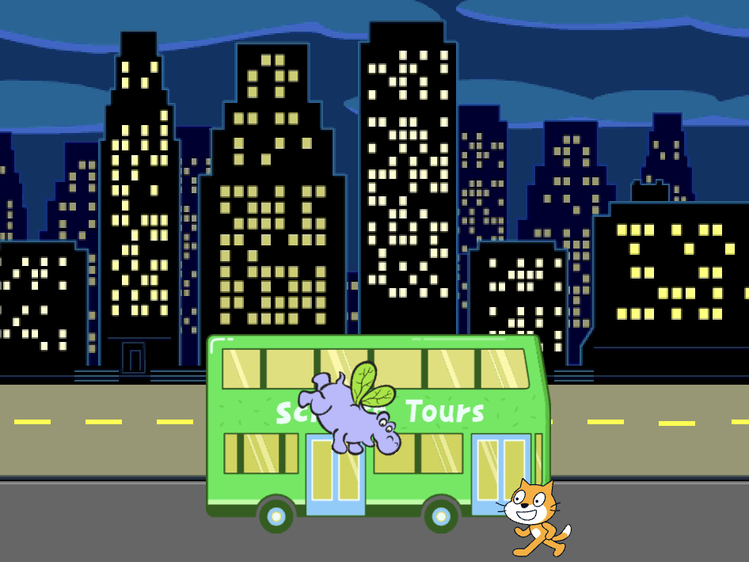
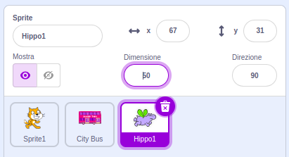

## Hippo vola verso l'autobus

<div style="display: flex; flex-wrap: wrap">
<div style="flex-basis: 200px; flex-grow: 1; margin-right: 15px;">
Aggiungi uno sprite hippo che vola verso l'autobus.
</div>
<div>

{:width="300px"}

</div>
</div>

### Dai a hippo una posizione iniziale

--- task ---

Aggiungi lo sprite **Hippo1** al tuo progetto.

Cambia la **dimensione** dello sprite **Hippo1**:



--- /task ---

--- task ---

Trascina hippo nella parte in alto a sinistra dello Stage.


--- /task ---

--- task ---

Aggiungi il codice per portare lo hippo alla sua posizione iniziale:

```blocks3
when flag clicked
go to x: [-200] y: [150] // top left-hand side
```

**Suggerimento:** Le coordinate `x`{:class="block3motion"} e `y`{:class="block3motion"} nel blocco `vai a x: y:`{:class="block3motion"} saranno la posizione attuale di hippo, quindi non è necessario riscriverle.

--- /task ---

### Fai sbattere le ali hippo e fallo volare

--- task ---

Aggiungi il codice per far volare hippo verso il **City Bus**:

```blocks3
when flag clicked
go to x: [-200] y: [150] 
+repeat [100] 
point towards (City Bus v) // change from mouse-pointer
move [3] steps
next costume
+end
```

--- /task ---

--- task ---

**Prova:** Clicca sulla bandierina verde e controlla che hippo voli verso l'autobus. Puoi modificare il numero nel blocco `ripeti`{:class="block3control"} per fare in modo che hippo si fermi nel posto giusto.

--- /task ---

### Mostra e nascondi l'autobus

--- task ---

Aggiungi un blocco `mostra`{:class="block3looks"} e un blocco `nascondi`{:class="block3looks"}:

```blocks3
when flag clicked
go to x: [-200] y: [150] 
+ show
repeat [90] 
point towards (City Bus v)
move [3] steps
next costume
end
+ hide
```

--- /task ---

--- task ---

**Prova:** Clicca sulla bandierina verde. Hippo volerà ed entrerà nell'autobus.

--- /task ---
