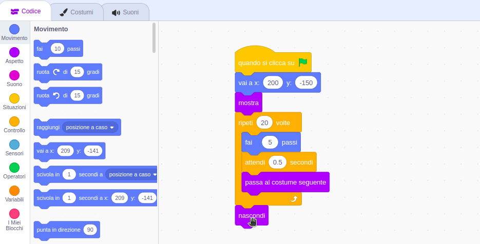

## Perdere l'autobus

<div style="display: flex; flex-wrap: wrap">
<div style="flex-basis: 200px; flex-grow: 1; margin-right: 15px;">
E se lo Scratch Cat non corresse abbastanza veloce da prendere l'autobus?
</div>
<div>

{:width="300px"}

</div>
</div>

### Fai perdere l'autobus allo Scratch Cat

--- task ---

Seleziona lo sprite **Scratch Cat** e aggiungi un blocco `attendi`{:class="block3control"}:


```blocks3
when flag clicked
go to x:(200) y:(-150) 
show
repeat (20) // prova numeri diversi
move (5) steps 
next costume 
+ wait (1) seconds
end
hide
```
--- /task ---

--- task ---

**Prova:** Clicca sulla bandierina verde. Lo Scratch Cat camminerà troppo lentamente e perderà l'autobus!

--- /task ---

### Fai prendere l'autobus allo Scratch Cat

--- task ---

Ti servirà un ritardo minore di un secondo. 0.5 è mezzo secondo, 0.25 è un quarto di secondo e 0.1 è un decimo di secondo.

Modifica il ritardo nel blocco `attendi`{:class="block3control"}:


```blocks3
wait (0.2) seconds // prova 0.1, 0.5, 0.05
```

**Prova:** Clicca sulla bandierina verde e lo Scratch Cat camminerà più velocemente. Scegli il ritardo che più ti piace.

--- /task ---

### Scegli se lo Scratch Cat prende o perde l'autobus

--- task ---

Se vuoi che lo Scratch Cat **perda l'autobus**, rimuovi il blocco `nascondi`{:class="block3looks"} dal tuo codice in modo che lo Scratch Cat rimanga sullo Stage:




```blocks3
when flag clicked
go to x:(200) y:(-150) 
show
repeat (20) 
move (5) steps 
next costume
wait (0.5) seconds 
end
-hide
```
--- /task ---

--- task ---

Se vuoi che lo Scratch Cat **prenda l'autobus**, fai aspettare l'autobus più a lungo prima di partire:


```blocks3
when flag clicked 
+wait [4] seconds // change from 4 to 6
glide [2] secs to x: [320] y: [-100] // lato destro dello Stage
hide
```

Dovrai reinserire il blocco `nascondi`{:class="block3looks"} nel codice dello sprite **Scratch Cat** se lo hai rimosso e vuoi che lo Scratch Cat prenda con successo l'autobus.

--- /task ---

--- task ---

Fai le modifiche finché ottieni l'animazione che vuoi tu.

--- /task ---

<p style="border-left: solid; border-width:10px; border-color: #0faeb0; background-color: aliceblue; padding: 10px;">
Quando lavori su un progetto, spesso torni indietro e modifichi o migliori il tuo codice man mano che hai nuove idee. 
</p>


