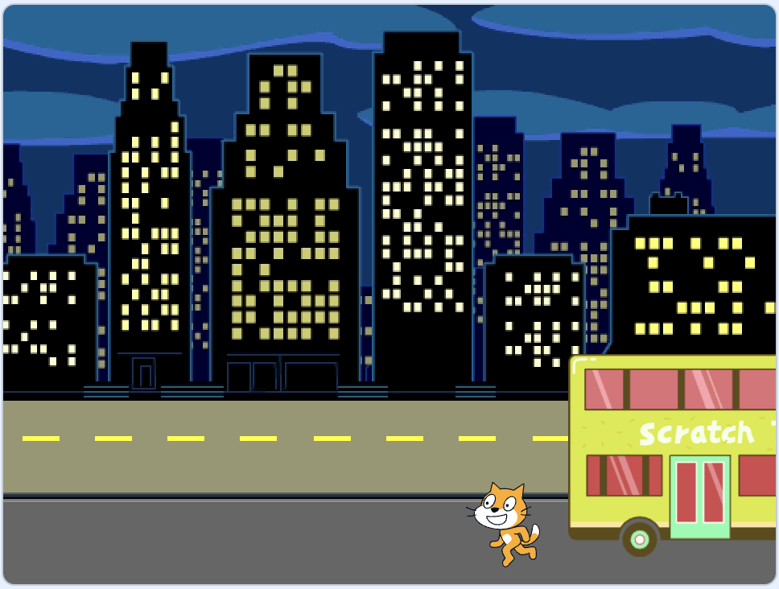

## Perdere l'autobus

<div style="display: flex; flex-wrap: wrap">
<div style="flex-basis: 200px; flex-grow: 1; margin-right: 15px;">
E se il Gatto Scratch non corresse abbastanza veloce per prendere l'autobus?
</div>
<div>

{:width="300px"}

</div>
</div>

### Fai perdere l'autobus al Gatto Scratch

--- task ---

Seleziona lo sprite del **Gatto Scratch ** e aggiungi un blocco `attendi`{:class="block3control"}:


```blocks3
when flag clicked
go to x:(200) y:(-150) 
show
repeat (20) // try different numbers
move (5) steps 
next costume 
+ wait (1) seconds
end
hide
```
--- /task ---

--- task ---

**Prova:** Clicca sulla bandierina verde. Il Gatto Scratch camminerà troppo lentamente e perderà l'autobus!

--- /task ---

### Fai prendere l'autobus al Gatto Scratch

--- task ---

Ti servirà un ritardo minore di un secondo. 0.5 è mezzo secondo, 0.25 è un quarto di secondo e 0.1 è un decimo di secondo.

Modifica il ritardo nel blocco `attendi`{:class="block3control"}:


```blocks3
wait (0.2) seconds // try 0.1, 0.5, 0.05
```

**Prova:** Clicca sulla bandierina verde e il Gatto Scratch camminerà più velocemente. Scegli il ritardo che più ti piace.

--- /task ---

### Scegli se il Gatto Scratch raggiunge o perde l'autobus

--- task ---

Se vuoi che il Gatto Scratch **perda l'autobus**, rimuovi il blocco `nascondi`{:class="block3looks"} dal tuo codice in modo che questi rimanga sullo Stage:


```blocks3
when flag clicked
go to x:(200) y:(-150) 
show
repeat (20) 
move (5) steps 
next costume
wait (0.5) seconds 
end
-hide
```
--- /task ---

--- task ---

Se vuoi che il Gatto Scratch **raggiunga l'autobus**, fai aspettare l'autobus più a lungo prima di partire:


```blocks3
when flag clicked 
+wait [4] seconds // change from 4 to 6
glide [2] secs to x: [320] y: [-100] // right-hand side of the Stage
hide
```

Dovrai reinserire il blocco `nascondi`{:class="block3looks"} nel codice dello **Gatto Scratch ** se lo hai rimosso e vuoi che raggiunga con successo l'autobus.

--- /task ---

--- task ---

Fai le modifiche finché ottieni l'animazione che vuoi tu.

--- /task ---

<p style="border-left: solid; border-width:10px; border-color: #0faeb0; background-color: aliceblue; padding: 10px;">
Quando lavori su un progetto, è normale tornare indietro e modificare o migliorare il tuo codice man mano che hai nuove idee. 
</p>


