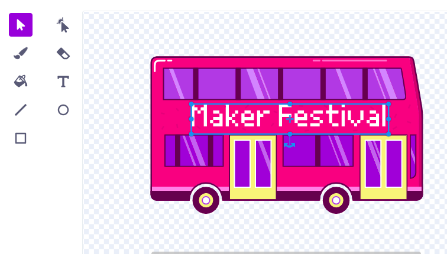

## Cambia la destinazione

La scritta sull'autobus dice "Scratch Tours", ma puoi cambiare la destinazione con una a tua scelta. Dove vuoi che vada il tuo autobus?  

{:width="300px"}

### Modifica lo sprite dell'autobus urbano

--- task ---

Seleziona lo sprite **City Bus** e fai clic sulla scheda **Costumi**:

--- /task ---

--- task ---

Fai clic sul testo bianco "Scratch Tours" per selezionarlo, quindi fare clic su **Cancella** per rimuoverlo.

**Suggerimento:** Puoi utilizzare l'icona **Cancella** nell'editor di Paint o il tasto <kbd>Canc</kbd> sulla tastiera.

--- /task ---

--- task ---

Selezionare lo strumento **Testo**.

Fai clic sull'autobus nel punto in cui vuoi che inizi il testo e scrivi la destinazione che preferisci.

Per cambiare il font (stile di scrittura), puoi cliccare sul menu a tendina **Font**:

--- /task ---

--- task ---

Fai clic sullo strumento **Seleziona** (Freccia), quindi trascina il testo per posizionarlo sull'autobus.

--- /task ---

