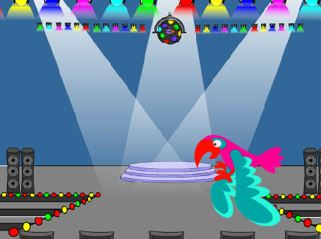

## 次は何をしますか？

[Scratch入門](https://projects.raspberrypi.org/ja-JP/pathways/scratch-intro)パスに従っている場合は[虫を捕まえる](https://projects.raspberrypi.org/ja-JP/projects/find-the-bug)プロジェクトに進むことができます。 このプロジェクトでは、各レベルに隠れている虫を見つけるゲームを作成します。

--- print-only ---

--- /print-only ---

--- no-print ---

  <iframe allowtransparency="true" width="485" height="402" src="https://scratch.mit.edu/projects/embed/486719939/?autostart=false" frameborder="0"></iframe>

--- /no-print ---

Scratchのさまざまな機能を触ってみたい場合は[これらのプロジェクト](https://projects.raspberrypi.org/ja-JP/projects?software%5B%5D=scratch&curriculum%5B%5D=%201)を試してみてください。

***
このプロジェクトは以下のボランティアによって翻訳されました。

Makoto Hirayama
Fumihiko Higashi

ボランティアのおかげで、世界中の人々に母国語で学ぶ機会を与えることができます。翻訳を引き受けていただくことで、より多くの人々に手を差し伸べることができます。詳しくは [rpf.io/translate](https://rpf.io/translate) をご覧ください。
