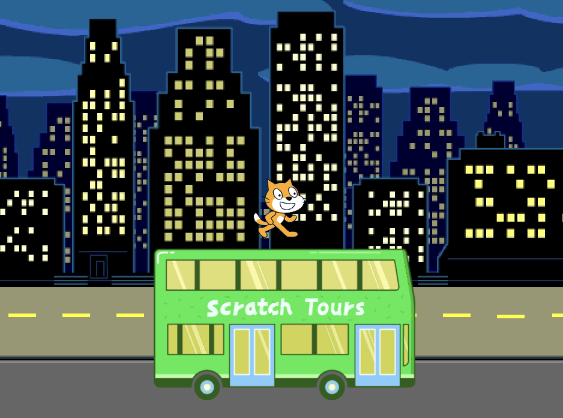
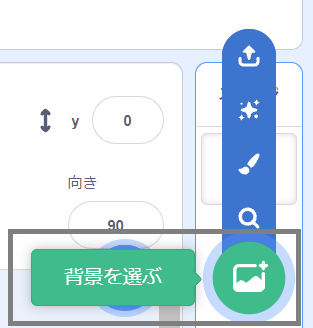
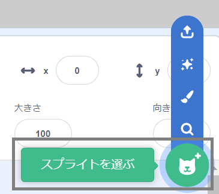
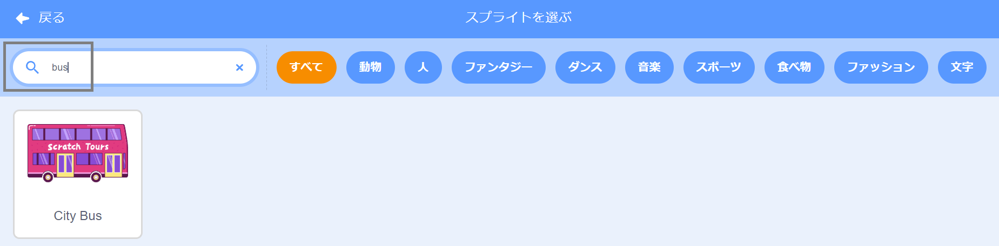
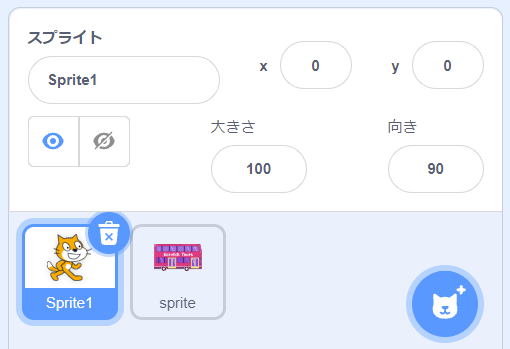
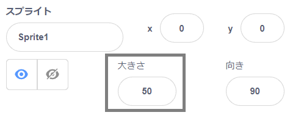

## バスの場面を作る

<div style="display: flex; flex-wrap: wrap">
<div style="flex-basis: 200px; flex-grow: 1; margin-right: 15px;">
背景を選択し、バスのスプライトを追加します。
</div>
<div>

{:width="300px"}

</div>
</div>

### スタータープロジェクトを開く

--- task ---

[バスに乗るスタータープロジェクト](https://scratch.mit.edu/projects/582214330/editor){:target="_blank"}を開きます。 スクラッチはブラウザの別のタブで開きます。

[[[working-offline]]]

--- /task ---

### 背景を選ぶ

--- task ---

ステージペイン(画面の右下隅) で**背景を選ぶ**をクリック(またはタブレットではタップ) します。:



--- /task ---

--- task ---

**屋外** カテゴリーをクリックします。 バスの出発地点に合った背景を追加します。


--- /task ---

### スプライトを選ぶ

--- task ---

**スプライトを選ぶ**をクリックします。



--- /task ---

--- task ---

上部の検索ボックスに`bus`と入力してください:



プロジェクトに **City Bus** (市バス) のスプライトを追加しましょう。

--- /task ---

### バスの開始位置を決める

--- task ---

ステージの下にあるスプライトリストで**City Bus**スプライトが選択されていることを確認します。

`イベント`{:class="block3events"}ブロックメニューから`緑色の旗が押されたとき`{:class="block3events"}ブロックをコードエリアにドラッグします。


```blocks3
when flag clicked
```

--- /task ---

--- task ---

バスをステージ上の適当な位置にドラッグします。


バスの**x**および**y**座標（位置を表す数値）がステージの下のスプライトペインに表示されます。


--- /task ---

--- task ---

`x座標を〇〇、y座標を〇〇にする`{:class="block3motion"}ブロックを追加します。


```blocks3
when flag clicked
+go to x: (0) y: (-100)
```

`x座標を〇〇、y座標を〇〇にする`{:class="block3motion"}ブロックの中の数値はバスの現在のx座標とy座標です。 あなたのプロジェクトでは違う数値になっているかもしれません。

--- /task ---

--- task ---

**テスト:** バスをステージ上の好きな場所にドラッグしてから、緑色の旗を押します。 バスは常に開始位置へ移動するはずです。


--- /task ---

### バスをキャラクタースプライトの後ろに移動する

--- task ---

**City Bus**スプライトが常にすべてのキャラクタースプライトより後ろになるようにするには、`最前面に移動する`{:class="block3looks"}ブロックを追加し、`最前面`{:class="block3looks"}をクリックして`最背面`{:class="block3looks"}へ変更します。


```blocks3
when flag clicked
go to x: (0) y: (-100)
+ go to [back v] layer
```

**ヒント:** `最前面に移動`{:class="block3looks"}ブロックが見つからないときには、`見た目`{:class="block3looks"}ブロックメニューを下にスクロールして探してみてください。

--- /task ---

### バスの色を変える

--- task ---

バスの色も変えられます。


```blocks3
when flag clicked
go to x: (0) y: (-100)
go to [back v] layer
+set [color v] effect to (50) // 200までの数
```

--- /task ---

### スクラッチキャットのサイズを変更する

--- task ---

スクラッチキャットは、すべての新しいプロジェクトのスプライトリストに**Sprite1**として表示されます。 スプライトリストの**Sprite1**をクリックして、スクラッチキャットのアニメーションの準備をします。



**ヒント:** 間違えて**Sprite1**（スクラッチキャット）スプライトを削除してしまった場合は、 **スプライトを選ぶ**アイコンをクリックして`cat`を検索します。

--- /task ---

--- task ---

スプライトペインで**大きさ**プロパティをクリックし、スクラッチキャットの大きさを`50`へ変更します。



--- /task --- 
