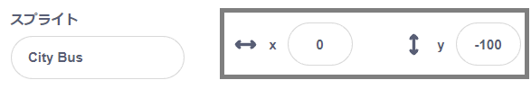

## バスの場面を作る

<div style="display: flex; flex-wrap: wrap">
<div style="flex-basis: 200px; flex-grow: 1; margin-right: 15px;">
背景を選択し、バスのスプライトを追加します。
</div>
<div>

{:width="300px"}

</div>
</div>

--- task ---

[バスに乗るスタータープロジェクト](https://scratch.mit.edu/projects/582214330/editor){:target="_blank"}を開きます。 スクラッチはブラウザの別のタブで開きます。

[[[working-offline]]]

--- /task ---

--- task ---

ステージペイン(画面の右下隅) で**背景を選ぶ**をクリック(またはタブレットではタップ) します。:


--- /task ---

--- task ---

**背景**(はいけい) アイコンをクリックします。 バスの出発地点に合った背景を追加します。


--- /task ---

--- task ---

**スプライトを選ぶ**をクリックします。


--- /task ---

--- task ---

上部の検索ボックスに`bus`と入力してください:


プロジェクトに **City Bus** (市バス) のスプライトを追加しましょう。

--- /task ---

 スクラッチでは、ステージの上にある緑色のフラグを押してプロジェクトを実行します。 `緑のフラグが押されたとき`{:class="block3events"} バスは出発地点にいる必要があります。

--- task ---

ステージの下にあるスプライトリストで**City Bus**スプライトが選択されていることを確認します。

`イベント`{:class="block3events"}ブロックメニューから`緑のフラグが押されたとき`{:class="block3events"}ブロックをコードエリアにドラッグします。


```blocks3
when flag clicked
```

--- /task ---

--- task ---

バスをステージ上の適当な位置にドラッグします。


**X** と **Y** のバスの座標（位置を表す数字）がステージの下のスプライトペインにあります。:




--- /task ---

--- task ---

`x座標を〇〇、y座標を〇〇にする`{:class="block3motion"} ブロックを追加します。:


```blocks3
when flag clicked
+go to x: (0) y: (-100)
```

`x座標を〇〇、y座標を〇〇にする`{:class="block3motion"} ブロックの中の数字はバスの現在のx座標とy座標です。: あなたのプロジェクトでは違う数値になっているかもしれません。

--- /task ---

--- task ---

**テスト：** バスをステージ上の好きな場所にドラッグして動かしてから、緑色のフラグを押します。 バスは出発地点に戻っていますか。

--- /task ---

バスをドラッグすると、スクラッチキャットの前に移動します。

--- task ---

**City Bus** スプライトがいつもすべてのキャラクタースプライトの後ろにあることを確かめるには `最前面に移動する`{:class="block3looks"}ブロックを `最前面`{:class="block3looks"}をクリックして、 `最背面`{:class="block3looks"}に変えます。:


```blocks3
when flag clicked
go to x: (0) y: (-100)
+ go to [back v] layer
```

**ヒント：** `最前面に移動`{:class="block3looks"}ブロックが見つからないときには、ブロックメニューの `見た目`{:class="block3looks"}の下の方にスクロールして探してみてください。

--- /task ---

--- task ---

バスの色も変えられます。


```blocks3
when flag clicked
go to x: (0) y: (-100)
go to [back v] layer
+set [color v] effect to (50) // 200までの数
```

--- /task ---

--- task ---

スクラッチキャットは **Sprite1**としてすべての新しいスクラッチ・プロジェクトに表示されます 。 スプライトリストの**Sprite1**をクリックして、スクラッチキャットのアニメーションの準備をします:


**ヒント:** 間違えて **Sprite1** (スクラッチキャット)を削除した場合は、 **スプライトを選ぶ** アイコンをクリックして `cat`で検索します。

--- /task ---

現時点では、スクラッチキャットは大きすぎてバスに乗れません。

--- task ---

スプライトペインで **大きさ** の値の場所をクリックして、スクラッチキャットの大きさを `50` に変えます:


--- /task ---

--- save ---
