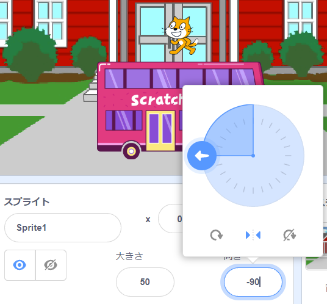
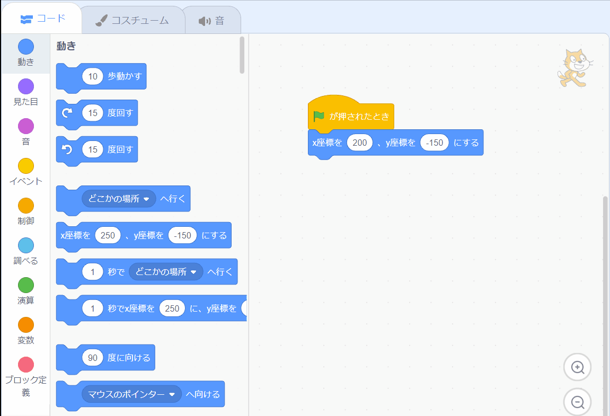

## スクラッチキャットがバスに乗る

<div style="display: flex; flex-wrap: wrap">
<div style="flex-basis: 200px; flex-grow: 1; margin-right: 15px;">
スクラッチキャットをアニメーション化してステージの**右側**に表示し、**ループ**で小さな動きを何度も繰り返してバスまで歩きます。 
</div>
<div>

{:width="300px"}

</div>
</div>

### スクラッチキャットを出発地点に移動します。

--- task ---

スプライトペインの **方向** プロパティをクリックします。 `-90`を指すように矢印を動かす 。 **左/右** アイコンをクリックして、回転スタイルを `左右`と し、スクラッチキャットが上下逆さまになるのを防ぎます。



--- /task ---


--- task ---

スクラッチキャットをステージの右下にドラッグします。

**ヒント:** スプライトをステージの外に配置しようとすると、スプライトはステージ上の最後の位置に戻ります。

--- /task ---

--- task ---

スクラッチキャットを出発地点に動かすコードを追加します。


```blocks3
when flag clicked
go to x:(200) y:(-150) // 下部の右側です
```

--- /task ---

--- task ---

**テスト:** スクラッチキャットを新しい場所にドラッグし、 `x座標を〇〇、y座標を〇〇にする`{:class="block3motion"}ブロックをクリックします。 スクラッチキャットは右下にいつも戻るはずです。

--- /task ---

### スクラッチキャットをアニメーション化する

`繰り返す`{:class="block3control"}ループにコードを追加して、スクラッチキャットが少ないステップを何度も繰り返すようにします。 これにより、スクラッチキャットがアニメーション化されたように見えます。

--- task ---

`10回` `繰り返す`{:class="block3control"} ブロックを追加して、次に`10` `歩動かす`{:class="block3control"}ブロックをその中にドラッグします。




```blocks3
when flag clicked
go to x:(200) y:(-150) // 下部の右側です
+ repeat (10) // 違う数を試してください
move (5) steps //  5歩はちょうど良い歩く速さです
end
```

--- /task ---

--- task ---

**テスト:** 緑色のフラグをクリックします。 スクラッチキャットがバスのところで止まるように数字を変えてみてください。

--- /task ---

一部のスプライトには複数のコスチュームがあります。 **Scratch Cat** スプライトのコスチュームを使って、スクラッチキャットが歩くアニメーションを作ります。

--- task ---

**コスチューム** タブをクリックします。 **Scratch Cat** スプライトには2つのコスチュームがあり、一緒に使うことで歩く動きを表現できます。

--- /task ---

--- task ---

**コード** タブをクリックします。 `次のコスチューム`{:class="block3motion"} ブロックを追加します。:


```blocks3
when flag clicked
go to x:(200) y:(-150) // 下部の右側です
repeat (20) // 違う数を試してください
move (5) steps //  5歩はちょうど良い歩く速さです
+ next costume 
end
```
--- /task ---

--- task ---

**テスト:** 緑色のフラグをクリックすると、スクラッチキャットがバスに向かって歩きます。

--- /task ---

ここで、スクラッチキャットがバスの中に入っているように見せます。

--- task ---

バスに到着したときにスクラッチキャットを`非表示`{:class="block3looks"}にするためにブロックを追加します。


```blocks3
when flag clicked
go to x:(200) y:(-150) // 下部の右側です
repeat (20) // 違う数を試してください
move (5) steps //  5歩はちょうど良い歩く速さです
next costume 
end
+ hide
```

--- /task ---

--- task ---

**テスト:** 緑色のフラグをもう一度クリックして、スクラッチキャットが消えることを確かめましょう。

--- /task ---

アニメーションを再実行したときに、スクラッチキャットが再表示されなければなりません。

--- task ---

`表示`{:class="block3looks"}ブロックを追加して、バスに行く前にスクラッチキャットが表示されるようにします。


```blocks3
when flag clicked
go to x:(200) y:(-150) // 下部の右側です
+ show
repeat (20) // 違う数を試してください
move (5) steps //  5歩はちょうど良い歩く速さです
next costume 
end
hide
```

**ヒント:** `非表示`{:class="block3looks"}ブロックを使う場合は `表示`{:class="block3looks"}ブロックも追加して、必要なときにスプライトが表示されるようにしてください。

--- /task ---

--- task ---

**テスト:** 緑色のフラグをクリックしてプロジェクトをテストし、スクラッチキャットが表示されることを確認します。

--- /task ---

--- save ---
