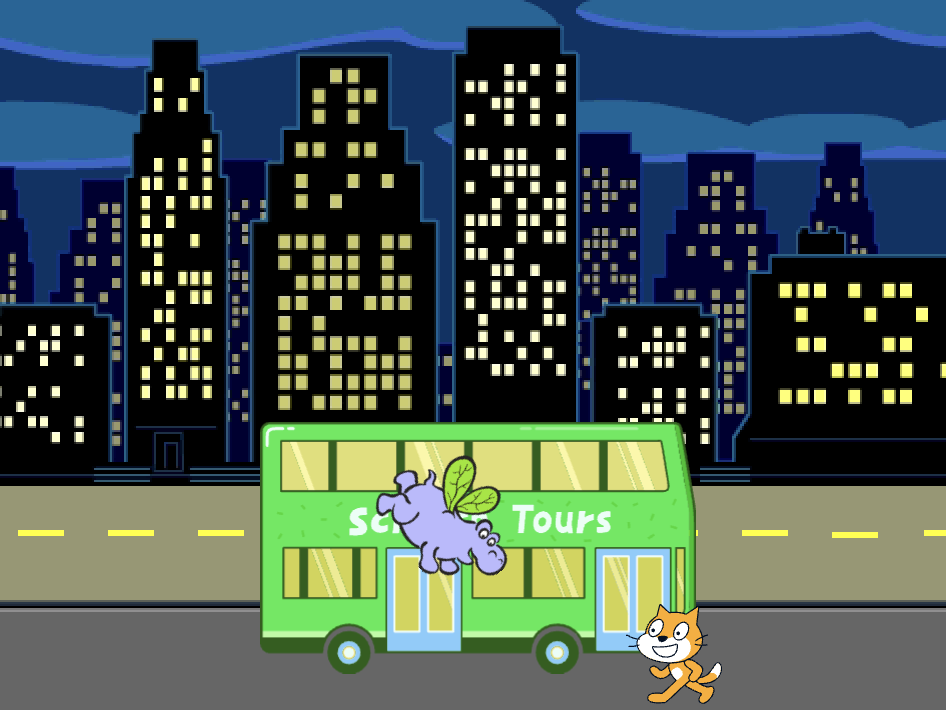

## カバはバスに向かって飛ぶ

<div style="display: flex; flex-wrap: wrap">
<div style="flex-basis: 200px; flex-grow: 1; margin-right: 15px;">
バスに向かって飛ぶカバのスプライトを追加します。
</div>
<div>

{:width="300px"}

</div>
</div>

**Hippo1** スプライトには、違う位置に翼のある2つのコスチュームがあるため、バスに向かってスプライトが飛んでいるようなアニメーションにすることができます。

--- task ---

プロジェクトに **Hippo1** のスプライトを追加しましょう。

**Hippo1** スプライトの **大きさ** を変えます:


--- /task ---

--- task ---

カバをステージの左上にドラッグします。


--- /task ---

--- task ---

カバを出発地点に動かすコードを追加します。

```blocks3
when flag clicked
go to x: [-200] y: [150] // top left-hand side
```

**ヒント:<0>x座標を〇〇、y座標を〇〇にする**{:class="block3motion"}ブロックの中の</0> `X`{:class="block3motion"}と `Y`{:class="block3motion"}の座標はカバの現在の位置なので、入力する必要はありません。

--- /task ---

カバはバスに向かって飛んで、羽ばたきます。

カバをシティバス `へ向ける`{:class="block3motion"}ようにします。

--- task ---

**シティバス**に向けてカバを飛ばすコードを追加します:

```blocks3
when flag clicked
go to x: [-200] y: [150] 
+repeat [100] 
point towards (City Bus v) // change from mouse-pointer
move [3] steps
next costume
+end
```

--- /task ---

--- task ---

**テスト:** 緑色のフラグを押すとカバがバスに向かって飛んでいきます。 `〇回繰り返す`{:class="block3control"}ブロックの数字を変えて、カバを好きなところで止めることができます。

--- /task ---

これで、カバがバスに乗り込みます。

--- task ---

`表示する`{:class="block3looks"}ブロックと `隠す`{:class="block3looks"}ブロックを追加します。

```blocks3
when flag clicked
go to x: [-200] y: [150] 
+ show
repeat [90] 
point towards (City Bus v)
move [3] steps
next costume
end
+ hide
```

--- /task ---

--- task ---

**テスト:** 緑色のフラグを押します。 カバが飛んでいってバスに乗ります。

--- /task ---

--- save ---
