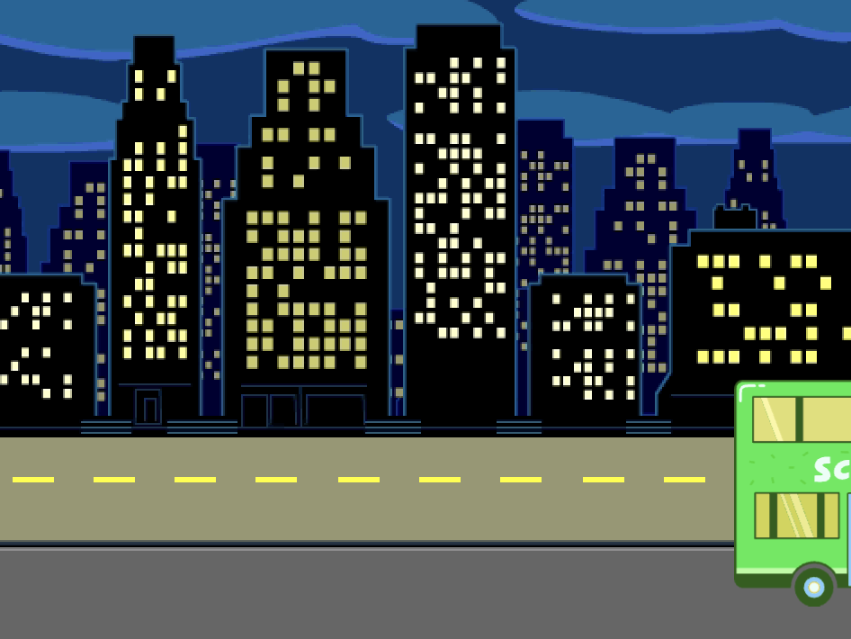

## バスの出発

<div style="display: flex; flex-wrap: wrap">
<div style="flex-basis: 200px; flex-grow: 1; margin-right: 15px;">
バスを発車させるブロックを追加します。
</div>
<div>

{:width="300px"}

</div>
</div>

### バスをアニメーション化する

--- task ---

**City Bus**スプライトを選択します。


--- /task ---

--- task ---

緑色の旗が押されてから4秒後にバスが右へ走るコードを追加します。


```blocks3
when flag clicked 
wait [4] seconds // change 1 to 4
```

--- /task ---

--- task ---

バスをステージの右側にドラッグします。 これが、バスの`x`{:class="block3motion"}座標、`y`{:class="block3motion"}座標を`変える`{:class="block3motion"}先になります。


**ヒント:** バスを右に移動しすぎるとジャンプして戻ります。 もう一度やり直してください。 あんまり遠くまで動かさないように。

--- /task ---

--- task ---

`待つ`{:class="block3control"}ブロックの下に、`2``秒でx座標を〇に、y座標を〇に変える`{:class="block3motion"}ブロックを追加します。

あなたのプロジェクトの`x`{:class="block3motion"}座標と`y`{:class="block3motion"}座標は少し異なっているかもしれません。座標はあなたがバスをドラッグしたちょうどその位置になります。


```blocks3
when flag clicked 
wait [4] seconds // change 1 to 4
+glide [2] secs to x: [320] y: [-100] // right-hand side of the Stage
```

--- /task ---

--- task ---

**テスト:** 緑色の旗を押します。 スクラッチキャットとカバがバスに向かって移動して4秒後にバスが右に走ります。

--- /task ---

### バスの非表示と表示

--- task ---

`隠す`{:class="block3looks"}ブロックを追加して、バスがステージから走り去ったように見せます。


```blocks3
when flag clicked 
wait [4] seconds // change 1 to 4
glide [2] secs to x: [320] y: [-100]
+ hide
```
--- /task ---

--- task ---

**テスト:** 緑色の旗を押します。 バスが走り去ると非表示になります。 緑色の旗を押したときにスプライトが再び表示されるようにする方法を覚えていますか？

--- /task ---

--- task ---

`表示する`{:class="block3looks"}ブロックを`緑色の旗が押されたとき`{:class="block3events"}スクリプトに追加して、プロジェクトの実行時にバスが表示されるようにします。


```blocks3
when flag clicked
go to x: (0) y: (-100)
go to [back v] layer
set [color v] effect to (85) // try numbers up to 200
+show
```

--- /task ---

--- task ---

**テスト:** 緑色の旗を押してアニメーションを見ます。 バスはステージの中央に表示され、右に走って消え去ります。

バスが出るとき、みんなバスに乗っていますか？ もし必要なら、バスの待ち時間を変更できます。

--- /task ---
