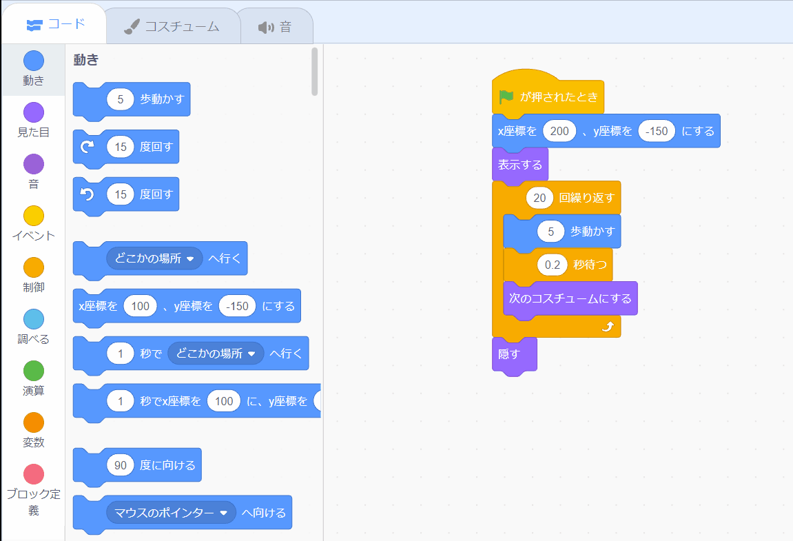

## バスに乗り遅れる

<div style="display: flex; flex-wrap: wrap">
<div style="flex-basis: 200px; flex-grow: 1; margin-right: 15px;">
スクラッチキャットがバスに乗るのに十分な速さで走らなかった場合はどうなるでしょう？
</div>
<div>

{:width="300px"}

</div>
</div>

--- task ---

**スクラッチキャット**のスプライトを選択し `待つ`{:class="block3control"}ブロックを追加します。


```blocks3
when flag clicked
go to x:(200) y:(-150) 
show
repeat (20) // 違う数を試してください
move (5) steps 
next costume 
+ wait (1) seconds
end
hide
```
--- /task ---

--- task ---

**テスト:** 緑色のフラグをクリックします。 スクラッチキャットは歩くのが遅すぎてバスに乗り遅れます！

--- /task ---

1秒未満の待つ時間が必要になります。 0.5は0.5秒、0.25は1/4秒、0.1は10分の1秒です。

--- task ---

`〇秒待つ`{:class="block3control"}ブロックの時間を変えます。


```blocks3
wait (0.2) seconds // 0.1、0.5、0.05を試してください
```

**テスト:** 緑色のフラグをクリックすると、スクラッチキャットが速く歩きます。 待つ時間に最も好きな値を選んでください。

--- /task ---

**選択：** **バスに乗り遅れる** または **バスに間に合う**を選択します。

--- task ---

スクラッチキャットを **バスに乗り遅れる**ようにしたい場合、 `隠す`{:class="block3looks"}ブロックを削除して、スクラッチキャットがステージ上にとどまるようにします。




```blocks3
when flag clicked
go to x:(200) y:(-150) 
show
repeat (20) 
move (5) steps 
next costume
wait (0.5) seconds 
end
-hide
```
--- /task ---

--- task ---

スクラッチキャットを **バスに間に合う**ようにしたい場合は、バスが出発するまでの待ち時間を長くします。


```blocks3
+when [timer v] > [6] // 4から6に変更します
glide [2] secs to x: [320] y: [-100] // ステージの右側
hide
```

スクラッチキャットをバスに間に合うようにするために、もし削除してしまっていた場合は`隠す`{:class="block3looks"}ブロックを**スクラッチキャット**のスプライトのコードに追加しましょう。

--- /task ---

--- task ---

アニメーションが希望通りに動くまで変更を加えます。

--- /task ---

<p style="border-left: solid; border-width:10px; border-color: #0faeb0; background-color: aliceblue; padding: 10px;">
プロジェクトに取り組んでいるときには、新しいアイデアを得たときに、前に戻ってコードを変更して改善することがよくあります。 
</p>

--- save ---


