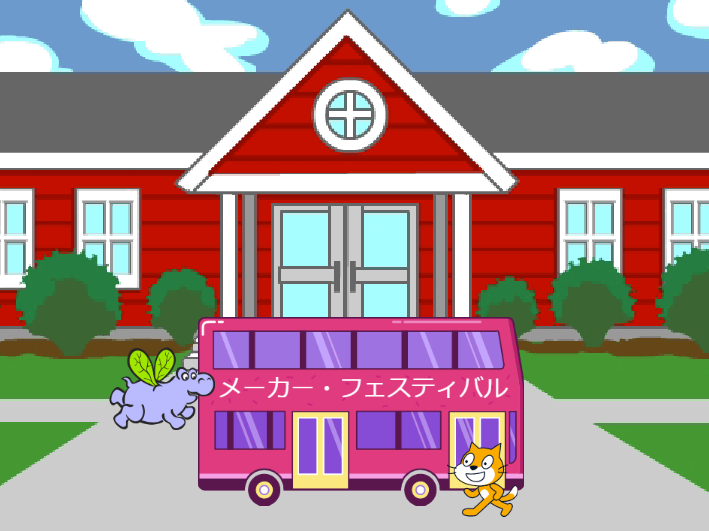
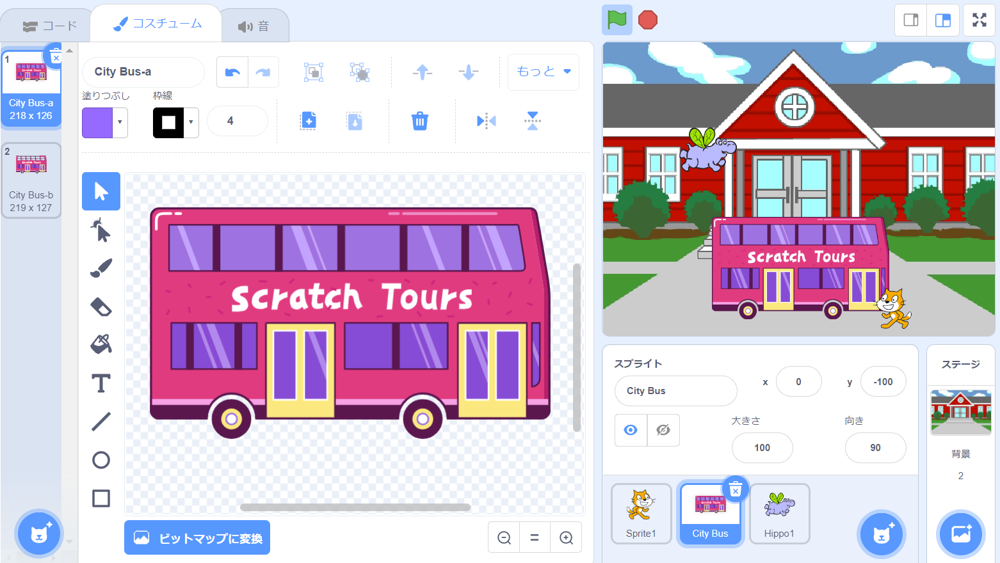
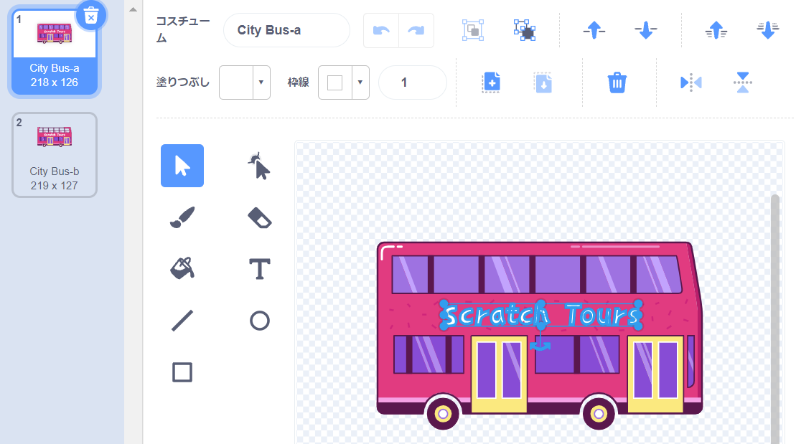
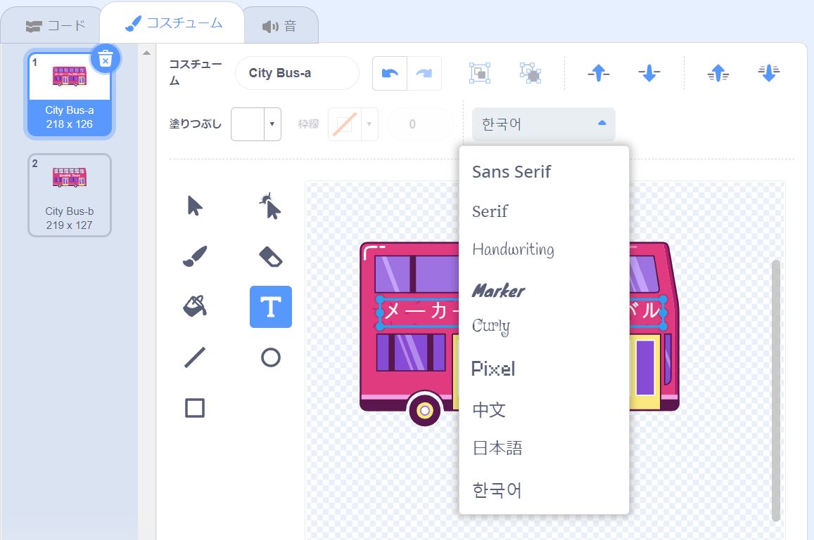
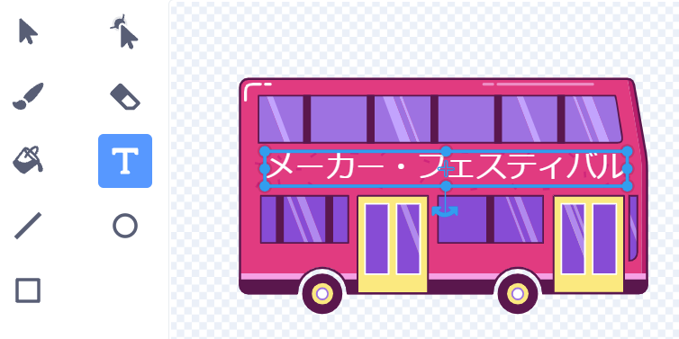

## 目的地を変更する

バスには「Scratch Tours」と書いてありますが、行き先はお好きなものに変更できます。 バスをどこに行かせたいですか？  

{:width="300px"}

### シティバスのスプライトを編集する

--- task ---

**City Bus**スプライトを選択し**コスチューム**タブをクリックします。

--- /task ---

--- task ---

白い「Scratch Tours」の文字をクリックして選択し、 **削除** をクリックして削除します。

**ヒント:** ペイントエディタの**削除**アイコンでも、キーボードの<kbd>削除</kbd> キーでもよいです。

--- /task ---

--- task ---

**テキスト** ツールを選択します。

文字を始めたい位置でバスをクリックして、好きな目的地を入力します。

フォント（書体）を変更するには、ドロップダウンメニューの**フォント**をクリックします。:

--- /task ---

--- task ---

**選択** （矢印）ツールをクリックし、テキストをドラッグしてバスの上に配置します。

--- /task ---

