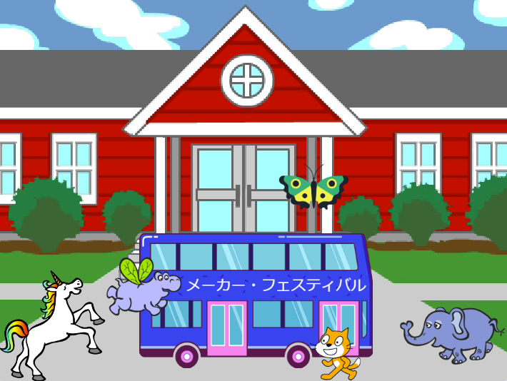

## プロジェクトをアップグレードする

これで、選択したスプライトをアニメーションに追加できます。 `x座標を〇〇、y座標を〇〇にする`{:class="block3motion"}で出発地点に移動すること、右側へ`行く`{:class="block3motion"}ことを確かめるためにコードを追加します。そして、バスに着くまで`動かす`{:class="block3motion"}と`次のコスチュームにする`{:class="block3looks"}のブロックを`繰り返す`{:class="block3control"}ようにします。

**ヒント:** **スプライトを選択**をクリックして、カーソルをスプライトの上に置くとコスチュームを表示できます。一部のモバイルデバイスでは、スプライトを長押ししてコスチュームを表示できます。（スプライトをタップしてホールドするとウィンドウがポップアップする場合、画面の角をタップしてウィンドウを閉じ、コスチュームを確認します）。 スプライトのコスチュームを確認すると、アニメーションに合ったスプライトを見つけるのに役立ちます。

{:width="300px"}

このプロジェクトで学習したブロックと、すでに知っているブロックを使用できます。

```blocks3
when flag clicked

when [timer v] > [5]

go to x: [0] y: [0] // x座標とy座標を変えてスプライトを動かします

show

hide

glide [2] secs to x: [0] y: [-100] // ステージ下の中央

repeat [30]
end

point towards (City Bus v)

point in direction (180) // 下向き

set rotation style [left-right v]

move [3] steps

next costume

start sound [clown honk v]

wait [0.1] seconds // 短い待ち時間

set [color v] effect to [50] // 最大200
```

--- collapse ---
---
title: 完成したプロジェクト
---

[完成したプロジェクトはこちら](https://scratch.mit.edu/projects/602807225/){:target="_blank"}で確認できます。

--- /collapse ---

プロジェクトを「リミックス」して、好きな変更を加えることもできます。 バスなどのスプライトに効果音を追加したり、バスにカラーエフェクトを加えたりできます。 スプライトの1つがバスに乗り遅れて、隠れることができませんでした。

この素晴らしいアップグレードを送ってくれたデジタルメーカーのLylaに感謝します！


--- save ---
