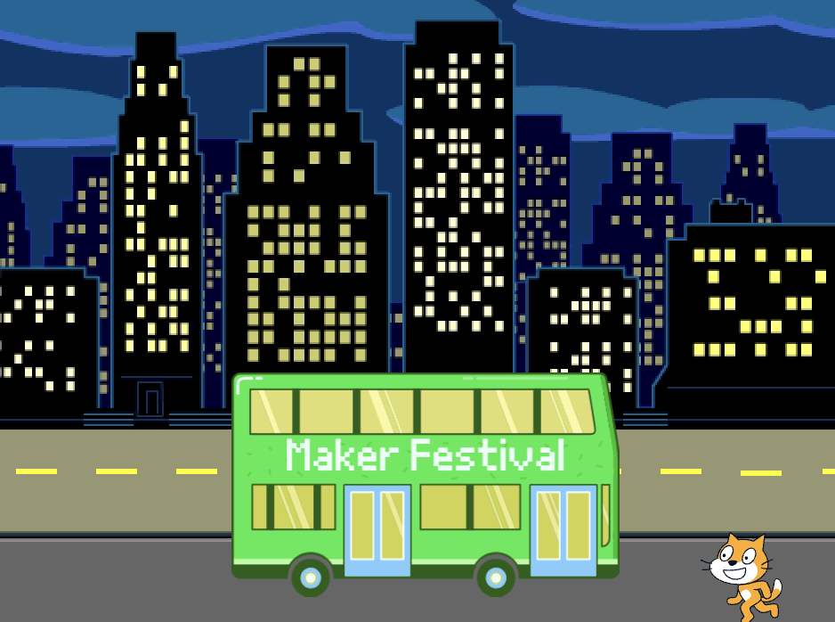

## ತಲುಪುವ ಸ್ಥಳವನ್ನು ಬದಲಾಯಿಸಿ

The writing on the bus says "Scratch Tours", but you can change the destination to one of your choice. ನಿಮ್ಮ ಬಸ್ ಎಲ್ಲಿಗೆ ಹೋಗಬೇಕೆಂದು ನೀವು ಬಯಸುತ್ತೀರಿ?  

{:width="300px"}

### Edit the City Bus sprite

--- task ---

Select the **City Bus** sprite and click on the **Costumes** tab:

--- /task ---

--- task ---

Click on the white "Scratch Tours" text to select it, and then click on **Delete** to remove it.

**Tip:** You can use the **Delete** icon in the Paint editor or the <kbd>Delete</kbd> key on your keyboard.

--- /task ---

--- task ---

**ಪಠ್ಯ** (ಬರವಣಿಗೆ) ಉಪಕರಣವನ್ನು ಆಯ್ಕೆ ಮಾಡಿ.

ನಿಮ್ಮ ಪಠ್ಯವನ್ನು ಪ್ರಾರಂಭಿಸಲು ನೀವು ಬಯಸುವ ಬಸ್ಸಿನ ಮೇಲೆ ಕ್ಲಿಕ್ ಮಾಡಿ ಮತ್ತು ನಿಮ್ಮ ಆಯ್ಕೆಯ ಗಮ್ಯಸ್ಥಾನವನ್ನು ಟೈಪ್ ಮಾಡಿ.

ಫಾಂಟ್ (ಬರವಣಿಗೆ ಶೈಲಿ) ಬದಲಿಸಲು, ನೀವು **ಫಾಂಟ್** ಡ್ರಾಪ್-ಡೌನ್ ಮೆನು ಮೇಲೆ ಕ್ಲಿಕ್ ಮಾಡಬಹುದು:

--- /task ---

--- task ---

Click on the **Select** (Arrow) tool, then drag the text to position it on the bus.

--- /task ---

