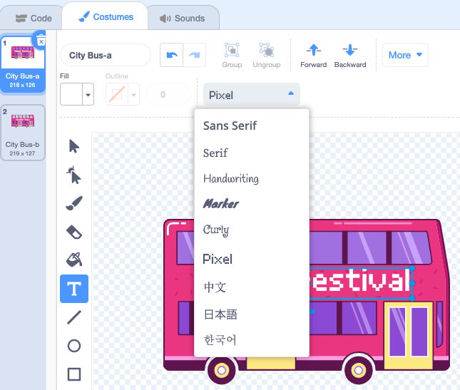

## ತಲುಪುವ ಸ್ಥಳವನ್ನು ಬದಲಾಯಿಸಿ

ಬಸ್ಸಿನಲ್ಲಿ ಬರೆದಿರುವುದು "ಸ್ಕ್ರಾಚ್ ಟೂರ್ಸ್" ಎಂದು ಹೇಳುತ್ತದೆ, ಆದರೆ ನೀವು ನಿಮ್ಮ ಆಯ್ಕೆಗೆ ಗಮ್ಯಸ್ಥಾನವನ್ನು ಬದಲಾಯಿಸಬಹುದು. ನಿಮ್ಮ ಬಸ್ ಎಲ್ಲಿಗೆ ಹೋಗಬೇಕೆಂದು ನೀವು ಬಯಸುತ್ತೀರಿ?  

{:width="300px"}

### Edit the City Bus sprite

--- task ---

**ಸಿಟಿ ಬಸ್** ಸ್ಪ್ರೈಟ್ ಅನ್ನು ಆಯ್ಕೆ ಮಾಡಿ**ಕಾಸ್ಟ್ಯೂಮ್** ಟ್ಯಾಬ್ ಮೇಲೆ ಕ್ಲಿಕ್ ಮಾಡಿ:

--- /task ---

--- task ---

ಅದನ್ನು ಆಯ್ಕೆ ಮಾಡಲು ಬಿಳಿ "ಸ್ಕ್ರಾಚ್ ಟೂರ್ಸ್" ಪಠ್ಯದ ಮೇಲೆ ಕ್ಲಿಕ್ ಮಾಡಿ, ತದನಂತರ ಅದನ್ನು ತೆಗೆದುಹಾಕಲು **ಡಿಲೀಟ್**ಕ್ಲಿಕ್ ಮಾಡಿ.

**Tip:** You can use the **Delete** icon in the Paint editor or the <kbd>Delete</kbd> key on your keyboard.

--- /task ---

--- task ---

**ಪಠ್ಯ** (ಬರವಣಿಗೆ) ಉಪಕರಣವನ್ನು ಆಯ್ಕೆ ಮಾಡಿ.

ನಿಮ್ಮ ಪಠ್ಯವನ್ನು ಪ್ರಾರಂಭಿಸಲು ನೀವು ಬಯಸುವ ಬಸ್ಸಿನ ಮೇಲೆ ಕ್ಲಿಕ್ ಮಾಡಿ ಮತ್ತು ನಿಮ್ಮ ಆಯ್ಕೆಯ ಗಮ್ಯಸ್ಥಾನವನ್ನು ಟೈಪ್ ಮಾಡಿ.

ಫಾಂಟ್ (ಬರವಣಿಗೆ ಶೈಲಿ) ಬದಲಿಸಲು, ನೀವು **ಫಾಂಟ್** ಡ್ರಾಪ್-ಡೌನ್ ಮೆನು ಮೇಲೆ ಕ್ಲಿಕ್ ಮಾಡಬಹುದು:

--- /task ---

--- task ---

**ಸೆಲೆಕ್ಟ್** (ಬಾಣ) ಟೂಲ್ ಮೇಲೆ ಕ್ಲಿಕ್ ಮಾಡಿ, ನಂತರ ಅದನ್ನು ಬಸ್ಸಿನಲ್ಲಿ ಇರಿಸಲು ಪಠ್ಯವನ್ನು ಎಳೆಯಿರಿ.

--- /task ---

