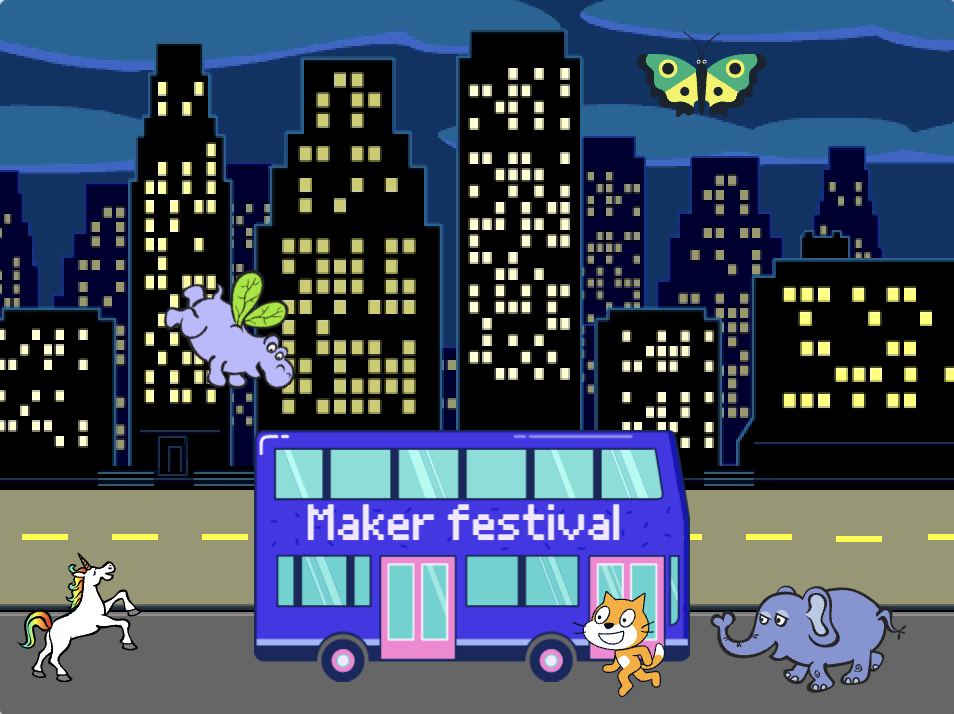

## Upgrade your project

ಈಗ, ನಿಮ್ಮ ಅನಿಮೇಷನ್‌ಗೆ ನಿಮ್ಮ ಆಯ್ಕೆಯ ಸ್ಪ್ರೈಟ್ ಅನ್ನು ನೀವು ಸೇರಿಸಬಹುದು. ನಿಮ್ಮ ಸ್ಪ್ರೈಟ್ ಮಾಡಲು ಈ ಕೋಡ್ ಬ್ಲಾಕ್ ಗಳನ್ನು ಸೇರಿಸಿ: `go to `{: ವರ್ಗ = "block3motion"} ಒಂದು ಆರಂಭಿಕ ಸ್ಥಾನವನ್ನು, ` point `: {ವರ್ಗ = "block3motion"} ಸರಿಯಾದ ದಿಕ್ಕಿನಲ್ಲಿ, `repeat`{: ವರ್ಗ = "block3control"} ಪುನರಾವರ್ತೆನೆಗೆ, `move`{: class = "block3motion"} ಚಲನೆಗೆ ಮತ್ತು `next costume`{: class = "block3looks"} ಮುಂದಿನ ಉಡುಪು,.

**ಸಲಹೆ:** **Choose a Sprite**ಕ್ಲಿಕ್ ಮಾಡಿದಾಗ, ಅದರ ವೇಷಭೂಷಣಗಳನ್ನು ನೋಡಲು ನೀವು ಸ್ಪ್ರೈಟ್ ಮೇಲೆ ನಿಮ್ಮ ಮೌಸ್ ಕರ್ಸರ್ ಅನ್ನು ಹಿಡಿದಿಟ್ಟುಕೊಳ್ಳಬಹುದು, ಅಥವಾ ಕೆಲವು ಮೊಬೈಲ್ ಸಾಧನಗಳಲ್ಲಿ, ಅದರ ವಸ್ತ್ರಗಳನ್ನು ನೋಡಲು ನೀವು ಸ್ಪ್ರೈಟ್ ಅನ್ನು ಟ್ಯಾಪ್ ಮಾಡಿ ಮತ್ತು ಹಿಡಿದಿಟ್ಟುಕೊಳ್ಳಬಹುದು (ಒಂದು ವೇಳೆ ವಿಂಡೋ ನೀವು ಸ್ಪ್ರೈಟ್ ಅನ್ನು ಒತ್ತಿ ಮತ್ತು ಹಿಡಿದಾಗ ಪಾಪ್ ಅಪ್ ಆಗುತ್ತದೆ, ವಿಂಡೋವನ್ನು ಮುಚ್ಚಲು ಮತ್ತು ವೇಷಭೂಷಣಗಳನ್ನು ನೋಡಲು ಪರದೆಯ ಬದಿಯಲ್ಲಿ ಟ್ಯಾಪ್ ಮಾಡಿ). ಸ್ಪ್ರೈಟ್‌ಗಳ ವೇಷಭೂಷಣಗಳನ್ನು ನೋಡುವುದರಿಂದ ಆನಿಮೇಷನ್‌ಗೆ ಉತ್ತಮವಾಗಿ ಕೆಲಸ ಮಾಡುವ ಸ್ಪ್ರೈಟ್ ಅನ್ನು ಕಂಡುಹಿಡಿಯಲು ನಿಮಗೆ ಸಹಾಯ ಮಾಡಬಹುದು.

{:width="300px"}

ಈ ಯೋಜನೆಯಲ್ಲಿ ನೀವು ಕಲಿತ ಯಾವುದೇ ಬ್ಲಾಕ್‌ಗಳನ್ನು ಹಾಗೂ ನಿಮಗೆ ಈಗಾಗಲೇ ತಿಳಿದಿರುವ ಬ್ಲಾಕ್‌ಗಳನ್ನು ನೀವು ಬಳಸಬಹುದು:

```blocks3
when flag clicked

go to x: [0] y: [0] // drag the sprite to choose x and y

show

hide

glide [2] secs to x: [0] y: [-100] // bottom middle of the Stage

repeat [30]
end

point towards (City Bus v)

point in direction (180) // point down

set rotation style [left-right v]

move [3] steps

next costume

start sound [clown honk v]

wait [0.1] seconds // short delay

set [color v] effect to [50] // up to 200
```

--- collapse ---
---
ಪೂರ್ಣಗೊಂಡ ಯೋಜನೆ
---

You can view the [completed project here](https://scratch.mit.edu/projects/724160134/){:target="_blank"}.

--- /collapse ---

ನೀವು ಇಷ್ಟಪಡುವ ಯಾವುದೇ ಬದಲಾವಣೆಗಳನ್ನು ಮಾಡಲು ನೀವು ಯೋಜನೆಯನ್ನು 'ರೀಮಿಕ್ಸ್' ಮಾಡಬಹುದು. ನೀವು ಬಸ್ ಅಥವಾ ಇತರ ಸ್ಪ್ರೈಟ್‌ಗಳಿಗೆ ಧ್ವನಿ ಪರಿಣಾಮಗಳನ್ನು ಸೇರಿಸಬಹುದು ಅಥವಾ ಬಸ್ಸಿನ ಬಣ್ಣದ ಪರಿಣಾಮವನ್ನು ಹೊಂದಿಸಬಹುದು. One of the sprites could miss the bus and not hide.

Thanks to digital maker Lyla for sending this fantastic upgrade!


--- save ---
