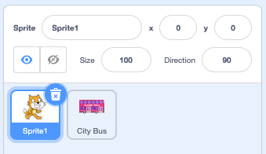

## तुमचा बसचा देखावा तयार करा

<div style="display: flex; flex-wrap: wrap">
<div style="flex-basis: 200px; flex-grow: 1; margin-right: 15px;">
पार्श्वभूमी निवडा आणि बस स्प्राइट जोडा.
</div>
<div>

{:width="300px"}

</div>
</div>

### स्टार्टर प्रकल्प उघडा

--- task ---

[कॅच द बस स्टार्टर प्रोजेक्ट](https://scratch.mit.edu/projects/582214330/editor){:target="_blank"} उघडा. दुसर्‍या ब्राउझर टॅबमध्ये स्क्रॅच उघडेल.

[[[working-offline]]]

--- /task ---

### एक पार्श्वभूमी निवडा

--- task ---

**वर क्लिक करा (किंवा टॅबलेटवर, टॅप करा) स्टेज फलकावर पार्श्वभूमी** निवडा (स्क्रीनच्या तळाशी उजव्या कोपर्यात):


--- /task ---

--- task ---

**आउटडोअर** श्रेणीवर क्लिक करा. एक पार्श्वभूमी जोडा जी तुमच्या बससाठी चांगली सुरुवात ठरेल:


--- /task ---

### स्प्राइट निवडा

--- task ---

**वर क्लिक करा स्प्राइट**निवडा:


--- /task ---

--- task ---

शीर्षस्थानी असलेल्या शोध बॉक्समध्ये `बस` टाइप करा:


तुमच्या प्रकल्पात **सिटी बस** स्प्राइट जोडा.

--- /task ---

### तुमच्या बसला सुरुवातीची स्थिती द्या

--- task ---

स्टेजच्या खाली असलेल्या स्प्राईट सूचीमध्ये **सिटी बस** स्प्राइट निवडले असल्याची खात्री करा.

`इव्हेंट`{:class="block3events"} ब्लॉक मेनूमधून </code>जेव्हा हिरवा झेंडा क्लिक केल्यावर`{:class="block3events"} ब्लॉक कोड क्षेत्रात ड्रॅग करा: </p>

<p spaces-before="0"></p>

<pre><code class="blocks3">when flag clicked
`</pre>

--- /task ---

--- task ---

बस स्टेज वरील चांगल्या जागी ड्रॅग करा:


बसचे **x** आणि **y** कोऑर्डिनेट्स (स्थितीचे वर्णन करण्यासाठी वापरलेले संख्या) स्टेजच्या खाली असलेल्या स्प्राईट उपखंडात दर्शविले आहेत:


--- /task ---

--- task ---

X: y:</code>{:class="block3motion"} ब्लॉकमध्ये `जोडा:</p>

<p spaces-before="0"></p>

<pre><code class="blocks3">when flag clicked
+go to x: (0) y: (-100)
`</pre>

`go to x: y:`{:class="block3motion"} ब्लॉक मधील संख्या बसचे वर्तमान x आणि y निर्देशांक आहेत. तुमच्या प्रकल्पातील संख्या थोड्या वेगळ्या असू शकतात.

--- /task ---

--- task ---

**चाचणी:** स्टेजवर कुठेही बस ड्रॅग करा, आणि नंतर हिरव्या ध्वजावर क्लिक करा. बसने नेहमी त्याच्या सुरुवातीच्या स्थितीत जावे.


--- /task ---

### Sprites पात्राच्या मागे बस हलवा

--- task ---

**सिटी बस** स्प्राइट नेहमी सर्व कॅरेक्टर स्प्राइट्सच्या मागे आहे याची खात्री करण्यासाठी, फ्रंट लेयर</code>{:class="block3looks"} ब्लॉकवर `जोडा, नंतर <code>फ्रंट`{:class="block3looks"} वर क्लिक करा. आणि ते `बॅक`{:class="block3looks"} वर बदला:


```blocks3
when flag clicked
go to x: (0) y: (-100)
+ go to [back v] layer
```

**टीप:** तुम्ही `फ्रंट लेयर`{:class="block3looks"} ब्लॉकबघू शकत नसल्यास, तुम्हाला `लुक्स`{:class="block3looks"} ब्लॉक मेनूमध्ये खाली स्क्रोल करावे लागेल.

--- /task ---

### बसचा रंग बदला

--- task ---

तुम्ही बसचा रंग बदलू शकता:


```blocks3
when flag clicked
go to x: (0) y: (-100)
go to [back v] layer
+set [color v] effect to (50) // try numbers up to 200
```

--- /task ---

### स्क्रॅच कॅटचा आकार बदला

--- task ---

स्क्रॅच कॅट सर्व नवीन स्क्रॅच प्रकल्पांमध्ये स्प्राइट सूचीमध्ये **Sprite1** म्हणून दिसते. स्क्रॅच कॅटला अॅनिमेट करण्यासाठी तयार होण्यासाठी स्प्राईट यादीतील **Sprite1** sprite वर क्लिक करा:



**टीप:** जर तुम्ही चुकून **Sprite1** (Scratch Cat) sprite हटवला असेल, तर तुम्ही **Choose a Sprite** चिन्हावर क्लिक करू शकता आणि `cat`शोधू शकता.

--- /task ---

--- task ---

स्प्राइट उपखंडात, **आकार** गुणधर्मावर क्लिक करा आणि स्क्रॅच कॅटचा आकार बदलून `50`करा:


--- /task --- 
