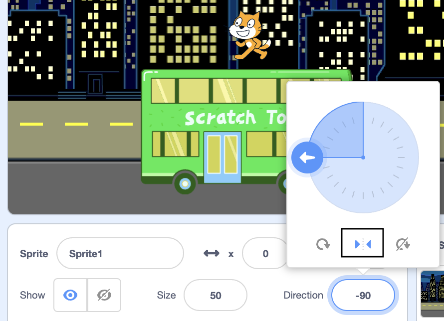

## स्क्रॅच मांजर बस पकडते

<div style="display: flex; flex-wrap: wrap">
<div style="flex-basis: 200px; flex-grow: 1; margin-right: 15px;">
स्टेजच्या **उजव्या बाजूला** दिसण्यासाठी स्क्रॅच मांजरीला अॅनिमेट करा आणि **लूप** मध्ये अनेक वेळा छोटी हालचाल करून बसकडे जा. 
</div>
<div>

{:width="300px"}

</div>
</div>

### स्क्रॅच कॅटला त्याच्या सुरुवातीच्या स्थितीत आणा

--- task ---

स्प्राइट फलकातील**दिशा** गुणधर्मावर क्लिक करा. `-90`कडे निर्देशित करण्यासाठी बाण फिरवा. त्यानंतर, स्क्रॅच मांजर उलटे वळायचे  थांबवण्यासाठी रोटेशन शैली `डावी-उजवी` मध्ये बदलण्यासाठी मध्यभागी **डावे/उजवे** चिन्हावर क्लिक करा:



--- /task ---

--- task ---

स्क्रॅच मांजर स्टेजच्या तळाशी उजव्या बाजूला ड्रॅग करा.


**टीप:** जर तुम्ही स्टेजच्या बाहेर स्प्राईट ठेवण्याचा प्रयत्न केला तर तो स्टेजवरील त्याच्या पूर्वीच्या स्थानावर परत जाईल.

--- /task ---

--- task ---

स्क्रॅच कॅटला त्यांच्या सुरुवातीच्या स्थितीत आणण्यासाठी कोड जोडा:


```blocks3
when flag clicked
go to x:(200) y:(-150) // bottom right-hand side
```

--- /task ---

--- task ---

**चाचणी:** स्क्रॅच मांजरीला नवीन स्थानावर ड्रॅग करा, नंतर तुमच्या `go to x: y:`{:class="block3motion"} ब्लॉकवर क्लिक करा. स्क्रॅच मांजर प्रत्येक वेळी तळाशी उजव्या बाजूला परत जावे.

--- /task ---

### स्क्रॅच मांजर एनिमेट करा

तुम्ही स्क्रॅच कॅटने अनेक वेळा छोट्या पायऱ्या रिपीट करण्यासाठी `रिपीट`{:class="block3control"} लूपमध्ये कोड जोडाल. यामुळे स्क्रॅच कॅट सजीव दिसेल.

--- task ---

एक `repeat`{:class="block3control"} `10` ब्लॉक जोडा, नंतर `move`{:class="block3motion"} `10` `steps`{:class="block3motion"} ब्लॉक त्याच्या आत ड्रॅग करा:


```blocks3
when flag clicked
go to x:(200) y:(-150) // bottom right-hand side
+ repeat (10) // try different numbers
move (5) steps //  5 is a good walking speed
end
```

--- /task ---

--- task ---

**चाचणी:** हिरव्या ध्वजावर क्लिक करा. `repeat`{:class="block3control"} `10` ब्लॉकमधील संख्या बदलण्याचा प्रयत्न करा जेणेकरून स्क्रॅच कॅट बसमध्ये थांबेल.

--- /task ---

काही स्प्राइट्समध्ये एकापेक्षा जास्त पोशाख असतात. तुम्ही स्क्रॅच कॅट वॉकिंगचे अॅनिमेशन तयार करण्यासाठी **स्क्रॅच कॅट** स्प्राइटचे पोशाख वापराल.

--- task ---

**पोशाख** टॅबवर क्लिक करा. **स्क्रॅच कॅट** स्प्राइटमध्ये दोन पोशाख आहेत आणि ते एकत्र, चालण्याची हालचाल करण्यासाठी वापरले जाऊ शकतात.

--- /task ---

--- task ---

**कोड** टॅबवर क्लिक करा. Add a `next costume`{:class="block3looks"} block inside the `repeat`{:class="block3control"} block:


```blocks3
when flag clicked
go to x:(200) y:(-150) // bottom right-hand side
repeat (20) // try different numbers
move (5) steps //  5 is a good walking speed
+ next costume 
end
```
--- /task ---

--- task ---

**चाचणी:** हिरव्या ध्वजावर क्लिक करा आणि स्क्रॅच मांजर बसमध्ये जाईल.

--- /task ---

### स्क्रॅच मांजर लपवा

--- task ---

स्क्रॅच मांजर बसमध्ये पोहोचल्यावर `लपवण्यासाठी`{:class="block3looks"} ला ब्लॉक जोडा:


```blocks3
when flag clicked
go to x:(200) y:(-150) // bottom right-hand side
repeat (20) // try different numbers
move (5) steps //  5 is a good walking speed
next costume 
end
+ hide
```

--- /task ---

--- task ---

**चाचणी:** हिरव्या झेंड्यावर पुन्हा क्लिक करा, आणि तुम्हाला दिसेल की स्क्रॅच मांजर आता नाहीशी झाली आहे.

--- /task ---

### स्क्रॅच मांजर दाखवा

--- task ---

`शो`{:class="block3looks"} ब्लॉक जोडा जेणेकरून स्क्रॅच मांजर बसमध्ये जाण्यापूर्वी दिसेल:


```blocks3
when flag clicked
go to x:(200) y:(-150) // bottom right-hand side
+ show
repeat (20) // try different numbers
move (5) steps //  5 is a good walking speed
next costume 
end
hide
```

**टीप:** जेव्हा तुम्ही `hide`{:class="block3looks"} ब्लॉक वापरता, तेव्हा आवश्यकतेनुसार स्प्राइट दृश्यमान आहे याची खात्री करण्यासाठी तुम्हाला `शो`{:class="block3looks"} ब्लॉक देखील जोडणे आवश्यक आहे.

--- /task ---

--- task ---

**Test:** Click on the green flag to test your project, and make sure that the Scratch Cat appears.

--- /task ---

