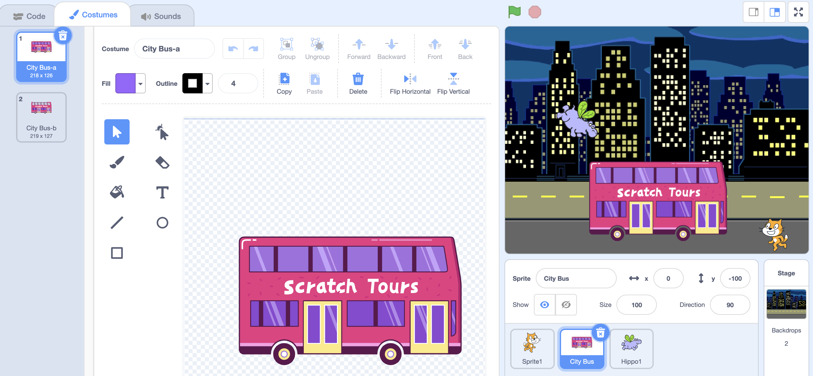
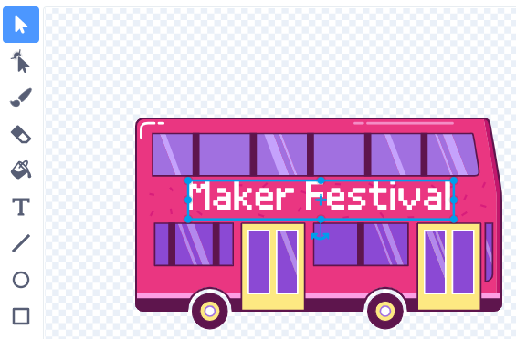

## गंतव्य स्थान बदला

बसवरील लिखाण "स्क्रॅच टूर्स" असे लिहिले आहे, परंतु तुम्ही तुमच्या आवडीचे गंतव्यस्थान बदलू शकता. तुम्हाला तुमची बस कुठे जायची आहे?  

{:width="300px"}

### सिटी बस स्प्राइट संपादित करा

--- task ---

**सिटी बस** स्प्राइट निवडा आणि **पोशाख** टॅबवर क्लिक करा:

--- /task ---

--- task ---

ते निवडण्यासाठी पांढऱ्या "स्क्रॅच टूर्स" मजकुरावर क्लिक करा आणि नंतर तो काढण्यासाठी **हटवा** वर क्लिक करा.

**टीप:** तुम्ही पेंट एडिटरमधील **हटवा** चिन्ह किंवा तुमच्या कीबोर्डवरील <kbd>हटवा</kbd> की वापरू शकता.

--- /task ---

--- task ---

**मजकूर** (लेखन) साधन निवडा.

जिथे तुम्हाला तुमचा मजकूर सुरू करायचा आहे त्या बसवर क्लिक करा आणि तुमच्या आवडीचे गंतव्यस्थान टाइप करा.

फॉन्ट (लेखन शैली) बदलण्यासाठी, तुम्ही **फॉन्ट** ड्रॉप-डाउन मेनूवर क्लिक करू शकता:

--- /task ---

--- task ---

**सिलेक्ट** (एरो) टूलवर क्लिक करा, त्यानंतर मजकूर बसवर ठेवण्यासाठी खेचा.

--- /task ---

