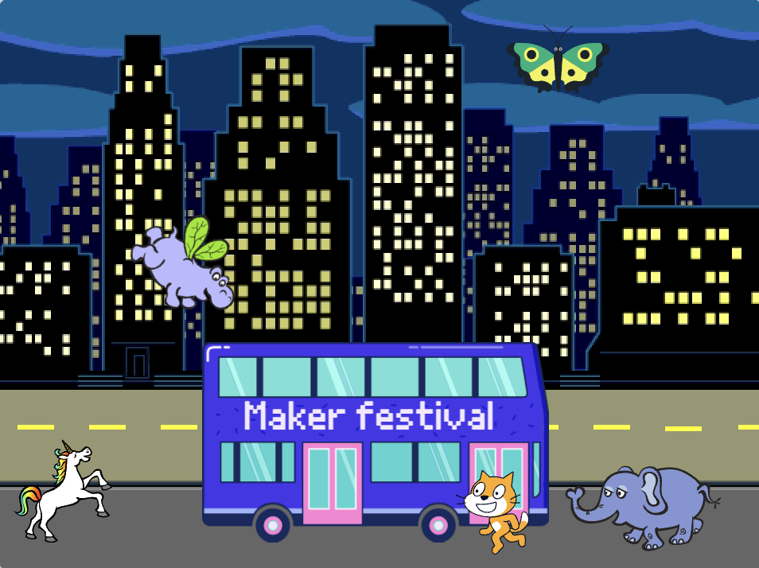

## तुमचा प्रकल्प श्रेणीसुधारित करा

आता, तुम्ही तुमच्या अ‍ॅनिमेशनमध्ये तुमच्या आवडीचे स्प्राइट जोडू शकता. तुमचा स्प्राइट ``{:class="block3motion"} वर जाण्यासाठी तुम्हाला कोड जोडणे आवश्यक आहे, `पॉइंट`{:class="block3motion"} योग्य दिशेने, आणि नंतर `पुनरावृत्ती`{:class ="block3control"} `हलवा`{:class="block3motion"} आणि `पुढील पोशाख`{:class="block3looks"} बसपर्यंत पोहोचण्यासाठी ब्लॉक.

**टीप:** जेव्हा तुम्ही **Sprite**निवडा वर क्लिक करा, तेव्हा तुम्ही तुमचा माउस कर्सर एखाद्या स्प्राईटवर त्याचे पोशाख पाहण्यासाठी धरून ठेवू शकता किंवा काही मोबाईल डिव्हाइसेसवर, तुम्ही स्पराईटचे पोशाख पाहण्यासाठी त्यावर टॅप करून धरून ठेवू शकता (विंडो असल्यास जेव्हा तुम्ही स्प्राइटवर टॅप करून धरून ठेवता तेव्हा पॉप अप होते, विंडो बंद करण्यासाठी स्क्रीनच्या बाजूला टॅप करा आणि पोशाख पहा). स्प्राइट्सचे पोशाख पाहिल्यास हलणारा प्रभाव साठी चांगले काम करणारे स्प्राइट शोधण्यात मदत होऊ शकते.

{:width="300px"}

तुम्ही या प्रकल्प मध्ये शिकलेल्या कोणत्याही ब्लॉक्सचा वापर करू शकता, तसेच तुम्हाला आधीपासून माहीत असलेल्या ब्लॉक्सचा वापर करू शकता:

```blocks3
when flag clicked

go to x: [0] y: [0] // drag the sprite to choose x and y

show

hide

glide [2] secs to x: [0] y: [-100] // bottom middle of the Stage

repeat [30]
end

point towards (City Bus v)

point in direction (180) // point down

set rotation style [left-right v]

move [3] steps

next costume

start sound [clown honk v]

wait [0.1] seconds // short delay

set [color v] effect to [50] // up to 200
```

--- collapse ---
---
शीर्षक: प्रकल्प पूर्ण झाला
---

तुम्ही</a>पूर्ण झालेला प्रकल्प येथे

 पाहू शकता.</p> 

--- /collapse ---

तुम्‍हाला आवडणारे कोणतेही बदल करण्‍यासाठी तुम्ही प्रकल्पचे 'रिमिक्स' देखील करू शकता. तुम्ही बस किंवा इतर स्प्राइट्समध्ये ध्वनी प्रभाव जोडू शकता किंवा बसचा रंग प्रभाव सेट करू शकता. स्प्राइट्सपैकी एक बस चुकवू शकतो आणि लपवू शकत नाही.

हे विलक्षण अपग्रेड पाठवल्याबद्दल अंकात्मक निर्माता Lyla चे आभार!


--- save ---
