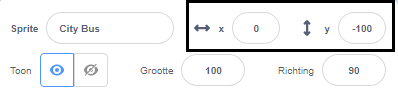

## Creëer je busscène

<div style="display: flex; flex-wrap: wrap">
<div style="flex-basis: 200px; flex-grow: 1; margin-right: 15px;">
Je kiest een achtergrond en voegt een bus-sprite toe.
</div>
<div>

{:width="300px"}

</div>
</div>

### Open het startproject

--- task ---

Open het [Neem de bus startproject](https://scratch.mit.edu/projects/582214330/editor){:target="_blank"}. Scratch wordt in een nieuw browsertabblad geopend.

[[[working-offline]]]

--- /task ---

### Kies een achtergrond

--- task ---

Klik (of tik op een tablet) op **Kies een achtergrond** in het speelveld-paneel (in de rechterbenedenhoek van het scherm):


--- /task ---

--- task ---

Klik op de categorie **Buiten**. Voeg een achtergrond toe die een goed startpunt is voor je bus:


--- /task ---

### Kies een Sprite

--- task ---

Klik op **Kies een Sprite**:


--- /task ---

--- task ---

Typ `bus` in het zoekvak bovenaan:


Voeg de **City Bus** sprite toe aan je project.

--- /task ---

### Geef je bus een startpositie

--- task ---

Zorg ervoor dat de **City Bus** is geselecteerd in de Sprite lijst onder het speelveld.

Sleep een `wanneer op de groene vlag wordt geklikt`{:class="block3events"} blok uit het `Gebeurtenissen`{:class="block3events"} blokkenmenu naar het huidige sprite paneel:


```blocks3
when flag clicked
```

--- /task ---

--- task ---

Sleep de bus naar een goede positie op het speelveld:


De **x** en **y** coördinaten (de getallen die worden gebruikt om de positie te beschrijven) van de bus worden weergegeven in het Sprite-venster onder het speelveld:



--- /task ---

--- task ---

Voeg een `ga naar x: y:`{:class="block3motion"} blok toe:


```blocks3
when flag clicked
+go to x: (0) y: (-100)
```

De getallen in het `ga naar x: y:`{:class="block3motion"} blok zijn de huidige x- en y-coördinaten van de bus. De getallen in jouw project kunnen een beetje anders zijn.

--- /task ---

--- task ---

**Test:** Sleep de bus naar een willekeurige plek in het speelveld en klik vervolgens op de groene vlag. De bus moet altijd naar de startpositie gaan.


--- /task ---

### Verplaats de bus achter de personage-sprites

--- task ---

Om ervoor te zorgen dat de **City Bus** altijd achter alle personage sprites staat, voeg je een `ga naar laag voorgrond`{:class="block3looks"}-blok toe en klik je vervolgens op `voorgrond`{:class="block3looks"} en verander het in `achtergrond`{:class="block3looks"}:


```blocks3
when flag clicked
go to x: (0) y: (-100)
+ go to [back v] layer
```

**Tip:** Als je het `ga naar laag voorgrond`{:class="block3looks"} blok niet kunt zien, moet je naar beneden scrollen in het `Uiterlijken`{:class="block3looks"} blokkenmenu.

--- /task ---

### Verander de kleur van de bus

--- task ---

Je kunt de kleur van de bus wijzigen:


```blocks3
when flag clicked
go to x: (0) y: (-100)
go to [back v] layer
+set [color v] effect to (50) // probeer getallen tot 200
```

--- /task ---

### Formaat van de Scratch kat wijzigen

--- task ---

De Scratch kat verschijnt in alle nieuwe Scratch-projecten als **Sprite1** in de Sprite-lijst. Klik op de **Sprite1** sprite in de Sprite-lijst om de Scratch kat te kunnen animeren:


**Tip:** Als je per ongeluk de **Sprite1** (Scratch kat) hebt verwijderd, kun je op **Kies een Sprite** klikken en zoeken naar `cat`.

--- /task ---

--- task ---

Klik in het Sprite-venster op de **Grootte** en wijzig de grootte van de Scratch kat in `50`:


--- /task --- 
