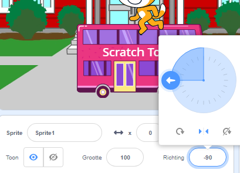
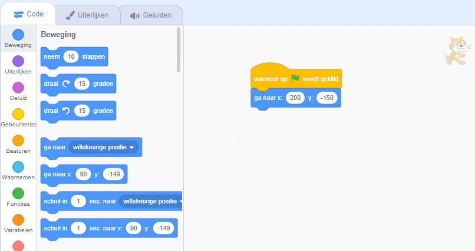

## De Scratch kat haalt de bus

<div style="display: flex; flex-wrap: wrap">
<div style="flex-basis: 200px; flex-grow: 1; margin-right: 15px;">
Je animeert de Scratch kat om aan de **rechterkant** van het speelveld te verschijnen en door een kleine beweging vele malen te herhalen in een **lus** naar de bus te lopen. 
</div>
<div>

{:width="300px"}

</div>
</div>

### Breng de Scratch kat naar de startpositie

--- task ---

Klik op de **Richting** in het Sprite-venster. Draai de pijl naar `-90`. Klik vervolgens op het **Links/Rechts** icoon in het midden om de draaistijl te wijzigen naar `links-rechts` om te voorkomen dat de Scratch kat ondersteboven draait:



--- /task ---

--- task ---

Sleep de Scratch kat naar de rechterbenedenhoek van het speelveld.


**Tip:** Als je een sprite buiten het speelveld probeert te plaatsen, zal deze teruggaan naar de laatste positie op het speelveld.

--- /task ---

--- task ---

Voeg code toe om de Scratch kat naar de startpositie te krijgen:


```blocks3
when flag clicked
go to x:(200) y:(-150) // rechtsonder
```

--- /task ---

--- task ---

**Test:** Sleep de Scratch kat naar een nieuwe positie en klik vervolgens op je `ga naar x: y:`{:class="block3motion"}-blok. De Scratch kat moet elke keer terug naar de rechteronderkant gaan.

--- /task ---

### Animeer de Scratch kat

Je voegt code toe in een `herhaal`{:class="block3control"} lus om de Scratch kat een klein aantal stappen vele malen te laten herhalen. Hierdoor zal lijken of de Scratch kat geanimeerd wordt.

--- task ---

Voeg een `herhaal`{:class="block3control"} `10` blok toe, sleep dan een `neem`{:class="block3motion"} `10` `stappen`{:class="block3motion"} blok erin:




```blocks3
when flag clicked
go to x:(200) y:(-150) // rechtsonder
+ repeat (10) // probeer verschillende getallen
move (5) steps //  5 is een goede loopsnelheid
end
```

--- /task ---

--- task ---

**Test:** Klik op de groene vlag. Probeer de getallen het `herhaal`{:class="block3control"} `10` blok te veranderen zodat de Scratch kat bij de bus stopt.

--- /task ---

Sommige sprites hebben meer dan één uiterlijk. Je gebruikt de uiterlijkheden van de **Scratch kat** sprite om een animatie te maken van een wandelende Scratch kat.

--- task ---

Klik op het tabblad **Uiterlijken**. De **Scratch kat** sprite heeft twee uiterlijken en samen kunnen ze worden gebruikt om een loopbeweging te maken.

--- /task ---

--- task ---

Klik op het tabblad **Code**. Voeg een `volgend uiterlijk`{:class="block3looks"} blok toe:


```blocks3
when flag clicked
go to x:(200) y:(-150) // rechtsonder
repeat (20) // probeer verschillende getallen
move (5) steps //  5 is een goede loopsnelheid
+ next costume 
end
```
--- /task ---

--- task ---

**Test:** Klik op de groene vlag en de Scratch kat zal naar de bus lopen.

--- /task ---

### De Scratch kat laten verdwijnen

--- task ---

Voeg een `verdwijn`{:class="block3looks"} blok toe aan de Scratch kat wanneer deze de bus bereikt:


```blocks3
when flag clicked
go to x:(200) y:(-150) // rechtsonder
repeat (20) // probeer verschillende getallen
move (5) steps //  5 is een goede loopsnelheid
next costume 
end
+ hide
```

--- /task ---

--- task ---

**Test:** Klik nogmaals op de groene vlag en je zult zien dat de Scratch kat nu verdwenen is.

--- /task ---

### De Scratch kat laten verschijnen

--- task ---

Voeg een `verschijn`{:class="block3looks"}-blok toe zodat de Scratch kat verschijnt voordat hij naar de bus loopt:


```blocks3
when flag clicked
go to x:(200) y:(-150) // rechtsonder
+ show
repeat (20) // probeer verschillende getallen
move (5) steps //  5 is een goede loopsnelheid
next costume 
end
hide
```

**Tip:** Als je een `verdwijn`{:class="block3looks"} blok gebruikt, moet je ook een blok `verschijn`{:class="block3looks"} toevoegen om ervoor te zorgen dat een sprite zichtbaar is wanneer dat nodig is.

--- /task ---

--- task ---

**Test:** Klik op de groene vlag om je project te testen en zorg ervoor dat de Scratch kat verschijnt.

--- /task ---

