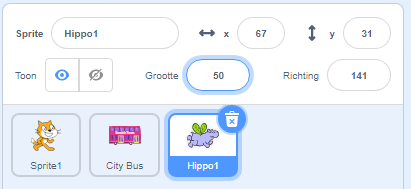

## Het nijlpaard vliegt naar de bus

<div style="display: flex; flex-wrap: wrap">
<div style="flex-basis: 200px; flex-grow: 1; margin-right: 15px;">
Je voegt een nijlpaard sprite toe die naar de bus vliegt.
</div>
<div>

{:width="300px"}

</div>
</div>

### Geef het nijlpaard een startpositie

--- task ---

Voeg de **Hippo1** sprite toe aan je project.

Verander de **Grootte** van de **Hippo1** sprite:



--- /task ---

--- task ---

Sleep het nijlpaard naar de linkerbovenhoek van het speelveld.


--- /task ---

--- task ---

Voeg code toe om het nijlpaard naar de startpositie te krijgen:

```blocks3
when flag clicked
go to x: [-200] y: [150] // linksboven
```

**Tip:** De `x`{:class="block3motion"} en `y`{:class="block3motion"} coördinaten in het `ga naar x: y:`{:class="block3motion"} blok zijn de huidige positie van het nijlpaard, deze hoef je dus niet in te typen.

--- /task ---

### Laat het nijlpaard met zijn vleugels klapperen en vliegen

--- task ---

Voeg code toe om het nijlpaard naar de **City Bus** te laten vliegen:

```blocks3
when flag clicked
go to x: [-200] y: [150] 
+repeat [100] 
point towards (City Bus v) // wijzigen van muisaanwijzer
move [3] steps
next costume
+end
```

--- /task ---

--- task ---

**Test:** Klik op de groene vlag en controleer of het nijlpaard naar de bus vliegt. Je kunt het getal in het `herhaal`{:class="block3control"}-blok wijzigen om het nijlpaard op de juiste plaats te laten stoppen.

--- /task ---

### Laat de bus verschijnen en verdwijnen

--- task ---

Voeg `verschijn`{:class="block3looks"} en `verdwijn`{:class="block3looks"} blokken toe:

```blocks3
when flag clicked
go to x: [-200] y: [150] 
+ show
repeat [90] 
point towards (City Bus v)
move [3] steps
next costume
end
+ hide
```

--- /task ---

--- task ---

**Test:** Klik op de groene vlag. Het nijlpaard vliegt naar de bus en gaat de bus in.

--- /task ---
