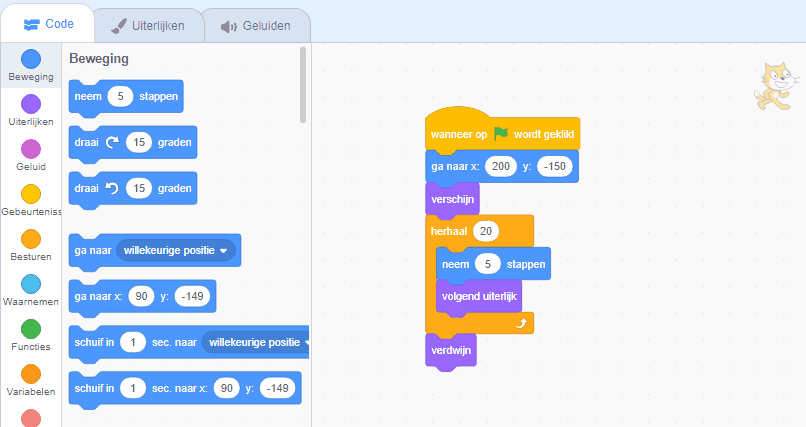

## De bus missen

<div style="display: flex; flex-wrap: wrap">
<div style="flex-basis: 200px; flex-grow: 1; margin-right: 15px;">
Wat als de Scratch kat niet snel genoeg rende om de bus te halen?
</div>
<div>

{:width="300px"}

</div>
</div>

### Zorg dat Scratch kat de bus mist

--- task ---

Selecteer de **Scratch kat** sprite en voeg een `wacht sec.`{:class="block3control"} blok toe:


```blocks3
when flag clicked
go to x:(200) y:(-150) 
show
repeat (20) // probeer verschillende getallen
move (5) steps 
next costume 
+ wait (1) seconds
end
hide
```
--- /task ---

--- task ---

**Test:** Klik op de groene vlag. De Scratch kat loopt te langzaam en mist de bus!

--- /task ---

### Zorg dat Scratch kat de bus haalt

--- task ---

Je wilt vertragingen van minder dan één seconde. 0,5 is een halve seconde, 0,25 is een kwart seconde en 0,1 is een tiende van een seconde.

Wijzig de vertraging in het `wacht sec.`{:class="block3control"} blok:


```blocks3
wait (0.2) seconds // probeer 0.1, 0.5, 0.05
```

**Test:** Klik op de groene vlag en de Scratch kat zal sneller lopen. Kies de vertraging die je het leukst vindt.

--- /task ---

### Kies of Scratch kat de bus haalt of mist

--- task ---

Als wilt dat de Scratch kat **de bus mist**, verwijder het `verdwijn`{:class="block3looks"} blok van de code, zodat de Scratch kat op het speelveld blijft:




```blocks3
when flag clicked
go to x:(200) y:(-150) 
show
repeat (20) 
move (5) steps 
next costume
wait (0.5) seconds 
end
-hide
```
--- /task ---

--- task ---

Als je wilt dat de Scratch kat **de bus haalt**, moet je de bus langer laten wachten voordat hij vertrekt:


```blocks3
when flag clicked 
+wait [4] seconds // veranderen van 4 naar 6
glide [2] secs to x: [320] y: [-100] // rechterkant van het speelveld
hide
```

Je moet het `verdwijn`{:class="block3looks"} blok terugplaatsen in de **Scratch kat** als je het hebt verwijderd en wilt dat de Scratch kat de bus haalt.

--- /task ---

--- task ---

Breng wijzigingen aan totdat de animatie werkt zoals jij dat wilt.

--- /task ---

<p style="border-left: solid; border-width:10px; border-color: #0faeb0; background-color: aliceblue; padding: 10px;">
Wanneer je aan een project werkt, ga je vaak terug en verander of verbeter je je code als je nieuwe ideeën krijgt. 
</p>


