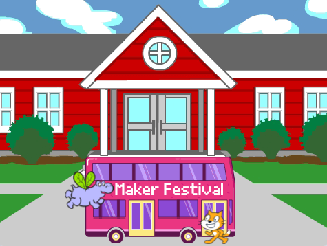
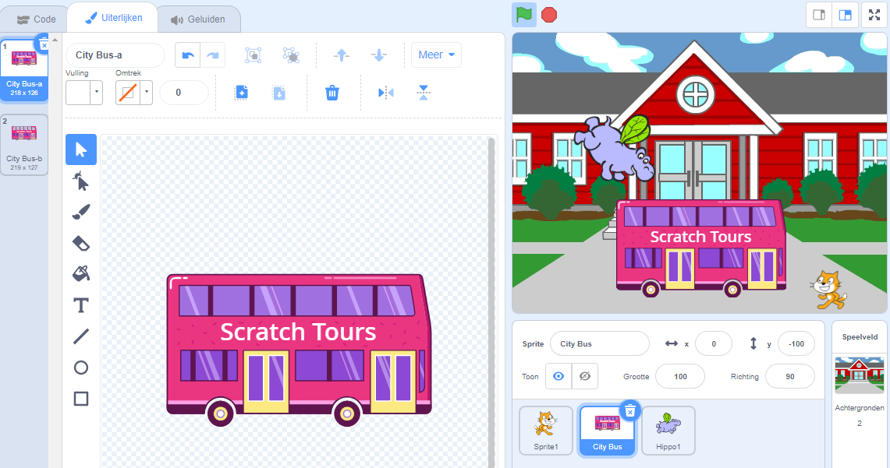
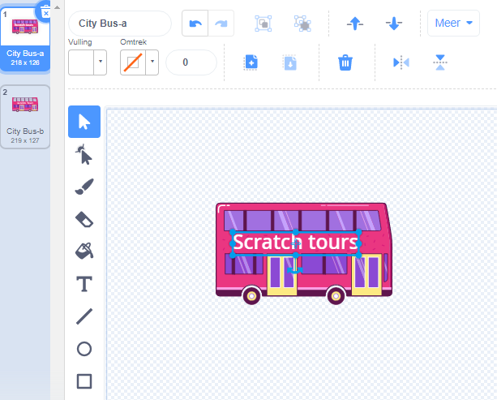
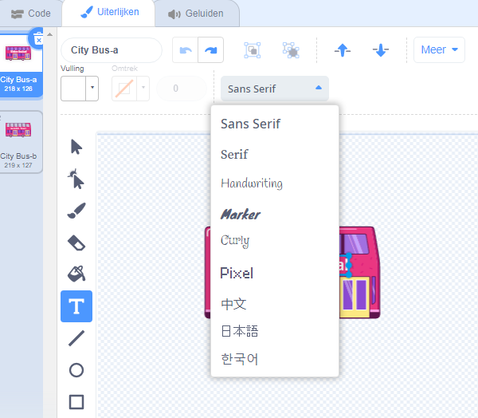

## Wijzig de bestemming

Het opschrift op de bus zegt "Scratch Tours", maar je kunt de bestemming wijzigen naar jouw keuze. Waar wil je dat je bus heen gaat?  

{:width="300px"}

--- task ---

Selecteer de **City Bus** sprite en klik op het tabblad **Uiterlijken**:

--- /task ---

--- task ---

Klik op de witte tekst "Scratch Tours" om deze te selecteren en klik vervolgens op **Verwijder** om deze te verwijderen.

--- /task ---

**Tip:** Je kunt het **Verwijder** icoon in de Paint-editor of de <kbd>Delete</kbd> toets op je toetsenbord gebruiken.

--- task ---

Selecteer het **Tekst** (schrijven) gereedschap.

Klik op de bus waar je jouw tekst wilt laten beginnen en typ de bestemming van jouw keuze.

Om het lettertype (schrijfstijl) te wijzigen, kun je op het vervolgkeuzemenu **Lettertype** klikken:

--- /task ---

--- task ---

Klik op het **Selecteren** (pijl) gereedschap en sleep de tekst om deze op de bus te plaatsen.

--- /task ---

--- save ---
